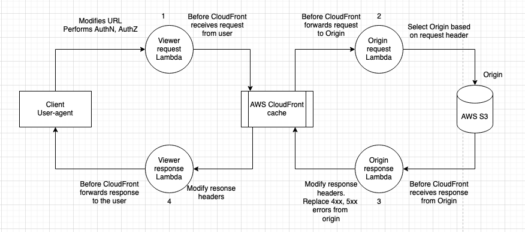
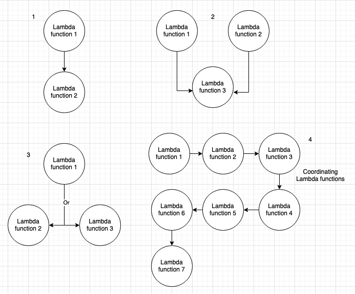
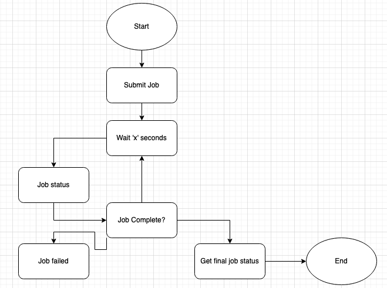

### AWS Lambda

- AWS Lambda is a compute service that lets you run code without provisioning or managing servers.
- If a Lambda function needs to talk to a AWS service, such as writing logs to AWS CloudWatch logs, it needs to be given appropriate permissions (See Lambda Execution Role below).

### Lambda Execution Role

- Lambda execution role permission define permission for Lambda, Ex: Access to S3, DynamoDB, CloudWatch, Kinesis DataStream, all given via IAM Roles.
- Each Lambda function has an IAM role (execution role) which gives it permission to perform tasks.

### AWS Lambda and AWS S3

- AWS S3 provides a feature to publish events to AWS Lambda functions.
- Once configured, an S3 event will trigger the execution of the Lambda function.
- For Lambda function to be invoked by S3, add permission in Lambda's resource based policy to allow S3 bucket principle to perform "lambda:invokefunction" action.

### AWS Lambda @ edge

- Lambda @ edge allows to customise the content that AWS CloudFront delivers.
- Lambda @ edge can change the request going into AWS CloudFront, and also the responses from AWS CloudFront.
- Security headers can be added using Lambda @ edge.

### Step Functions

- Step functions are orchestration for server-less functions.
- Step functions coordinates Lambda functions - provides a visual workflow.

### AWS Lambda and AWS Config

- Lambda config changes can be tracked via AWS Config.

### AWS Lambda and API Gateway

- Lambda Authorizer provides AuthN/AuthZ to API Gateway.
- For captcha, use "Auth Challenge Lambda".

---
