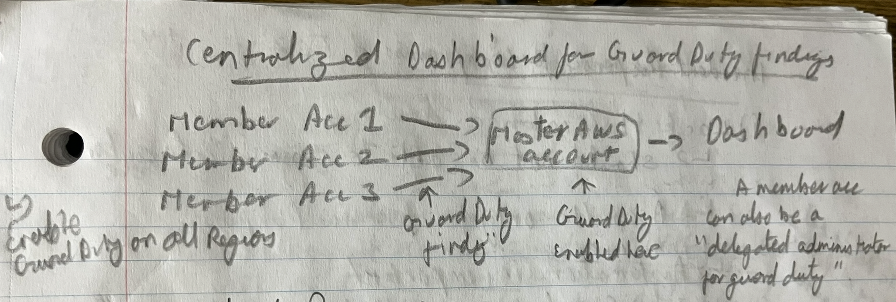
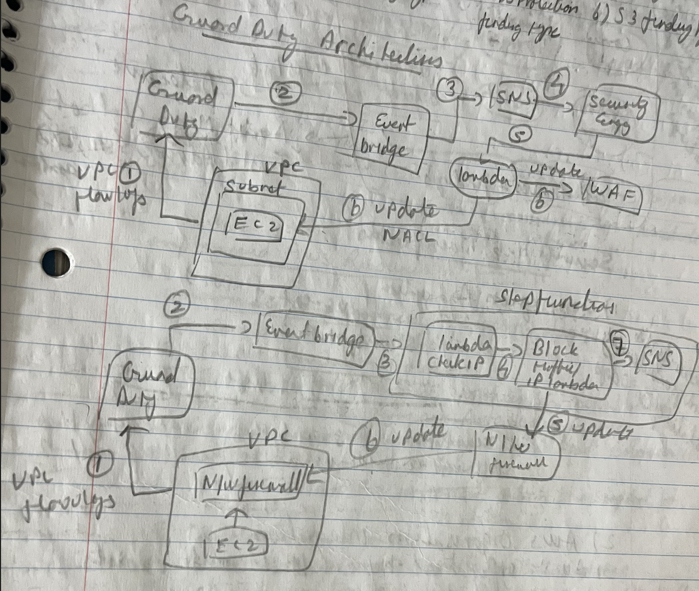

### AWS Guard Duty
- It is a threat detection service monitoring for malicious activity, similar to a SIEM.
- It uses machine learning in the backend.
- It does anomaly detection.
- It can integrate with 3rd party tools.
- Guard Duty supports multiple AWS accounts and organisations automatically.
	- Centralised dashboard for all Guard Duty findings can be built in to the Master AWS account, where all member AWS accounts feed the findings into it.
	- 
	- All member accounts in the organisation must have Guard Duty enabled.
	- Guard Duty is enabled on the Master AWS account.
		- A member AWS account can also be a "delegated administrator for Guard Duty". 
	- All findings from member accounts and master AWS account are visible centrally in the master AWS account.
		- Findings are published both on member and master accounts.
- 30-days free trial.
 
**Threat detection service**
- Monitor events and detect real security incidents.
- More the logs and events sent to a threat detection tool, the more effective the tool is.

**Common supported resources in Guard Duty**
- EC2
- EKS
- IAM
- Kubernetes
- Lambda
- Malware
- RDS
- S3

**Log sources of Guard Duty**
- Mandatory / Default enable
	- CloudTrail Management logs -> unusual API calls like, creation, deletion, read of resources.
	- CloudTrail Event logs
	- VPC flow logs -> unusual internet traffic
	- DNS logs -> Encoded DNS queries (Only for default VPC DNS resolver, not for 3rd party DNS requests)
- Optional
	- EKS audit logs and runtime monitoring
	- RDS + Aurora login logs
	- S3 logs
	- EBS logs
	- Lambda Network activity

**Finding types**
- Finding types based on severity (0-10)
	- High
	- Medium
	- Low
- Some finding types
	- EC2 finding type
	- IAM finding type
	- Kubernetes log finding type
	- Malware protection finding type
	- RDS protection finding type
	- S3 finding type
		- "Bucket anonymous access granted" -> Bucket policy has been configured to make it accessible over internet.
		- "Bucket public access granted" -> Granted public access to the bucket.
		- "Account block public access disabled" -> Account level setting for blocking public access has been disabled.
		- "Bucket block public access disabled" -> Bucket level setting for blocking public access has been disabled.
	- "Instance credential exfiltration" finding in Guard Duty can identify credentials which might be stolen or used.
	- There is a dedicated finding type to protect against crypto mining attacks.

**Trusted IP list**
- Guard Duty will trust it.
- No findings will be generated.
- Adding IPs to "Trusted IP list" will whitelist alerts in Guard Duty.
	- IPs can be added to a file and stored in a S3 bucket.
	- S3 bucket with the file having the "Trusted IP list" should be supplied.

**Threat IP list**
- Guard Duty will consider them as threat, along with its built in list.
- Findings will be generated.

**Malware protection in Guard Duty**
- AWS Guard Duty performs agent less malware scanning.
	- Default/other malware protection is based on agent running on a system to scan for malware (deep security).
- Steps done by Guard Duuty to perform agent less malware scans
	- Step 1 - There is a EC2 instance with EBS attached to it, where malware scan needs to be performed.
	- Step 2 - Takes a snapshot of EBS.
	- Step 3 - Snapshot is used to deploy EBS in AWS account.
	- Step 4 - EBS is attached to a EC2 instance in AWS account.
	- Step 5 - Malware scan done by AWS Guard Duty.
- Malware scans are run on 
	- EC2 instances
	- Container workloads
- Types of Guard Duty malware scan
	- Guard Duty initiated malware scan - a finding triggers it
	- On-demand - Customer can trigger it

**Triaging findings**
- Findings can be addressed, by fixing the issue. Else they (finding types or specific resources) can be
	- Archived
	- Suppressed
		- Suppressed findings are not sent to Security Hub, Detective, SNS.
		- Suppression rules can be written to filter out low findings and false positives.
- "Guard Duty Active Finding Type" page has all the rule list.

**Sample Guard Duty architectures**

EventBridge can be integrated with GuardDuty to automate responses to Guard Duty findings.

Upon receiving the Guard Duty alert, EventBridge can
- Send notifications using SNS, hence to Slack via HTTP and Email.
- Trigger Lambda function or orchestrated Step functions to automatically remediate/fix findings.

---
