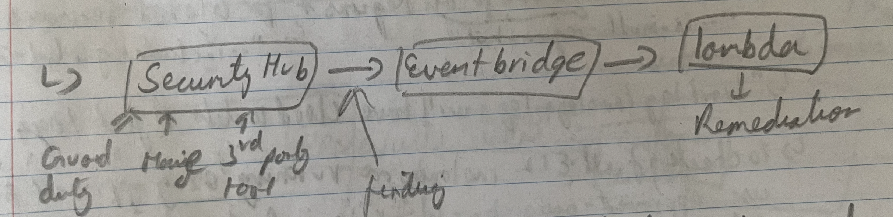

### AWS Security Hub

- AWS Security Hub collects issues and findings from multiple AWS services such as
	- AWS Macie
	- Amazon Guard Duty
	- AWS Inspector
	- AWS Config
	- AWS Firewall Manager
	- IAM Access Analyzer
	- AWS Systems Manager
	- IOT Device Defender
- AWS Security Hub works at organization level, integrating multiple member accounts.
- Events generated by Security Hub can be sent to SNS and EventBridge.
	- Custom actions can be setup for response and remediation of the events.
	- 
- Findings are generated automatically at Security Hub.
- For further investigation, Security Hub findings can be sent to Detective.
- Security Hub can further be integrated with Audit manager, Chatbot, Trusted advisor, SSM and Ops centre.
- Security Hub can be integrated to 3rd party vulnerability scanners (3coresec, alert logic, aqua), and findings can be sent to Atlassian, Fireeye, Fortinet, ServiceNow etc.
- Security Hub automation rules enable automatic modification/suppression of findings.
- 
- Security Hub main features
	- Cross-region aggregation - Security Hub findings from different regions aggregate to a single Security Hub account.
		- Security Hub is region specific.
	- AWS organization integration - Security Hub findings from different member accounts aggregate to the Master Administrator account.
		- AWS Config must be enabled on all accounts
	- AWS Security Hub is a centralised place to view all security alerts across all accounts.
	- AWS Security Hub can also check for unintended network access from instances.

### Security Hub and Guard Duty integration

- Guard Duty is automatically enabled when Security Hub is enabled on an account.
	- It can be disabled manually.
- Guard Duty sends non-suppressed, non-archived findings to Security Hub.
- Findings will be in AWS Security Finding Format (ASFF) within 5 minutes.

### Security Hub Insights

- Collection of related findings that identifies a security area requiring attention and intervention.
- Two types
	- Built-in
	- Custom

### Security Hub Custom Actions

- Respond and remediate automatically
- Detect, via Security Hub + Ingest, via EventBridge + Remediate, via Step Functions + Log, via CloudWatch
- Ex: 3rd party tools + Security Hub + Event Bridge + Lambda

### Security Hub and Config integration

- AWS Security Hub checks for compliance standards, such as PCI DSS, CIS etc, using AWS Config.

### AWS Security Finding Format (ASFF)

Security Hub produces findings / report in ASFF

Top level attributes of ASFF
- AWS account ID
- Created at
- Description
- Generator ID
- Product ARN
- Resources
- Schema version
- Severity
- Title
- Types
- Updated at

---
