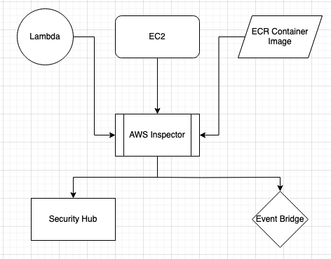

### AWS Inspector
- Automated vulnerability (CVEs) scanner for AWS workloads.
	- Has a CVE rule package
- Uses SSM run command to deploy inspector agent on number of instances
- Supported resources
	- EC2
		- AWS Inspector uses SSM agent to detect network access and vulnerabilities in OS.
	- Elastic Container Registry (ECR)
	- Lambda
- Security Group misconfigurations are also shown
- Checks for unintended network exposures
- Reports are sent to Security Hub, which can then be integrated with EventHub for notifications and auto remediations.
- Can automatically be enabled for new member accounts.

---
