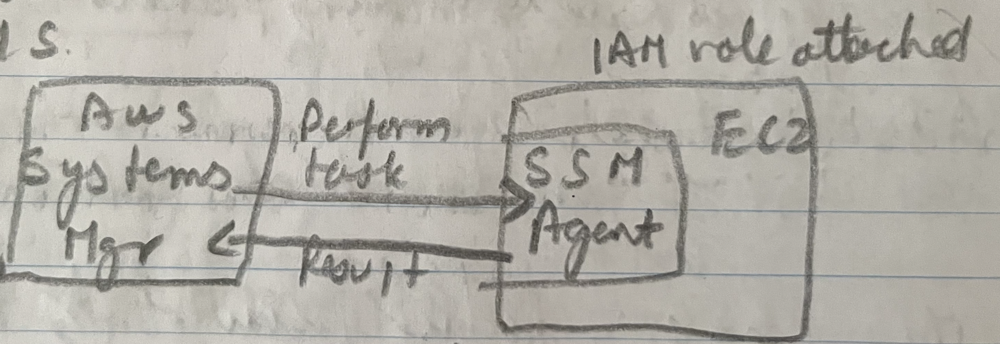
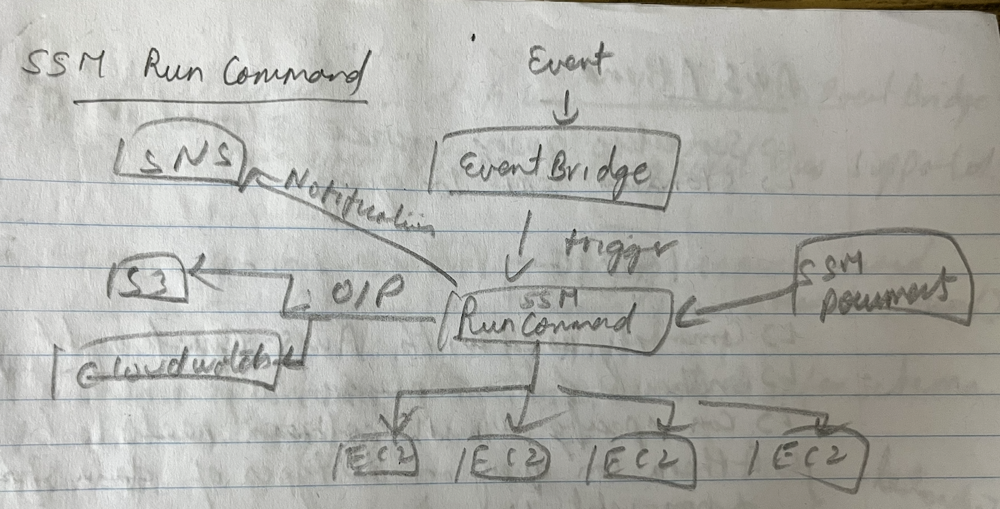
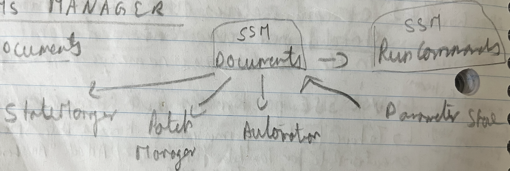
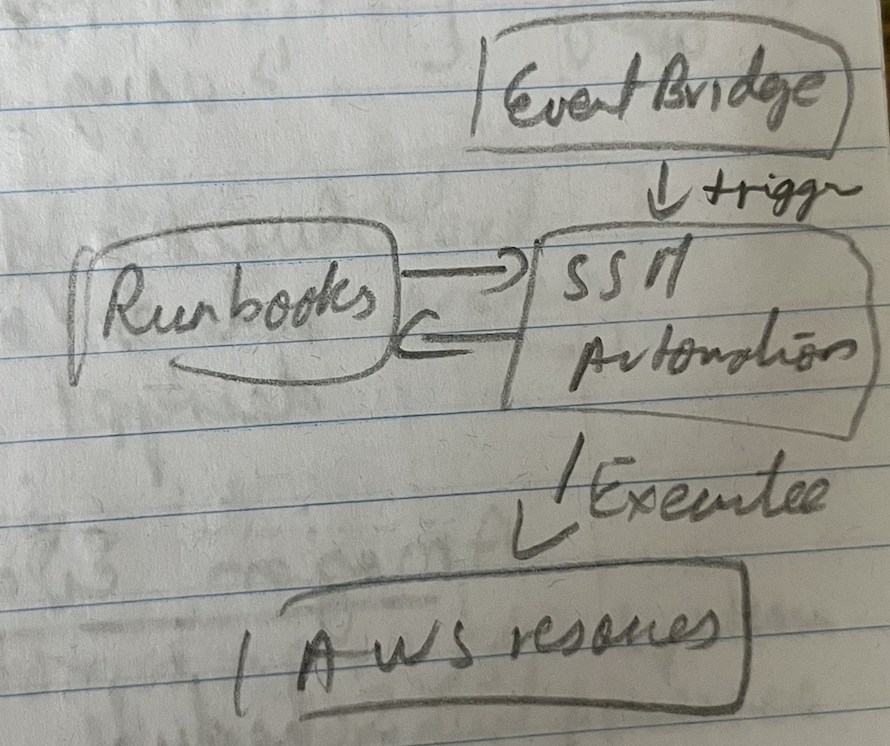
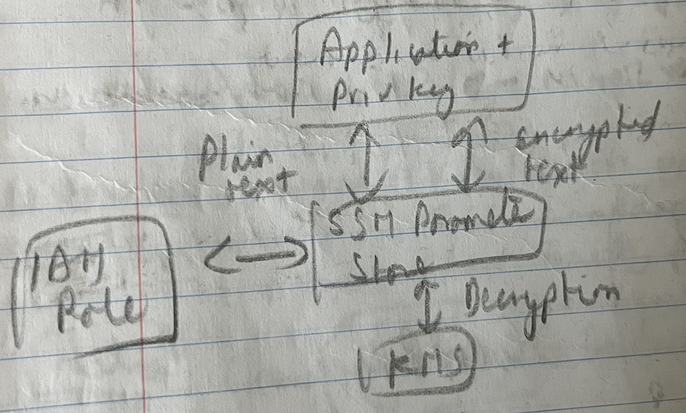
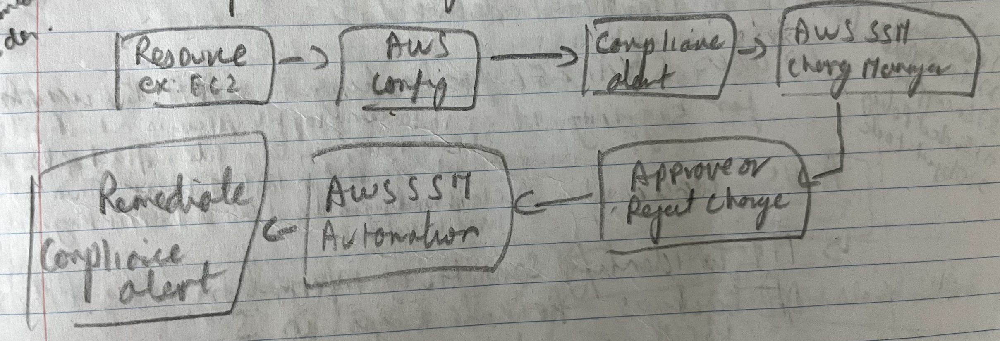

### AWS Systems Manager (SSM)

- Group of services to have visibility and control of infrastructure (Both EC2 and on-premise)
	- It is a free service
- Example of services from Systems Manager
	- Run Command - Runs commands on multiple instances
	- Parameter store - Stores secrets
	- Sessions Manager - Console access to EC2 instances without any modification to security groups or opening up of ports
	- Patch Manager - Patches EC2 instances
- SSM agent will be installed on EC2 instances
- Tasks can be performed on EC2 instances via SSM manager
- Checks for compliance of EC2 instances and missing patches
	- Patching automation for missing compliance can be set.
- Can detect problems in the EC2 instances
- For on-premise systems, IAM service role is required for on-premise systems to communicate with SSM

### AWS SSM Agent

- Can be installed on EC2 instances, on-premise servers, VMs etc.
- 
- EC2 instances need to be attached with "Amazon SSM Managed Instance Core" policy to allow it to use systems manager core functionality.

### AWS SSM Sessions Manager

- Browser based shell access to EC2 instances
- 

|                                           | EC2 Instance Connect | Sessions Manager                 |
| ----------------------------------------- | -------------------- | -------------------------------- |
| IAM Role                                  | None                 | Amazon SSM Managed Instance Core |
| Security Group (Inbound allow on Port 22) | Required             | Not Required                     |
| Public IP                                 | Required             | Not Required                     |
- Can control access to EC2 instances using IAM permissions
- Benefits os using SSM Sessions Manager
	- Access control via IAM policy
	- No inbound ports need to be opened
	- Logging and auditing of session, including commands executed
		- Session logs can be sent to S3 and CloudWatch logs.
	- One-click access to instance
	- No need of VPN

### AWS Systems Manager - Run Command

- Run commands, like "update firewall config", on multiple EC2 instances (using Resource Groups)
	- Run command "AWS Support-Enable VPC Flow logs" enables VPC flow logs.
- AWS SSM Run Commands can be integrated with IAM and CloudTrail.
- Output of Run commands can be sent to S3, CloudWatch, Event Bridge, SNS.
- 

### AWS Systems Manager - Document

- Is in json or yaml format, which define parameter or actions.
- "Command Document" allows to perform ready-made tasks/actions like "configure docker", "update windows", "update S3 bucket policies", run shell commands/scripts.
- 

### AWS Systems Manager - Patch Manager

- Automates detection of missing patches and to apply patches.
	- OS + application +security updates
- Patch Baseline -> Determines the list of patches which are missing and which are approved to be installed.
	- Patch baseline can be either custom defined or AWS defined
- IAM Service role is required for on-premise servers to be patched
- Maintenance window -> is when the patch is installed
- Patch Group -> Set of instances associated with a patch baseline (tags can be used)
- Patching automation for missing compliance can be implemented using AWS SSM Automation.

### AWS Systems Manager - Automation

- Automates common maintenance and deployment tasks like attach IAM roles, patching, create AMIs etc.
- AWS tags can be used for automation
- Resource Groups can be created using tags, and automation can be triggered on specific Resource Groups.
- Automation run book
	- SSM Documents of type automation
	- Defines actions to be performed
	- AWS created or custom created
- 

### AWS Systems Manager - Parameter Store

- Centralized store to manage configuration data, like passwords, secrets.
- Type of data stored in Parameter Store can be
	- String - No encryption
	- Secure String - Encryption of data in Parameter Store is done using key in KMS.
- It is a serverless offering
- IAM policies can be used to restrict access to parameters in Parameter Store.
- TTL can be set to delete data after sometime.
- Lambda can use parameters in Parameter Store with the following permissions
	- "SSM:GetParameter" permission
	- "KMS:Decrypt" permission (If the parameter is stored as a secure string)
- Parameter Store supports versioning.
- Can store in a hierarchical structure
	- "/dept/app/db/un"
	- "/dept/app/db/pwd/pwd"
	- Can control access to this hierarchical structure using IAM
- Parameter policy can be attached to rotate credentials, and delete credentials.
- 

### AWS Systems Manager - Inventory

- Manages inventory like application names, files, network configurations, instance details of all EC2 and on-premise instances.
	- Basically the metadata of all AWS resources
- Once inventory data is collected, queries can be run like "which anti-virus agent?" using Athena.

### Centralised architecture with AWS Systems Manager

- From different AWS accounts, pull data from each AWS Systems Manager and store in S3 bucket.
- Now run queries using Athena, build dashboards using quicksight etc.
- AWS SSM is integrated with CloudWatch and AWS Config.
	- Integration with AWS Config for automatic remediation and changes to configuration of AWS resources.

### AWS Systems Manager - Change Manager

- For requesting, approving, implementing, and reporting operation changes to resources in AWS account.
- 

### AWS Systems Manager -State Manager

- Automates the process of keeping EC2 instances in the state we define.
	- Ex: Port 22 must be closed.

---
