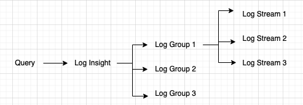

### AWS CloudWatch

- Metrics are captured by default when EC2 and on-premise instances are launched.
	- Metrics such as CPU, Network, Disk 
- Benefits of CloudWatch
	- More metrics than default
	- Access to multiple folks
	- Alarms to monitor logs
- CloudWatch logs are stored indefinitely. Can set retention policy to auto delete logs.
- CloudWatch collects logs from various sources using CloudWatch agent and pushes to CloudWatch dashboard (a central log server).
	- CloudWatch logs permission required to create a log stream and upload logs to CloudWatch
		- logs:putlogevents
		- logs:createlogstream
- Private access to CloudWatch logs can be set up using VPC endpoints.
- Access restriction to logs can be implemented via CloudWatch
	- Restrict access to specific Log Groups only, so that users cannot access other Log Groups.
	- For Ex: Developers can be restricted from accessing Security Log Group and can be provided with read-only access to Developer Log group.

### Unified CloudWatch Agents

- Captures both internal system level metrics as well as logs.
- CloudWatch unified agent must be installed on EC2 instances.
	- CloudWatch agent cannot be installed on ALB.
- Sends/pushes logs and metrics to CloudWatch dashboard.

### Steps to configure CloudWatch Unified Agents

- IAM role "CloudWatchAgentServer" (or "CloudWatchAgentAdmin") policy is set
- Assign EC2 with the above role
	- IAM role setting on EC2 is very important for logs to be sent to CloudWatch.
- Install Unified CloudWatch agent
- Run CloudWatch agent configuration wizard
- Start unified CloudWatch agent
	- "awslogs" service should be running in EC2 instances
	- "/var/log/awslogs.log" will have CloudWatch agent logs.
- "Procstat" plugin collects metrics and monitors system utilization of individual processes
	- Select process by PID, exe, pattern (regex) etc.

### CloudWatch Logs sources and destinations

- Sources
	- CloudWatch unified agent
	- Elastic Beanstalk
	- Elastic Container Service (ECS)
		- EKS control plane logging delivers logs directly from EKS to CloudWatch
			- Type of log (API server, Audit, Authenticator, Controller manager, scheduler) can be specified.
	- Lambda
	- VPC Flow logs
	- API Gateway
	- CloudTrail
	- Route53
- Destinations
	- Kinesis Data Stream
	- Kinesis Data Firehose
	- Lambda
	- Open search
	- S3

### CloudWatch Log Insight

- Search logs in CloudWatch using purpose build query language
- Can search on multiple log groups
- 
	- Log Group is for an application
	- Log Stream is for multiple log file locations of an applications (stdout, stderr).
- CloudWatch log insight is an effective and an efficient way to respond to queries.
	- Ex: CloudWatch can be used to store web access logs and CloudWatch log insight can query it.
- CloudWatch log insights help identify potential issues and validate deployed fixes.
	- Ex: Search for IP sending malicious traffic.
- CloudWatch log insight incur charges based on the amount of data that is generated.

### CloudWatch Events

- Rules can monitor for events and user activities.
- Ex: Whenever a EC2 instance is terminated, a custom Lambda function should be run with the details of terminated EC2 instances.
	- To achieve this, use CloudWatch Events and associate with the Lambda function.
	- CloudWatch Events deliver stream of system events describing changes in AWS environment in real time.
- Ex: CloudWatch can be configured to alert if root user account is used.
- Ex: To be notified when a specific IAM key is used, set up a system consisting of 
	- CloudTrail logs to log all APIs called
	- CloudTrail Management Event should be configured as "Write-only" or "All".
	- CloudWatch Event to identify the specific APIs call with the IAM key in question.
	- If there is an event matching, notify using SNS.

### CloudWatch Metrics Filter

- Search and filter the log data coming into CloudWatch by creating Metrics Filter.
- CloudWatch uses these metric filters to turn log data into numerical CloudWatch metrics, which we can set alarm or create a graph.
- Permission required "CloudWatch:PutMetricData" in IAM
- Input for CloudWatch metrics filter can be from CloudTrail as well
	- Ex: Alarm can be generated if # of unauthorized API requests crosses a threshold.
- CloudWatch custom metrics filter based on VPC flow logs can identify egress traffic on any port, say 5343.

### CloudWatch Subscription Filters

- Logs coming into CloudWatch logs can be forwarded to other services such as, Kinesis Data Stream, Lambda etc for further processing.
- Supported services
	- Kinesis Data Stream
	- Kinesis Data Firehose
	- Lambda
	- Open search
	- S3
- Subscription filter pattern can customize the type of logs sent to down stream service.

### CloudWatch Alarms

- Can be triggered for any metrics
- Monitors generated metrics and triggers alarm when threshold is breached.
	- Ex: Alert 3 or more failed login attempts to AWS console in 5 minutes.
		- Send CloudTrail logs to CloudWatch logs
		- Set metrics filter in CloudWatch to capture failed login attempt to AWS console
		- To capture user sign-in to AWS console use, "event name=console login" and "event source=signin.amazonaws.com"
		- Set CloudWatch Alarm with a threshold of 3 failed login attempts in 5 minutes.
	- Ex: To get notified when a new Security Group inbound rule is created
		- CloudWatch Alarm is set up to monitor CloudTrail logs, and send e-mail notification on Alarm
		- Ensure "Filter Pattern" includes "AuthorizeSecurityGroupIngress" event in CloudWatch alarm.
		- Metric filter with correct filter pattern and metric value of "1" is created in CloudWatch Alarm.
- Alarm Status
	- Ok
	- Insufficient data
	- Alarm
- Period
	- Length of time in seconds to evaluate metrics
- Targets
	- Action on EC2, Auto scaling, SNS etc.

### CloudWatch Contributor Insights

- Helps in identifying bad hosts, heaviest network users, URLs generating most errors etc.

---
