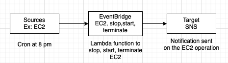

### Amazon EventBridge

- Extension of CloudWatch Events
- Streams realtime data from source to target.
- 
	- Cron jobs can be scheduled (scheduled events)
	- Schedule every hour say -> triggers a Lambda function
	- Once an event is triggered say, IAM root user sign in -> send a SNS notification
- To identify key rotation events in EventBridge,use detail type "KMS key rotation".
- EventBridge is the default event bus of AWS services
	- Partner and custom event busses are supported.
- Access can be controlled using resource based policies (Allow/Deny events from other AWS accounts)
- Schema registry -> Analyze events and infer schema

### Sources and destination for EventBridge

- Sources
	- EC2 events
	- CodeBuild events
	- S3 events
	- Trusted Advisor
	- CloudTrail APIs
	- Cron
- Destination
	- Lambda
	- Batch
	- SNS/SQS
	- Kinesis
	- Code Pipeline