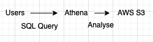

### AWS Athena

- Analyse log files using SQL.
	- Instead of uploading logs to SIEMs like Splunk, you can use Athena.
- 
- Serverless query service on objects stored in S3 using standard SQL
- It is commonly used with AWS Quicksight for dashboards.
	- Quicksight must be granted permissions via IAM role to access S3 bucket, and also to decrypt if S3 has encrypted data.
- Can be used to analyse logs.
- Can specify which columns need to be searched.
- Federated query
	- Athena can query all types of datastores, relational and non-relational
	- This is done using datastore connectors running on Lambda

---
