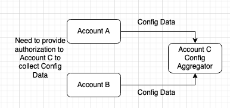
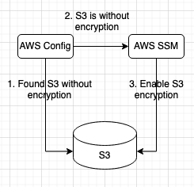

### AWS Config

- Records resource configuration changes to infrastructure and AWS resources.
- Comes with a large set of rules that can monitor and report findings for audit and compliance.
	- Ex: If an EC2 instance is launched from an non-approved AMI.
- Conformance packs
	- Collection of AWS Config rules and remediation actions.
- AWS Config can check if access keys are not rotated for a specified time.
- For global resources like IAM, for AWS Config to monitor them, enable "global resource check" while configuring AWS Config.
- AWS Config on recurring basis checks if EBS volumes are encrypted, EC2 are deployed from approved AMIs etc.
- AWS Configs can monitor public write access to S3 buckets.
- AWS Config maintains comprehensive list of resources.
- AWS Config can check when/if CloudTrail gets disabled.
- AWS Config can check if root user creates a new API key.
- AWS Config can check if internet gateway is attached to a Private subnet.
- Config checks can be triggered on configuration changes or on a periodic basis, say every 1 hour.
  AWS Config can check is intended applications are installed on a EC2 instance or not using "ec2-managedinstance-applications-required" config rule.
- Resources in Config keeps track of changes in a resource.
- Rules in Config evaluates changes for violation and compliance.
- Pricing
	- Based on Config item per account per region
	- Based on rule evaluation - Every time a resource is evaluated for compliance against a AWS Config rule.
	- Based on Conformance pack evaluation per account per region.

### Evaluation Modes
- Protective Evaluation Mode - To access and analyze resources before deployment to determine compliance or non-compliance.
- Detective Evaluation Mode - Accesses the resources which are already deployed.
	- AWS Config Detective controls detects non-compliant resources.
- AWS Config's evaluation results can be sent to Security Hub.

### AWS Config and AWS CloudTrail

- AWS Config can tell you the configuration changes, but cannot tell which user, role, access key performed it.
	- Integrating AWS Config (to identify configuration changes) with AWS CloudTrail (to identify the corresponding API calls and the caller) can help solve this requirement.

### AWS Config and AWS CloudWatch
- To get notified if a EC2 instance is launched from an non-approved AMI, integrate AWS Config (to check the configuration of the launched EC2) and CloudWatch Alarm (to set an alarm via metrics to notify on non-compliant instances).
	- To check if EC2 instances are running using approved AMIs, use "approved-amis-by-id" rule in AWS Config to identify.

### AWS Config and Lambda
- AWS Config can run Lambda function for automation and remediation (of issues).
- Ex: AWS Config can check if internet gateway is attached to a Private subnet.
	- It can auto-remediate using Lambda functions.

### AWS Config and SNS
- AWS Config can be configured to send notifications to SNS topic, when ever specific conditions are met.

### AWS Config Aggregator

- Aggregates AWS Config data from
	- Multiple accounts and regions
	- Single account and multiple regions
	- All accounts in AWS organizations where AWS Config is enabled.
- 
	- P.S: AWS Config is enabled on all 3 accounts above.
- Is accounts are not part of AWS Organizations, source AWS accounts must give authorization by adding Aggregator account id and region.
	- If part of Organizations, then IAM role permission will work.

### AWS Config and AWS SSM Automation

- Remediate non-compliant Config rules with AWS SSM Automation
- AWS Config audits the compliance of the environment
- AWS SSM Automation - Automates maintenance, deployment and remediation tasks on EC2, RDS, S3 etc.
- 
- AWS SSM Automation will execute using the ARN of IAM role which has permission to execute the operation.
- Have a trust policy in place for Config service to work within a IAM role by specifying "config.amazonaws.com" in principle.

### AWS Config and AWS SSM Document

- To automatically revoke unused/expired IAM access keys, use AWS Config remediation with SSM Document.

### AWS Config and VPC Flow logs

- AWS Config can determine is VPC flow logs are disabled.
- Remediation action can be set to automatically enable VPC flow logs using "AWSSupport-EnableVPCFlowlogs" SSM run book.

---
