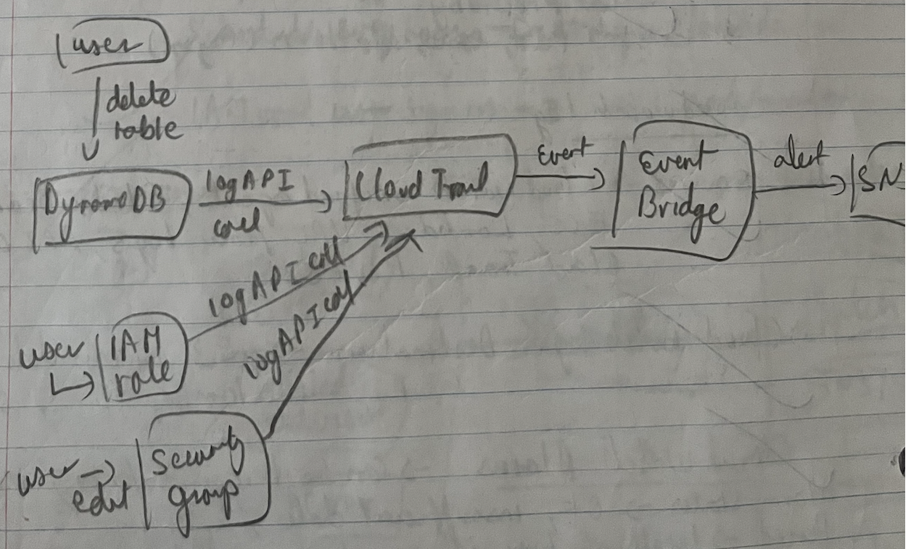
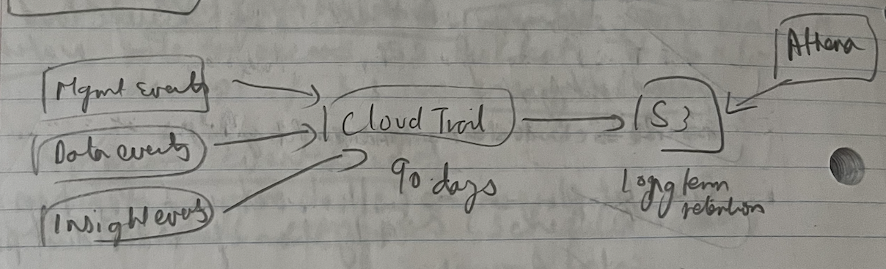
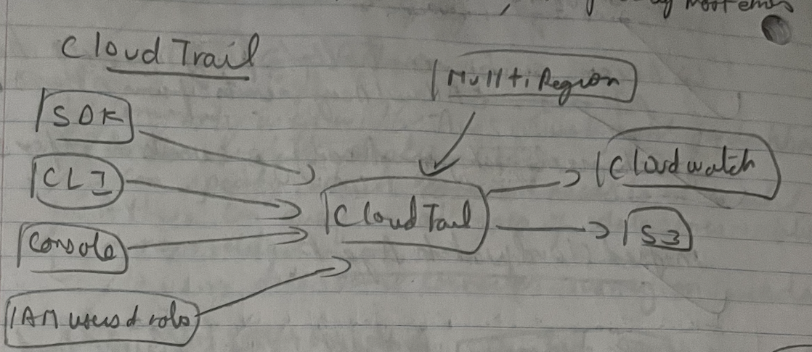
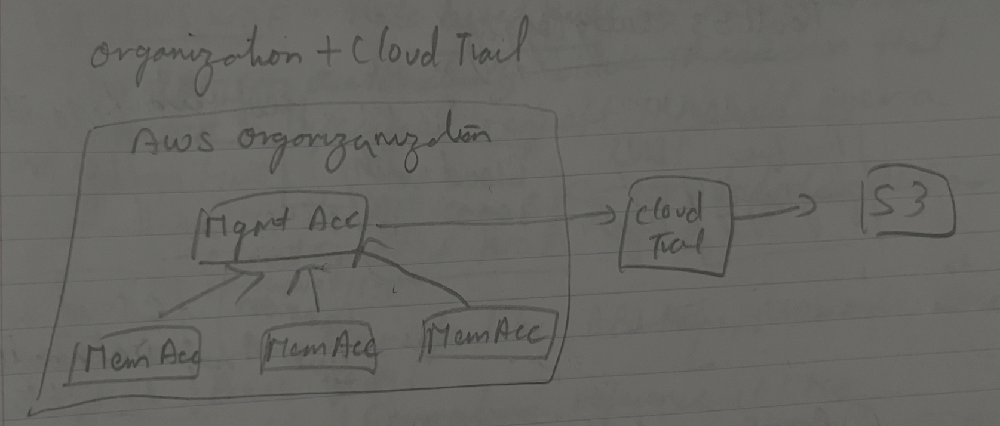

### AWS CloudTrial

- Records AWS events
- Tracks user activity and API usage, by maintaining history of AWS API calls made in AWS account
- Provides governance, compliance and audit for AWS accounts
- Enabled for all customers by default
	- No additional configuration needed
- Limitations of default configuration
	- CloudTrail events are not stored for ever. Deleted after 90 days.
	- Not all types of events are logged, only Management events (Read, Write, All) are logged.
	- Very little customization
- To preserve CloudTrail for longer than default period (90 days), send the CloudTrail logs to
	- S3 (can be queried by Athena)
		- Update bucket policy to sending logs
	- CloudWatch Logs and Events
- CloudTrail logs are encrypted by default with SSE using KMS managed keys.

### CloudTrail Event Types

- Management Events
	- On by default
	- Management operations on AWS resources
	- Ex: Create new EC2, Create new IAM user, User sign-up
- Data Events
	- Off by default
	- Resource operation performed on or within a resource
	- Ex: GetObject, PutObject, DeleteObject on S3
- Insight Events
	- Off by default
	- Unusual activity, errors or user behaviour in account
		- This can be captured via API call rate or API error rate

### CloudTrail log aggregation

- CloudTrail allows to configure a single trail to capture events from all regions
- To enable CloudTrail for all regions, use "--is-multi-region-trail"
- To enable CloudTrail for all global services, use "--include-global-service-events"
- Create separate trails for separate event types, each trail sending log to separate S3 buckets.
	- Logs in S3 bucket can be queried with Athena
	- Update S3 bucket policy to send the logs
	- Protect S3 buckets with
		- Versioning
		- MFA delete protection
		- Encryption
		- Bucket policy
		- Object lock
- Integrate CloudTrail to CloudWatch, so that we can track CloudTrail Data Events in CloudWatch.
- Global services like CloudFront, IAM, STS etc create their CloudTrail logs in us-east-1 region.
- To record and retain AWS API calls in a centralized location, for both current and future AWS regions
	- CloudTrail supports AWS Organization, ensuring a single trail is created and applied to all AWS accounts in an Organization.
	- Enable CloudTrail by creating a new trail and applying the trail to all regions.
	- Use an IAM user in the Management account to create the Trail.
	- Specify a single S3 bucket as the storage location.
- To update the log prefix of an existing trail in CloudTrail, 
	- update the existing bucket policy in S3 with new log prefix
	- update the log prefix in CloudTrail console

### CloudTrail Log File Integrity Validation

- Whether a log file was modified, deleted, or unchanged after CloudTrail delivered it.
- CloudTrail uses SHA-256 for hashing and SHA-256 with RSA for signing log files.
	- For every log file there is a hash created
	- Every hour, it creates a file with hashes of each file created in last 1 hour. This is the digest file
	- CloudTrail signs the digest file with Private key. Public Key can be used to validate

**For CloudTrail to deliver logs to S3 bucket**
- Ensure that "Requester pays" feature is disabled in S3 bucket
- Verify S3 bucket does not have any older policies that limit CloudTrail's permission to deliver logs only to certain regions.
- Ensure log prefix in CloudTrail exists in S3 bucket policy. 