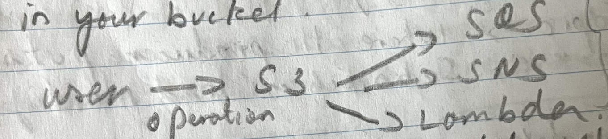
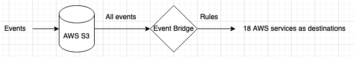

### S3 Event Notification

- Send notification when certain event happens in your bucket.
- 
	- IAM permission to be configured for S3 to send notification to SQS, SNS and Lambda.
- Sample use case - Upon file upload to S3, event notification can be configured to scan the file for virus/malware using Lambda
- 

---
