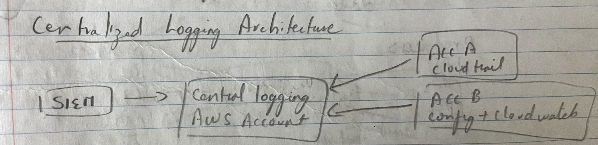

### Logging in AWS

- CloudTrail trails
	- For all AWS API calls
	- Maintains API history
- Config rules
	- For configuration and compliance overtime
	- Maintains configuration history
- CloudWatch logs
	- Application logs (and CloudTrail logs)
- VPC Flow logs
	- IP traffic of VPC
- ELB access logs
	- Metadata of requests made to ELB
- CloudFront logs
	- Web distribution access logs
- WAF logs
	- Web firewall logs of all requests

All of the above can be stored in S3 and analysed by Athena
- S3 can be ACL'ed by IAM and bucket policies + MFA
- S3 can be encrypted

### Centralized logging architecture

