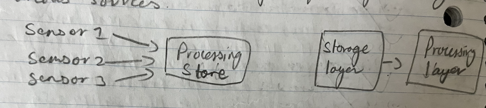
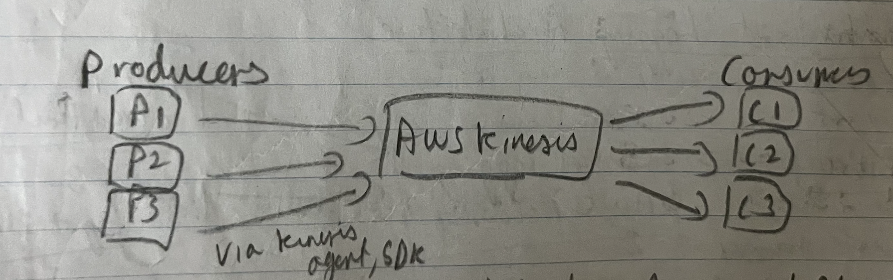

### Amazon Kinesis

- Streaming data is continuous flow of data generated by various sources
- 
- Kinesis -> Collect, process and analyze realtime streaming data
- 
- Kinesis Data Streams
	- Captures, processes and stores data streams in real time
	- Realtime processing of streaming data
	- Provides capability to
		- Ordering of records
		- Read/replay records in same order
	- Can perform cross-account log data sharing.
		- Create a subscription filter in each account (members).
		- Send the logs to destination Kinesis data stream in centralized account.
- Kinesis Data Firehose
	- To move data from point A to point B
- Kinesis Data Analytics
	- Streaming data in realtime with SQL/java code
- Kinesis video stream
	- Capture, process and store video streams

Kinesis data stream can be used with OpenSearch (searching and analytics engine) to send application logs to a centralized location, where real time analytics can be performed.

---
