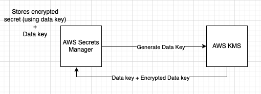
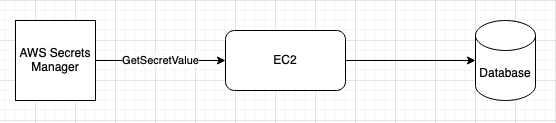
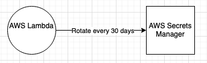

### AWS Secrets Manager

- It is used to store sensitive data such as passwords, tokens, keys, etc in a secure environment, with strict access controls.
- Hashicorp Vault has similar capabilities of AWS Secrets Manager.
- It enables you to easily rotate, manage, and retrieve credentials, keys, and other secrets throughout their lifecycle.
- Hard coding secrets or sensitive information is a bad practice as it brings instability and misuse. AWS Secrets Manager eliminates the need to hardcode sensitive information in plain text.
- AWS stores secrets in Secrets Manager in an encrypted format, using AWS KMS.
- 
- "GetSecretValue" API is used to fetch credentials from AWS Secrets Manager.

### Rotating secrets in AWS Secrets Manager

- Periodic updation of secrets is a necessary security practice. Force rotation of secrets and automate it.
- Rotation of secrets can be automated using lambda function.
	- Lambda function updates the secrets in AWS Secrets Manager and also the target using the secret, such as a Database

- Watch out -> Enabling rotation at secrets manager will cause rotation of secrets immediately.

---
