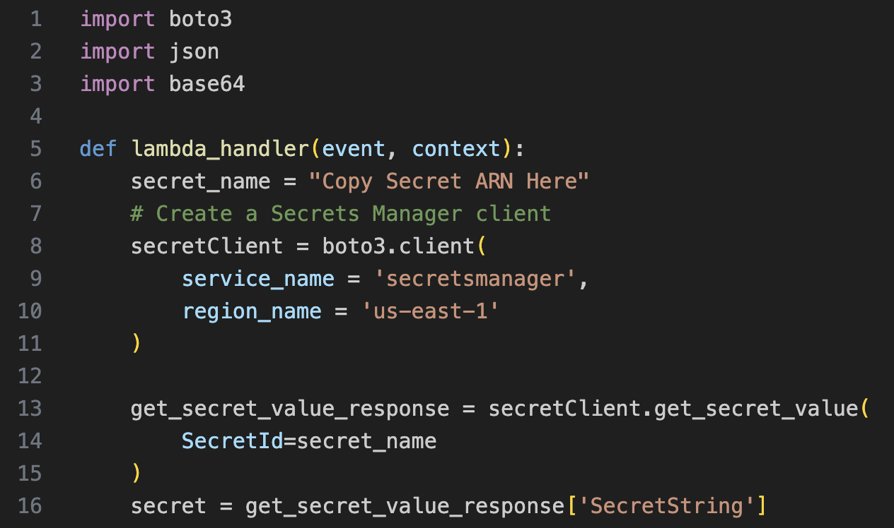

### Architecture diagram

### Creating a Lambda function

1. Go into Lambda service.
2. Click on create function
3. Enter a function name, select runtime (based on code language).
4. Under default execution role, select/create a role which gives lambda access to AWS Secrets Manager.

5. Edit the configuration to set Timeout to 2 mins.

6. Click Save to create a Lambda function.
7. Under the code tab, you can create a Lambda function to talk to any AWS service, say DynamoDB.
	1. For the Lambda function to access the DynamoDB, we could hard code AWS access and secret keys in the Lambda code.
	2. 
	3. Deploy and Test.
	4. Hardcoding AWS access and secret keys is a bad practice.

### Create secret in AWS Secret Manager

1. Go to Secret Manager service, and click on "Store new secret".
2.  On Store a new Secret page:
	1. Secret Type: Select "Other Type of Secret"
	2. Key/Value: Enter "Access key" in Key and Copy Your Access Key as Value
	3. Click on "Add row"
	4. Key/Value: Enter "Secret Access key" in Key and Copy Your Secret Access Key as Value
	5. Encryption Key: Select Default Key

3. Give this secret a name and keep everything else default.
4. Review the details and click on the Store button in the bottom right corner.
5. Click on "View Details" and Copy the "Secret ARN" which we’ll use in the next step.

### Using Lambda to use secrets in AWS Secret Manager

1. In the Lambda function code, give the secret ARN.
2. Since Lambda function's execution role has permission to talk to AWS Secrets Manager, it will fetch the AWS access and secret keys securely for AWS Secrets Manager.
3. By doing this, we do not need to hard code secrets in Lambda function code.

By doing the above steps, we can securely store secrets in AWS Secrets Manager and retrieve secrets in AWS Lambda securely.

---
