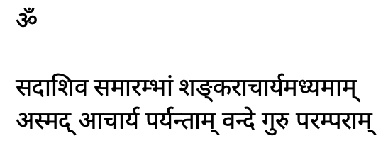
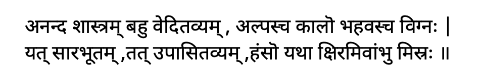
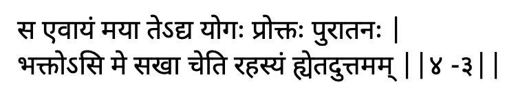

Indian culture is a Vedic culture. Lifestyle based on Vedic culture cannot be separated from religion.

Vedic culture is a religious culture, mean a god-centered culture.

In a god-centered culture, the day begins with the remembrance of god; throughout the day, our entire life right from conception to death, everything is intimately associated with god.
- When we brush our teeth, we are supposed to pray to the gods presiding over the tree.
	- In olden days, we used twig from the tree to brush our teeth.
	- So we pray Vanaspathi devatha to remove dirt from our teeth, and also to remove the dirt from our mind.
- When we take a bath, we look upon the bath as Abhishekam done to the god within us.
- Wearing cloths is associated to the presiding deity of cloths, Revathi devatha.
- Eating is also associated with god.
- The very conception of baby happens with chanting of the Vedic mantra, so that the conceived baby will be well refined and cultured.
- Upon death, cremation is a yagna where we offer our own bidy to the homa kunda.
	- Fire is Agni devatha.

Thus, our life is a god-centered life.

Why do our vedic scriptures prescribe a god-centered life?
1. Our primary relationship is with god alone, in every Janma
	1. It is the fundamental relationship
2. All our relationship with the people of the world are temporary relationships
3. The moment you lose sight of this fundamental relationship, your life becomes directionless
	1. Real prosperity is non-forgetfulness of the fundamental relationship with god
	2. Life will become an asrama if it is god-centered, else it will be a srama.

How to preserve and nourish relationship with god?
1. Give quality time via various religious practices
2. Understand/Study the theory and principle behind the religious practices
	1. These principles/theories are prescribed in our vedic scriptures
	2. Without the theory and principle, it will become a meaningless mechanical practice
	3. When something becomes mechanical mumbo-jumbo ritual, sooner or later it will drop off from one's life - as one would lose interest
3. Learning theory/principles is incomplete without practices, its like knowing about all yoga asanas and their benefits and not practicing those asanas.

How big is our scriptures?
1. 14 or 18 sciences
	1. aṅgāni, vēda chatvāra; mimāmsa nyāya visthara, puraṇam dharma śāstram ca, vidya hētē caturdaśa
2. 4 vedas
	1. Rig, Yejur, Sama, Atharva
3. Six angas - Sad angani
4. Puranas
5. Upavedas - 4
	1. Like gandharva veda
6. Shastras / upa-angas
	1. Mimamsa sastra
	2. Tarka sastra
	3. Dharma sastra
7. So in total 18 vidhyasthanas or indian knowledge systems

Our literature is too voluminous. So Krishna tells in 4th chapter 

- Anantha śāstram, scriptures are many; bhahu-vēditavyam; plenty to study; alphascakālo; time is very limited; and bhahavasca vignaḥ; and the obstacles are too many; And therefore yat sārabhūtam; tat upāsitavyam. If you do not have time to study all our scriptures, at least you should study the essence of our scriptural literature; just as the swan takes the milk out of a milk water mixture; similarly at least we have to study the sāra of our scriptures.

- Bhagavān Kṛṣṇa has taken the essence of all the śāstras and given in the form of Bhagavat Gīta and this one text book is enough to comprehensively understand our entire scriptural literature; to understand what is religious culture, what is vēdic culture; to understand what is god centered living; to understand the principles behind every religious practice of ours.
- Bhagavad-Gīta study is compulsory for all.

To completely assimilate the knowledge of Bhagavad Gita, one must do the following (all 4)
1. Study the Bhagavad Gita (From a guru preferably)
	1. Understand the context and the meaning of each verse
2. Go back and revise what you have learnt
3. Share it with people
	1. In form of discussion
	2. In form of teaching
4. By alert living
	1. Constantly ask yourself if my life is keeping with the Bhagavad Gita teaching

---
