$`docker run nginx`
- Checks for nginx image locally. If not available, pulls from docker hub and runs the image as container.
- This will run the container in attached/foreground mode.
- ctrl+c to release the terminal.

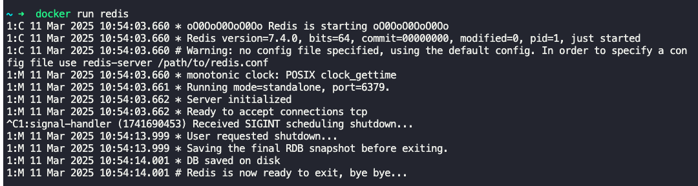

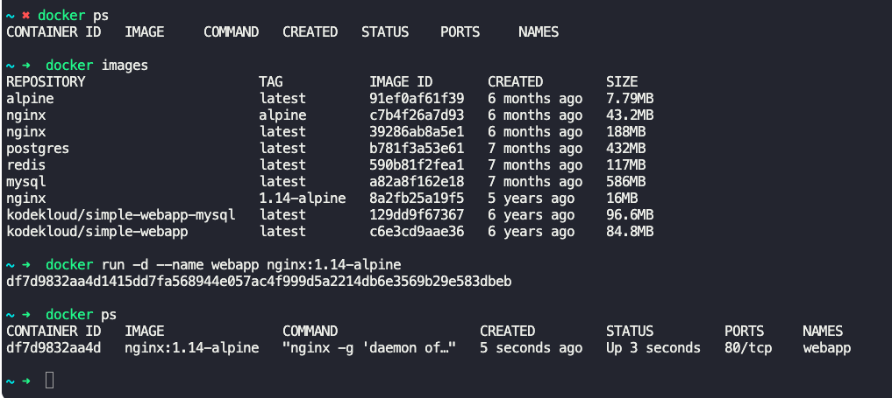

$`docker run -d sample_webapp`
- Runs the container in detached/background mode.

$`docker ps`
- Lists all running containers with basic information such as, container id, image, status, name etc.

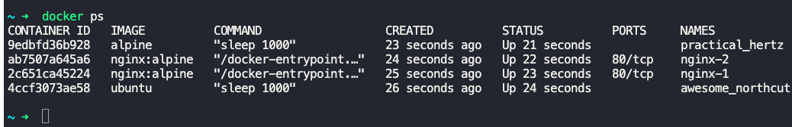

$`docker ps -a`
- Lists all running and stopped/exited containers.

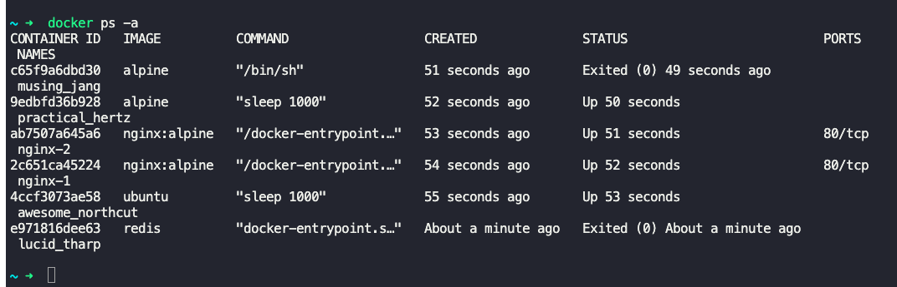

$`docker attach <container_id or name>`
- To bring the detached container or the container running in the background to foreground.

$`docker stop <container_id> or <name>`
- Stops the running container.

$`docker rm <container_id> or <name>`
- Removes a stopped or exited container.
- Multiple container ids can be specified separated by space.

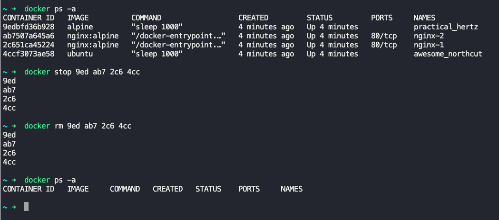

$`docker images`
- Lists all images present in the host.

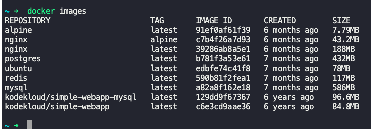

$`docker rmi <image_name>`
- Deletes image from the host.
- Stop and delete all dependent containers before deleting docker image.

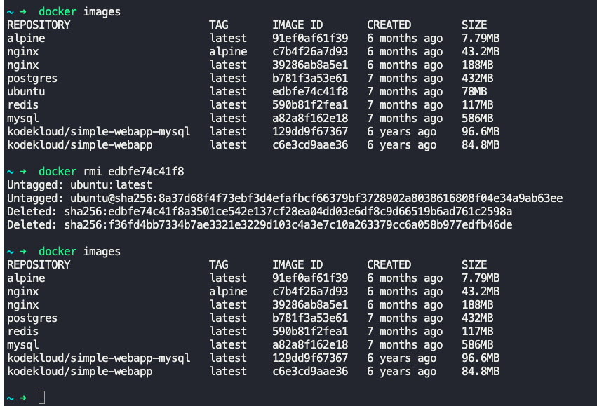

Docker clean up

- 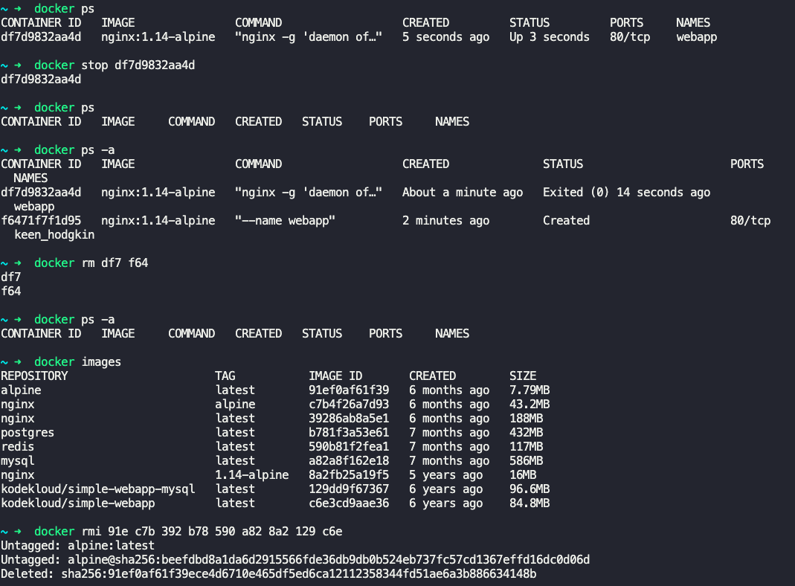
- 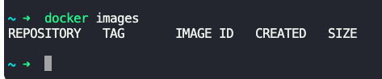

$`docker pull nginx`
- Pulls/downloads nginx image from docker hub locally.
- It does not run the image.

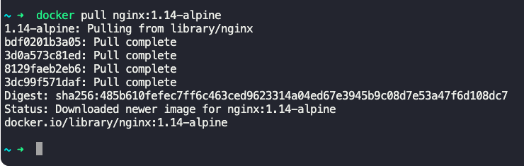

Notes about containers
- Containers are not meant to host VMs.
- Containers are meant to run specific task or process, such as web server, DB server, etc.
	- Once the task is complete, the container exits.
- Container lives as long as the process inside it is alive.
	- If the web server inside the container is stopped or crashed, the container exits.

$`docker run ubuntu`
- Starts ubuntu OS container and exits immediately.

$`docker run ubuntu sleep 5`
- Runs ubuntu OS container with a command "sleep 5".
- The command which actually runs on the OS is "/bin/bash sleep 5".
- Post sleeping for 5 seconds, the container will exit.

$`docker exec <container_id or name> <command>`
- Command can be like `cat /etc/hosts` etc.
- This will execute the specified command on the running container.

$`docker run -it centos bash`
- Runs the centos docker container by running the bash command in interactive mode.

$`docker -v` -> Gives docker version.

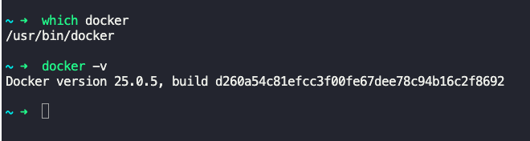

---

