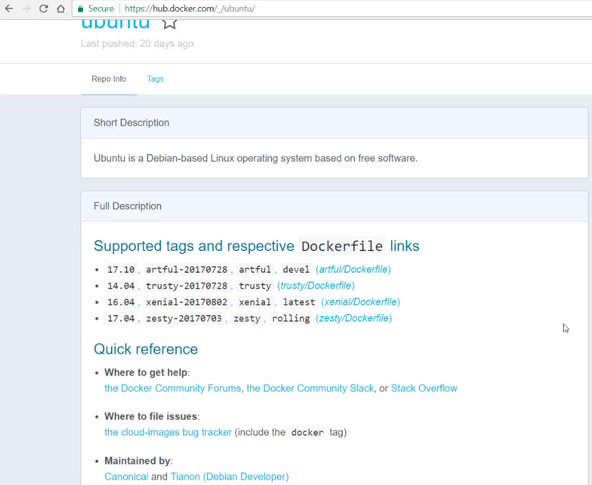
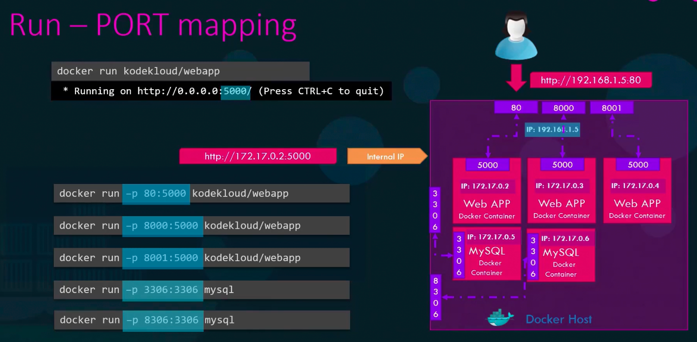
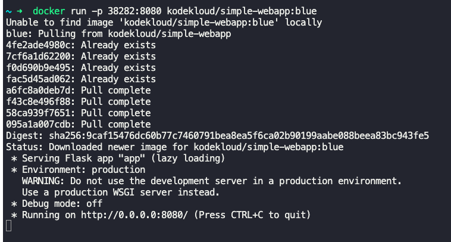
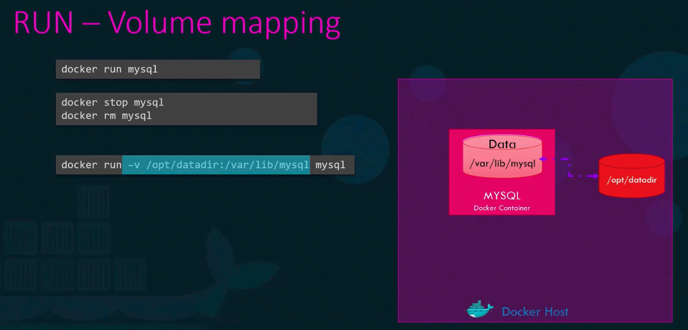

$`docker run redis:4.0`
- Runs a specific image or version of a docker image. It is specified as tag.
- Docker hub will have information about versions.

$`docker run -i sample-app`
- "-i" specifies interactive mode.
- Waits for user input after running.

$`docker run -it sample-app`
- "-t" specifies pseudo terminal.

**Docker port mapping**

$`docker run sample-webapp`
- <"Running on http://0.0.0.0:5000/">
- Every container running on docker host gets an internal i.p, say 172.17.0.2 in this case.
- This internal i.p is accessible only within the docker host.
	- So if we try reaching http://172.17.0.2:5000 from a browser outside the docker host, it will fail.

To be able to connect from outside the docker host, we need to map a port on the docker host to the port in which the container is listening.

$`docker run -p 80:5000 sample-webapp`
- This runs the container and listens on port 5000.
- Any connections to docker host i.p, say 192.168.1.5, on port 80 will be routed or mapped to this container on port 5000.
- This can be done for any number of container.

$`docker inspect <container_id or name>`
- Gives lot of details about the container in json format, including internal i.p of the container.

**Docker volume mapping**

- Every docker container has its own dedicated and isolated file system.
- Stopping and removing the docker container will delete the filesystem associated with the container.
- To persist the data of the container, we map it to a directory in docker host, outside of the container.

$`docker run -v /opt/datadir:/var/lib/mysql mysql`
- `/opt/datadir` specifies the directory in docker host.
- `/var/lib/mysql` specifies the directory in container.
- This command maps the `/var/lib/mysql` directory on the container to `/opt/datadir` directory on the docker host.
	- Even if the container is stopped and removed, the data will persist in the `/opt/datadir` directory of docker host.

$`docker logs <container_id or name>`
- Gives the stdout logs of the container.

---

