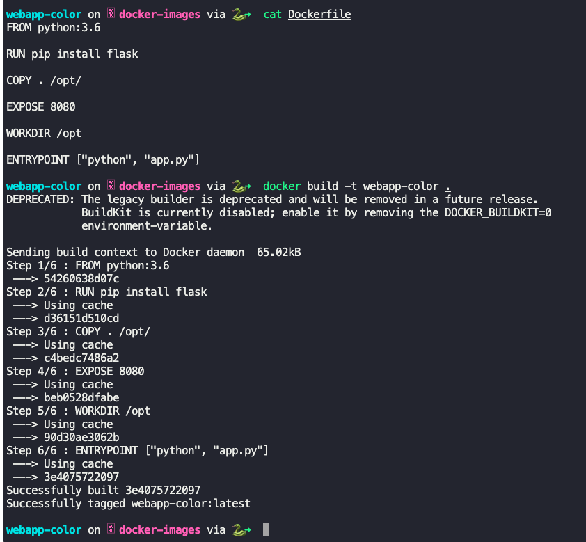
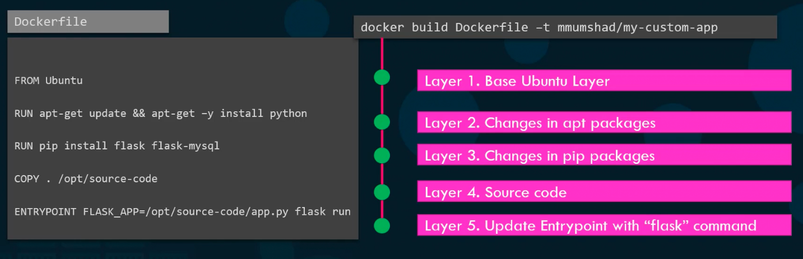
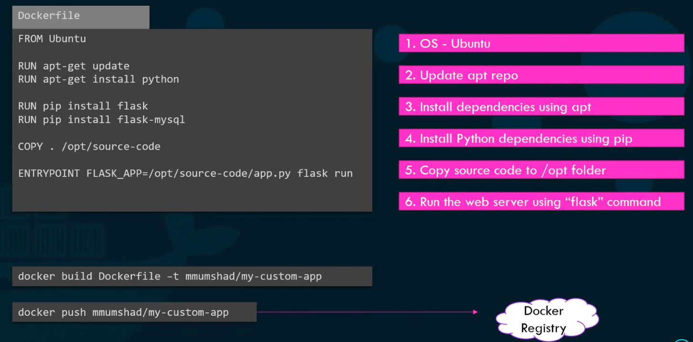
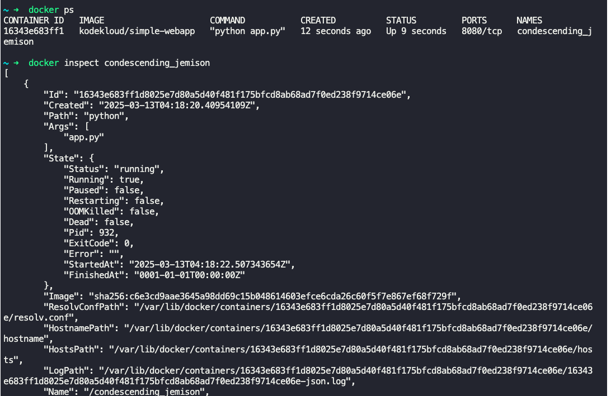
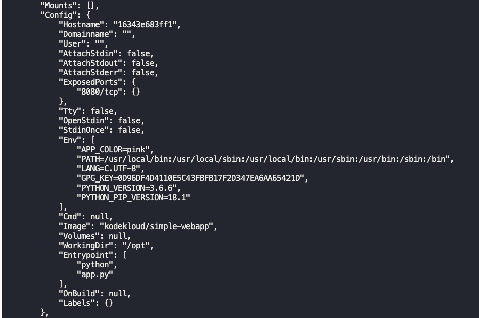
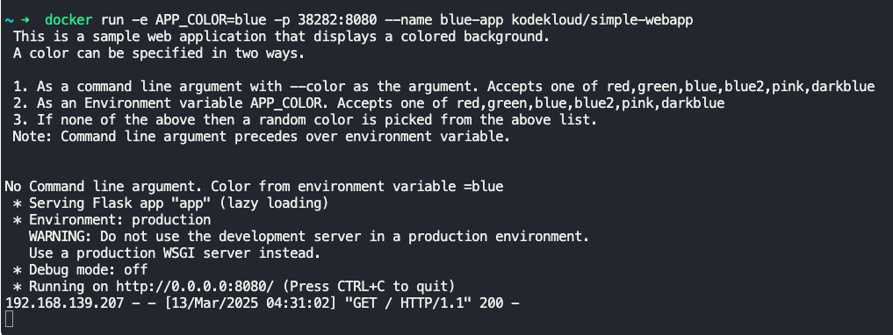
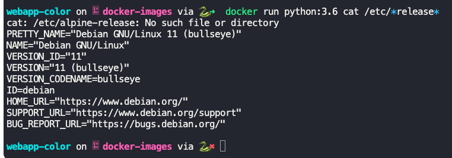
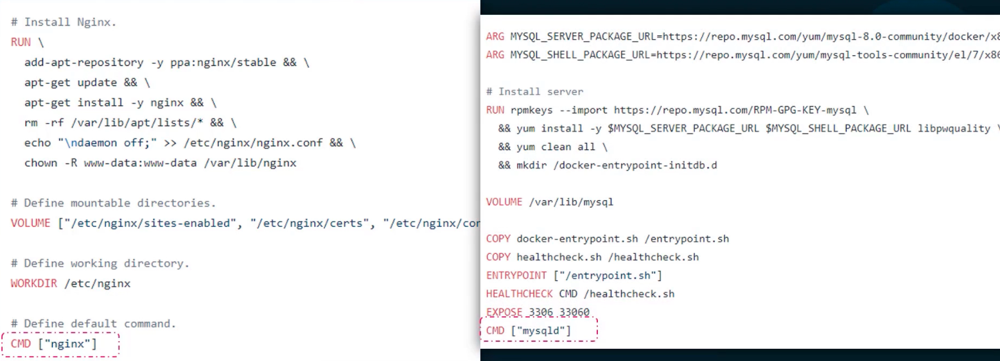
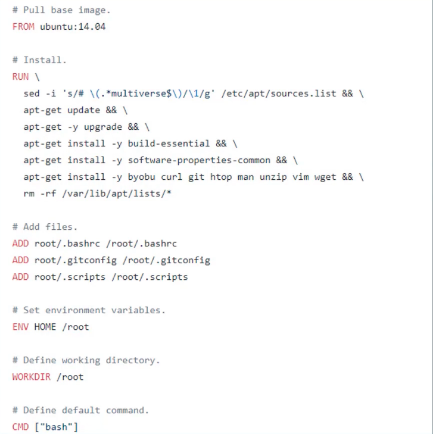

To bring up an application, we might need to perform some of the following setups manually
- Operating system - Ubuntu
- Update apt repo
- Install dependencies using apt
- Install python dependencies using pip
- Copy source code to `/opt` folder
- Run web server using flask command

To create a docker image of the above same application, we can specify all these steps in a docker file.

Once the docker file with all commands are specified, we can build the docker file to create a docker image.

$`docker build docker_file -t custom_app`
- Builds the docker image `custom_app` from the docker file `docker_file`.

$`docker push account_name/custom_app`
- To make the docker image available in docker hub.
- $`docker login` before pushing to docker hub.

**Docker file**

Format of docker file is `Instruction Argument`
- `FROM Ubuntu`
- `RUN apt-get update`
- `COPY . /opt/source-code`
- `ENTRYPOINT FLASK_APP=/opt/source-code/app.py flask run`

`FROM Ubuntu`
- Start from a base OS like Ubuntu or any other image.
- All docker files typically start from `FROM` instruction.

Install dependencies
- `RUN apt-get update`
- `RUN apt-get install python`

Copy source code
- `COPY . /opt/source-code`

`ENTRYPOINT FLASK_APP=/opt/source-code/app.py flask run`
- Command that will run when image is run.

Docker file is in a layered architecture
- OS
- apt
- pip
- source code
- Entry point

`docker build` gives sizes of each layer.
- Each layer is cached.
- If a step were to fail, during re-attempt it will start from where it failed.

---

### Environment variables

$`docker run -e APP_COLOR=blue simple-webapp-color`
- Pass the environment variable to the container when running it.

To find the environment variable set on an already running container
- $`docker inspect <container_id or name>`
- Check under "config":"env".

To set environment variable, name and port mapping in a single command run,
- `docker run -e APP_COLOR=blue -p 38282:8080 --name blue-app kodekloud/simple-webapp-color`

---

### Commands vs Entrypoints

- If you run `docker run ubuntu`, it will run and exit immediately.
- `docker ps -a` will list it.

Notes on containers
- Containers are meant to host a specific task or process, like web server, DB or analysis task.
- Container only lives as long as the process inside is alive.

Docker file defines what process is run when the container is started.
- `CMD` defines it. Ex: `CMD ["nginx"]`, `CMD ["mysqld"]`.
- Docker file for Ubuntu OS, it will be mentioned `CMD ["bash"]`.
	- "bash" is not a process, it listens for input from shell to execute.
- If you append a command to `docker run` command, it will override the default specification of `CMD` in docker file.
	- Ex: `docker run ubuntu sleep 5`

To change the default behaviour of ubuntu image to sleep 5 every time it runs.
- Create a new docker file
	- `FROM Ubuntu`
	- `CMD sleep 5 or ["sleep", "5"]`
- Build a new docker image
	- `docker build -t ubuntu-sleeper .`
- Run docker image
	- `docker run ubuntu-sleeper`
- To make it sleep for 10 seconds
	- `docker run ubuntu-sleeper sleep 10` 
	- This will override the "sleep 5" mentioned in the docker file.
- If you want to specify only the seconds, "5", "10", when running the docker run command, use "ENTRYPOINT".
	- In the docker file mention
		- `FROM Ubuntu`
		- `ENTRYPOINT ["sleep"]`
	- Now if you run `docker run ubuntu-sleeper 5`, it will sleep for 5 seconds.

Behaviour of CMD and ENTRYPOINT
- In case of "CMD", the command line parameters will replace the ones specified in docker file.
- In case of "ENTRYPOINT", the command line parameters will get appended to the "ENTRYPOINT" in the docker file.

To define a default behaviour, specify the argument in "CMD" in docker file like,
- `FROM Ubuntu`
- `ENTRYPOINT ["sleep"]`
- `CMD ["5"]`

Execution of ENTRYPOINT and CMD
- When executing `docker run ubuntu-sleeper`, "sleep 5" will be executed, which will be the default behaviour.
- When executing `docker run ubuntu-sleeper 10`, "sleep 10" is executed, where the "CMD" is overwritten by the command line parameter "10", and is appended to the "ENTRYPOINT" sleep.

To modify the ENTRYPOINT
- `docker run --entrypoint sleep2.0 ubuntu-sleeper 10`

---

