### References

[https://docs.docker.com/compose/](https://docs.docker.com/compose/)

[https://docs.docker.com/engine/reference/commandline/compose/](https://docs.docker.com/engine/reference/commandline/compose/)

[https://github.com/dockersamples/example-voting-app](https://github.com/dockersamples/example-voting-app)

---

### Docker Compose

- Configuration is specified in YAML file. docker-compose.yml.
- Sets up complex application requiring different services, with necessary options for each.
- Once docker compose file is created, you can bring up the entire application stack using
	- $ `docker-compose up`

**Sample Architecture**

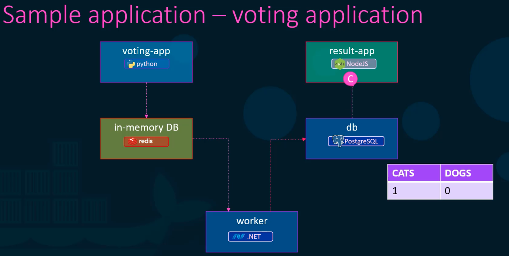

Lets take a sample voting application with the above architecture.
- There is a frontend called "voting-app", written in FLASK Python.
	- This takes user's vote as input.
- The above frontend application stores the user's vote in Redis in-memory cache.
- The "worker" service reads the data in Redis in-memory cache and stores it in a PostGreSQL DB.
- There is another frontend called "result-app", written in NodeJS, to display the results.

To setup this entire application, we could use `docker run` command and run each service as below.

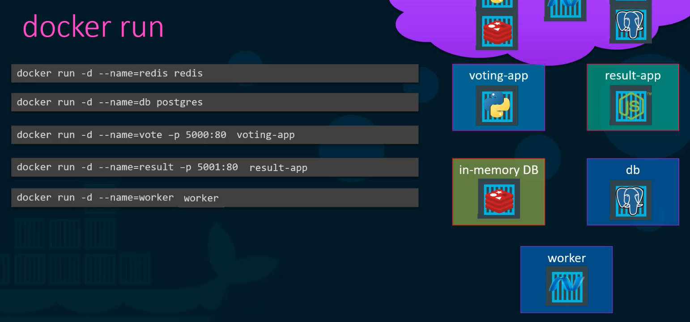

`docker --links` is used to connect 2 containers together.
- In the above image the "voting-app" service does not know where the "redis" container is running, "worker" app does not know where both the "redis" and "postgres" containers are running.
- So the application will fail to function.
- To solve this, we need to link the necessary containers.
- P.S: `--links` will be deprecated soon.

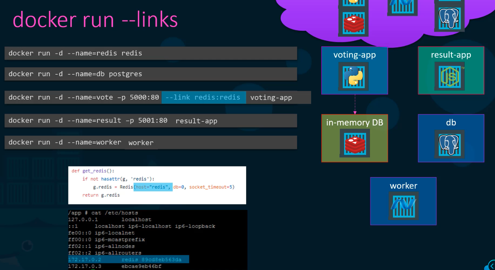

In the above screenshot, the "voting-app" container is linked to the "redis" container.
- Effectively what happens is , in the `/etc/hosts` file in the "voting-app" container, a entry is added to resolve "redis" to the container's internal i.p address.

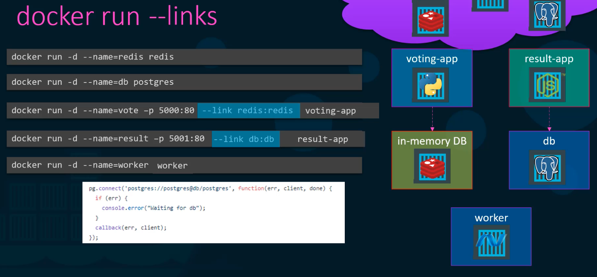

In the above screenshot, the "result-app" is linked to the postgres container.

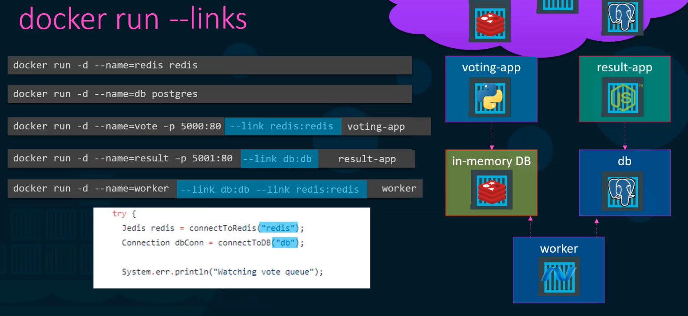

In the above screenshot, the "worker" app is linked to both "redis" and "postgres" containers.

Sample docker run commands with linking and port specifications

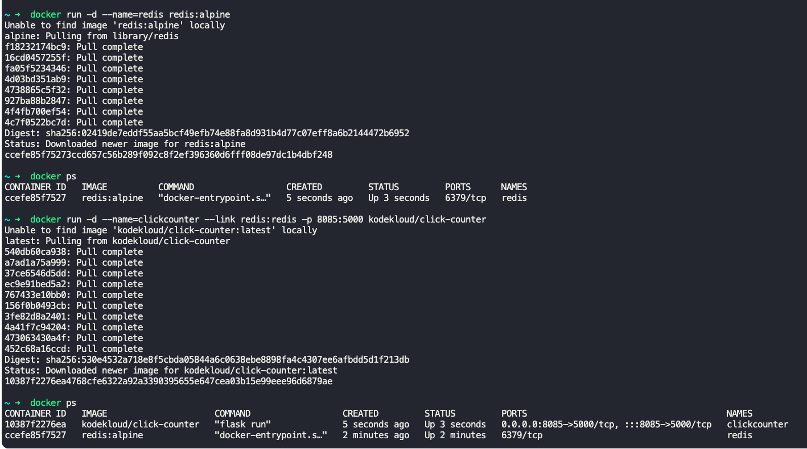

Instead of running each individual `docker run` commands, we can create a docker compose file with all the services and its required options, required for the application to run.

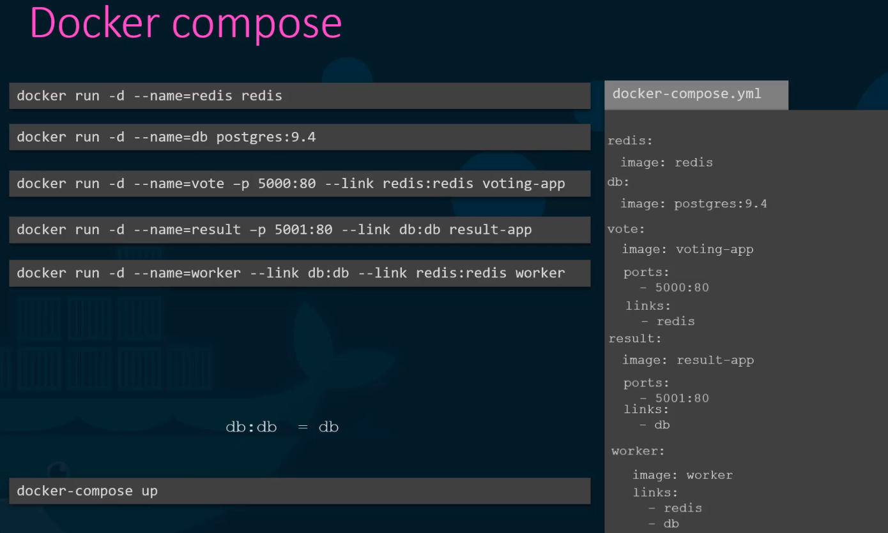

Elucidating the above screenshot.
- `redis`, `db`, `vote` etc are dictionary of container names.
- `image: redis`, `image: postgres:9.4` are image names.
- `ports:` specifies the port mapping host:container.
- `links:` specifies links to other containers in the application.
	- `db:db` is same as `db`.

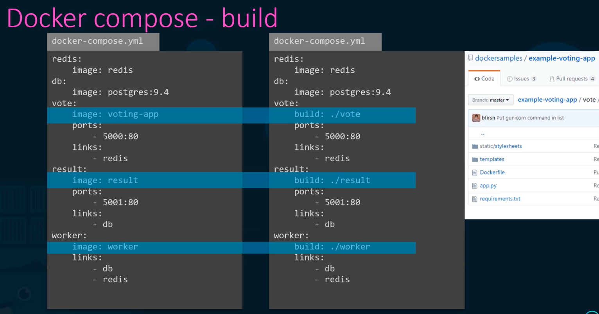

- Services such as "voting-app", "result", and "worker" are build by us, and are not readily built and available in docker hub.
- If the services are not built, there are 2 options.
	- 1. Using `docker build` we can create the image of the service and mention in the docker compose file.
	- 2. We can specify to build the service in docker compose file.
		- `build: ./<folder_name>`
		- When the docker compose file runs, it will build the service's image on the fly.
	- In either of the above cases, the service is build based on the specification/configuration in "DockerFile" of the service.
		- This is normally placed along with the code.

There are 3 versions of docker compose

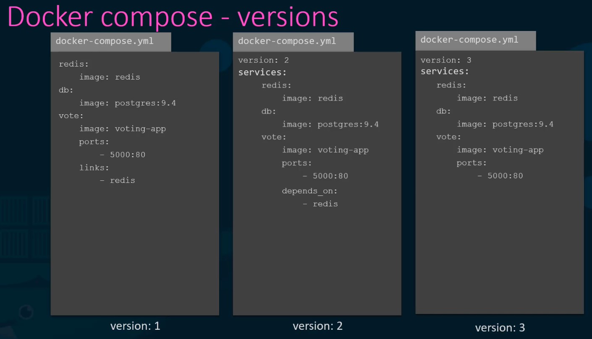

Docker compose version 2 and greater
- Need to specify version at the top of the file.
- Need not specify links, automatically all containers specified in the compose files are linked.
- Automatically adds all services in the compose file (the specified application) to a dedicated network bridge.
	- Each container can talk to other using service/image name.
	- In Docker compose v1, all containers, including those outside the compose file are added to the default network bridge.
- `depends-on` can be added to specify starting order to resolve dependencies to other containers.
- Docker stacks and swarms work from v3 onwards.

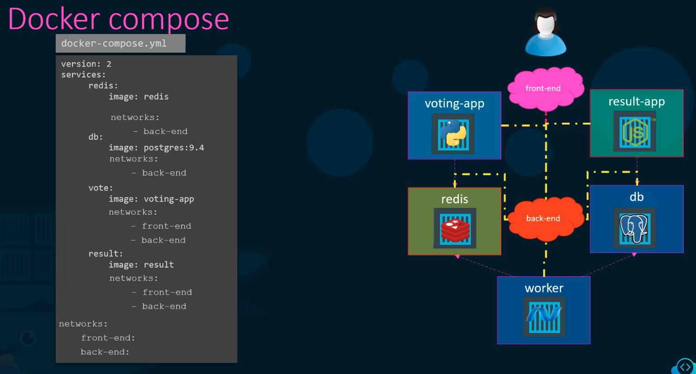

As shown in the above screenshot, different networks for the services in application can be specified.
- In the above, 2 networks are defined, "front-end" and "back-end".
- "vote" and "result" containers are mapped to both "front-end" and "back-end" networks.
- "db" and "redis" containers are mapped to only "back-end" network.

If a container like PostGreSql needs environment variables such as user name and password to start, we can specify them in the docker compose file using `environment:` as follows.

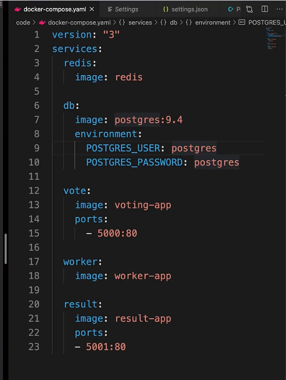

