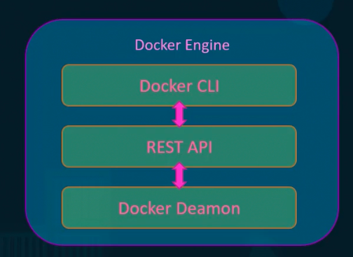
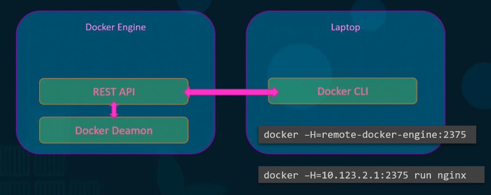
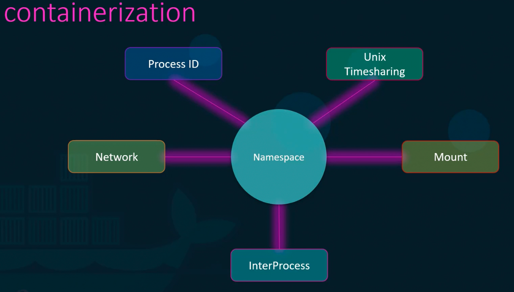
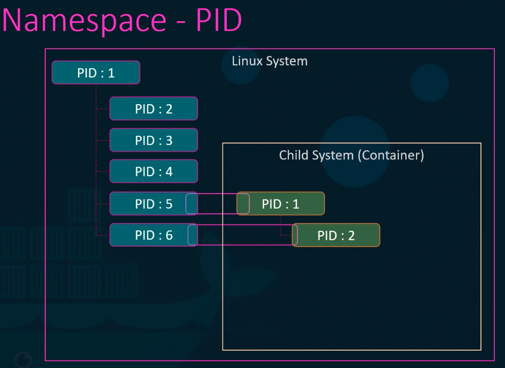
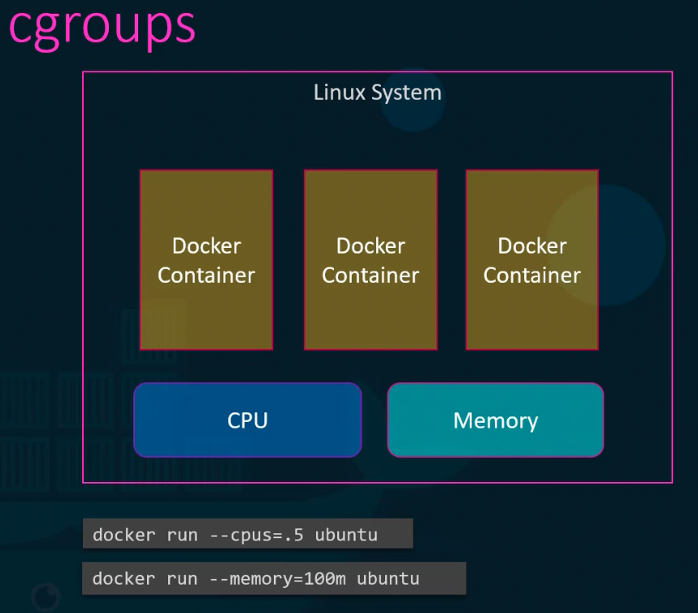
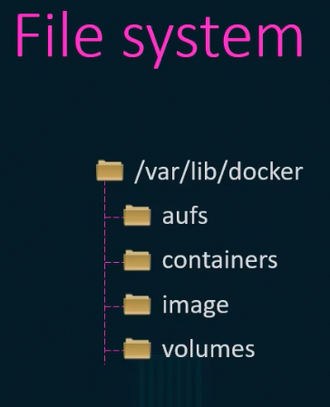
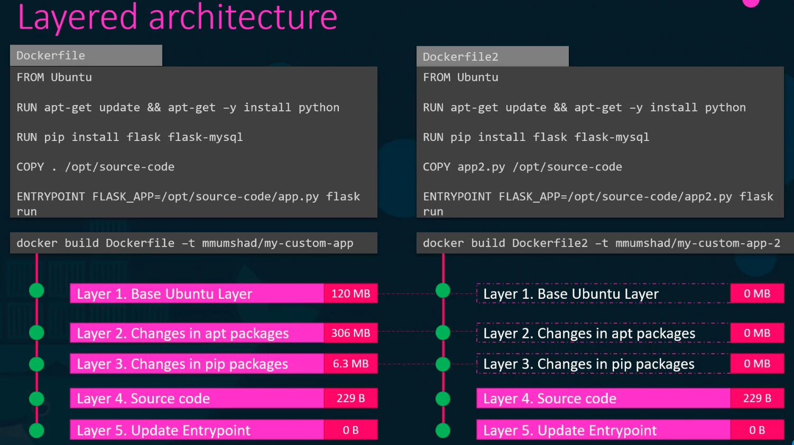
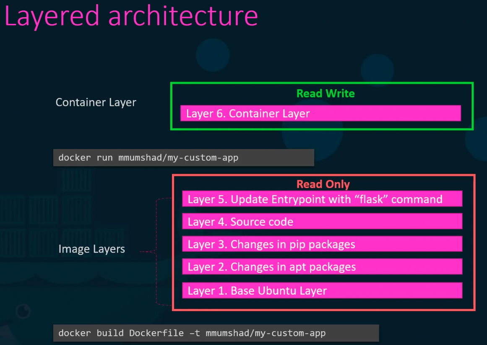
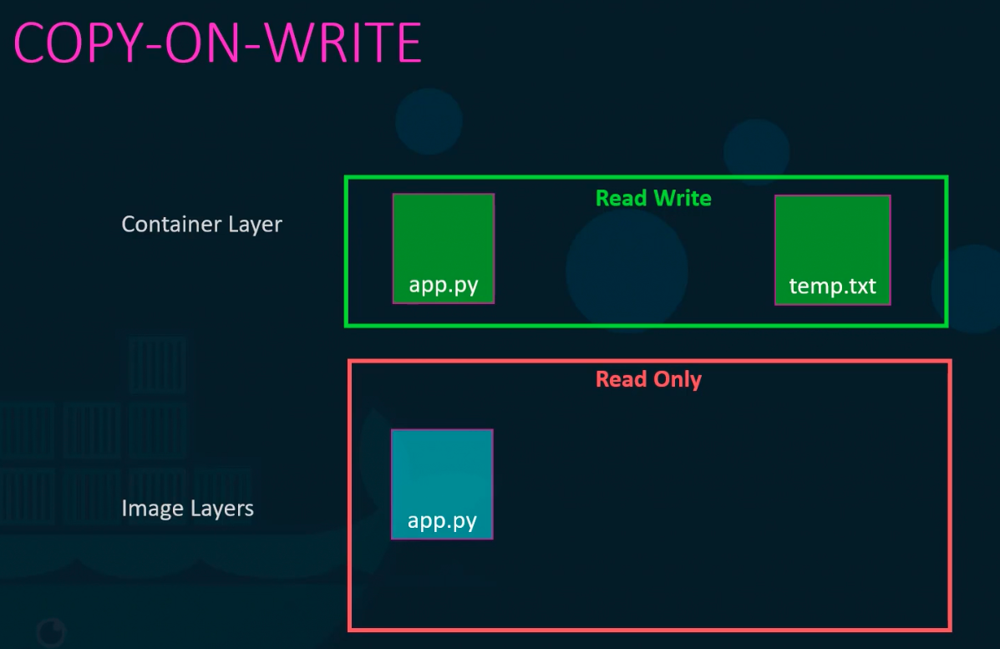
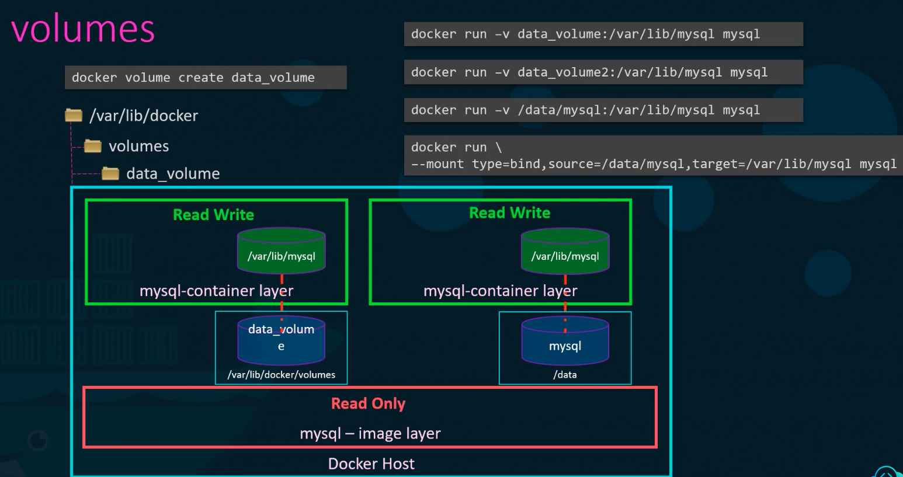

### Docker Engine

Docker installed on a host is referred to as Docker engine.

Three components in Docker engine

1. Docker daemon - It is the background process managing images, containers, volumes and networks.
2. Rest API - API interface that programs can use to talk to docker daemon
3. Docker CLI - 
	1. CLI to run docker commands. It uses Rest APIs to interact with the underlying Docker daemon.
	2. Docker CLI can be on a laptop and can still work with a remote docker engine.
		1. $`docker -H = remote-docker-engine:2375`
		2. $`docker -H = 10.123.2.1:2375 run nginx`

---

### Containerisation

Docker user Namespaces to isolate containers from one another. The following are part of a Namespace.
- Process ID
- Network
- Inter process communication
- Unix time sharing
- Mount

**Isolating using PID Namespace**

- Whenever a system boots up, root process with PID:1 is started, and subsequently multiple other processes are started with PID:2, ID:3, etc.
- When we start a container, say nginx service, for the container (or in the container) the nginx runs with PID:1. Whereas, in the docker host, the PID for the nginx service will be something else, say PID:5.

**Cgroups**

- Docker uses croups to restrict amount of hardware resources allocated to each container.
- $`docker run --cpus=.5 ubuntu`
	- Ensures the container does not take more than 50% of underlying cpu resources at any given time.
- $`docker run --memory=100m ubuntu`
	- Ensures the memory available for the container is maximum 100MB.

**Docker storage**

- When docker is installed, it creates folder under `/var/lib/docker`, under which all files related to images, containers, etc are stored in different folders.

**Layered architecture**

- When building docker images, docker uses layered approach as specified in the docker file.
- It reuses a layer from one container to the other if it is similar, thus saving strage space and time required to build the docker image.

- Container layer is a writable layer for the application to write changes or user inputs, logs etc.
- The life of the container layer is as long as the container is alive.

**Copy on write**

- Read-Write is done on Container layer only.
- Image layer is read only.
- When the container is deleted, all the data with respect to the container layer are deleted.

**Persistant volumes**

- All docker files are stored under `/var/lib/docker`.
- $`docker volume create data_volume`
	- This creates a folder `data_volume` under `/var/lib/docker/volumes/`.
- To persist data, run
	- $`docker run -v data_volume:/var/lib/mysql mysql`
		- This is a volume mount.
		- This stores the data present under `/var/lib/mysql` in the container layer, to the `/var/lib/docker/volumes/data_volume` folder in docker host.
	- $`docker run -v /data/mysql:/var/lib/mysql mysql`
		- This is a bind mount.
		- This stores data present under `/var/lib/mysql` in the container layer, to the `/data/mysql` folder in docker host.
		- Similar command - `docker run --mount type=bind, source=/data/mysql, target=/var/lib/mysql mysql`

Docker command with following options
- `--name`
- `-e` - environment variable
- `-v` - volume mount

![[dockerrunwithenvvarandvolmap.png]]

---
