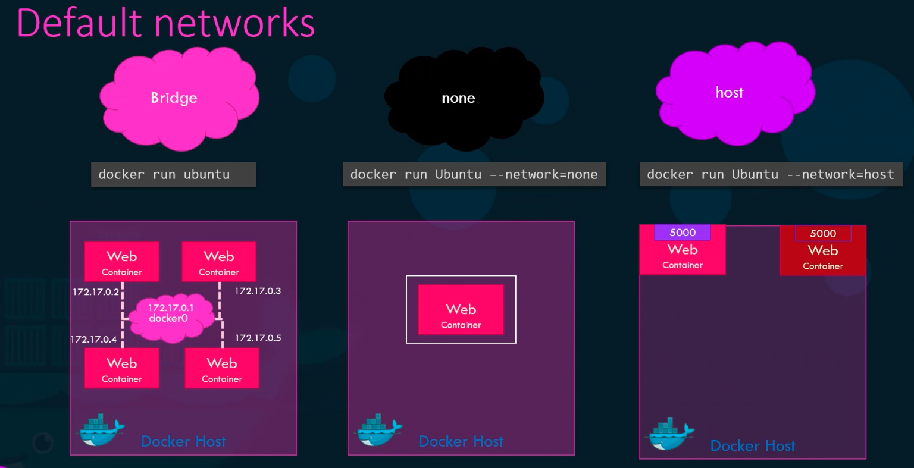
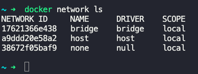
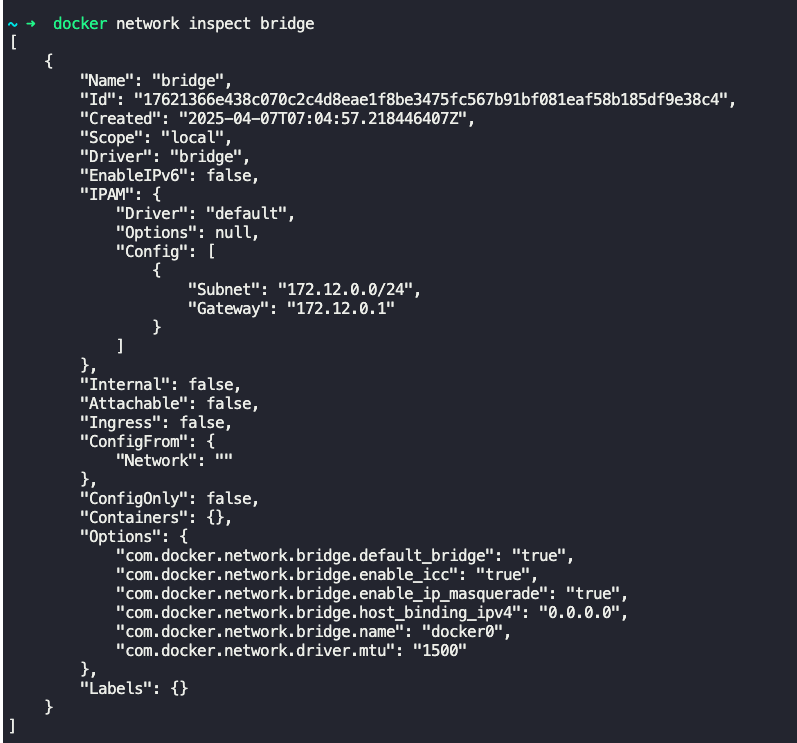
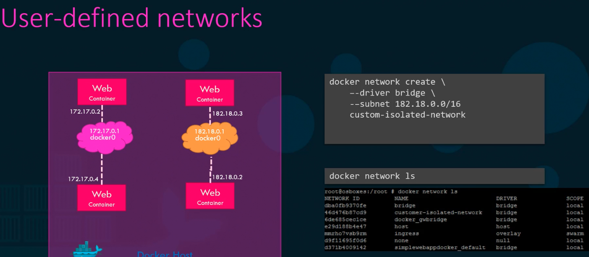
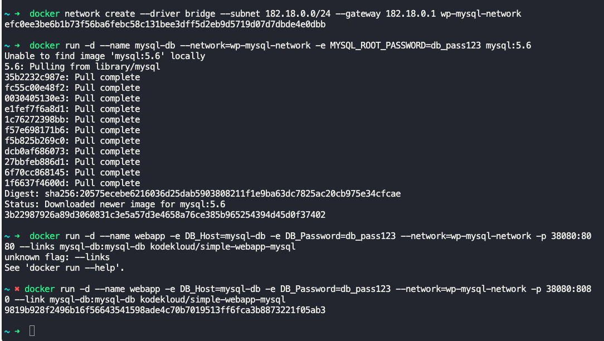
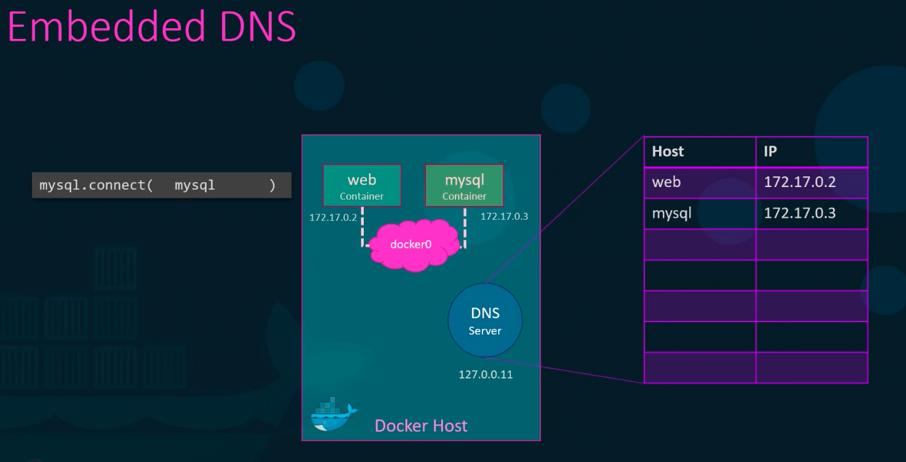

### Docker Networking

When Docker is installed, 3 networks are created automatically

- Bridge
	- Default network a container gets attached to.
	- This is a private internal network. All containers get an internal i.p usually in 172.17.0.0 series.
	- Containers can communicate with each other using this i.p.
	- Port mapping is used to access these containers from outside.
- Host
	- Containers are directly attached to docker host's network.
	- No isolation between host and docker container.
		- $`docker run --network=host ubuntu`
	- If a web application is attached to host network, then can be accessed from outside without port mapping.
		- Make use of unique ports for each container.
- None
	- $`docker run --network=none ubuntu`
	- Containers are not attached to any network, and cannot be accessed from outside or from other conatiners.

**User defined networks**
User defined networks can be created using
- $`docker network create --driver bridge --subnet 182.18.0.0/16 custom-isolated-network`
- $`docker network ls` -> Lists all docker network
	- 
- To check the network type, i.p and other network related details of a container, run the following command and check under "Network settings:Networks"
	- $`docker inspect <container_id or name>`
	- 

All commands
- Create network
	- $`docker network create --driver bridge --subnet 182.18.0.0/24 --gateway 182.18.0.1 wp-mysql-network`
- Join to a user defined network, along with setting environment variables and name for the container
	- $`docker run -d --name mysql-db --network=wp-mysql-network -e MYSQL_ROOT_PASSWORD=db_pass123 mysql:5.6`
- Join to a user defined network, along with setting environment variables, name for the container, port mapping, links to another container and run it in detached mode
	- $`docker run -d --name webapp -e DB_Host=mysql-db -e DB_Password=db_pass123 --network=wp-mysql-network -p 38080:8080 --link mysql-db:mysql-db kodekloud/simple-webapp-mysql`
- 

**Embedded DNS**
- Containers can talk to each other using container names.
- Docker has a built in DNS server that helps the containers resolve their container names to their corresponding internal i.ps.
- Built in DNS server runs at 127.0.0.11.
- $`docker network inspect bridge`
- 

---
