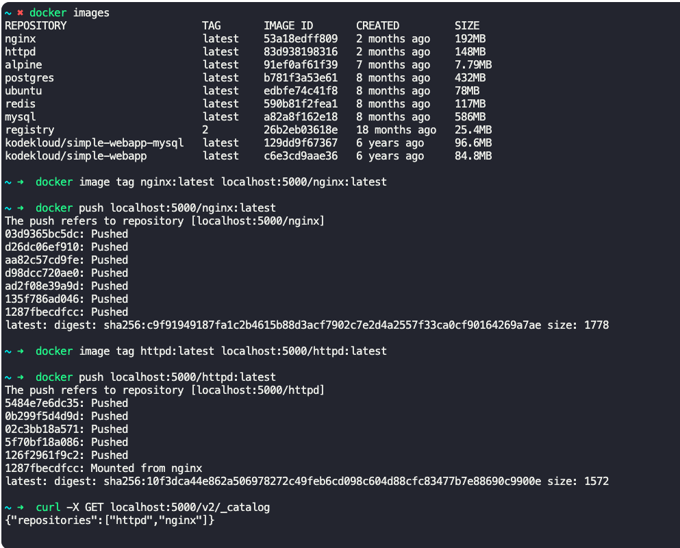

### Docker Registry

Registry - Central repository for all docker images.
- Dockerhub is a registry.
- By default, docker engine talks to dockerhub.

Public registry like dockerhub (docker.io) and gcr.io (Google's registry) hosts container images for public consumption.

Private registry can be hosted internally for hosting applications built in-house and restrict access to those images.

To deploy a private registry, you can use dockerhub registry's image and deploy it internally.
- $`docker run -d p- 5000:5000 --name registry registry:2`

To push an image to the private registry
- $`docker image tag my-image localhost:5000/my-image`
- $`docker push localhost:5000/my-image`

To check images in the private registry
- `curl -X GET hocalhost:5000/v2/_catalog`

To pull an image from private registry
- $`docker pull localhost:5000/my-image`

To login to a docker registry server
- $`docker login <server>`

To remove docker images and containers which are not running
- $`docker image prune -a`

---

