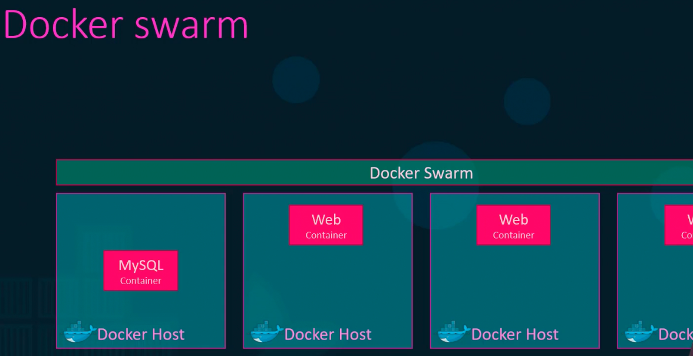
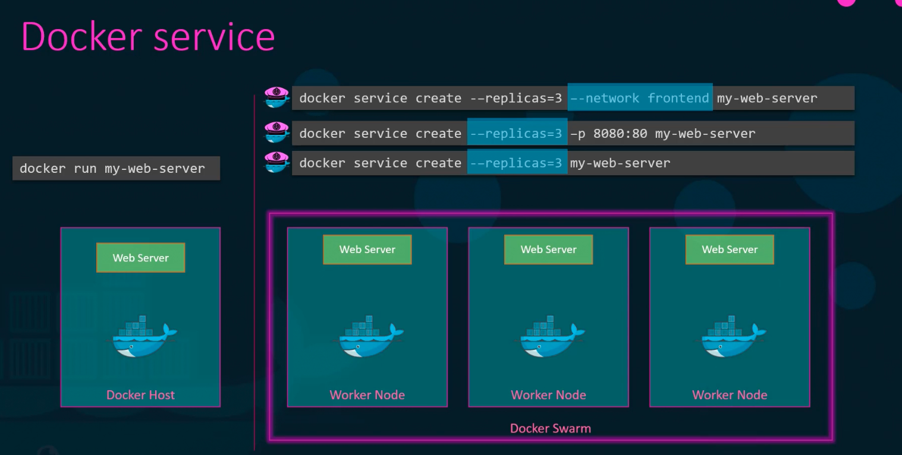
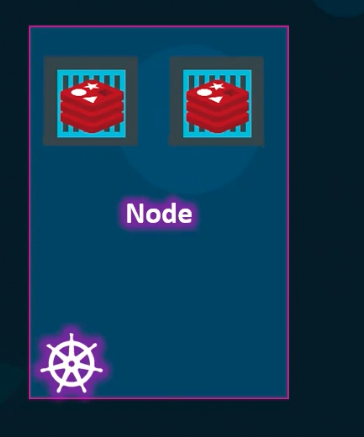
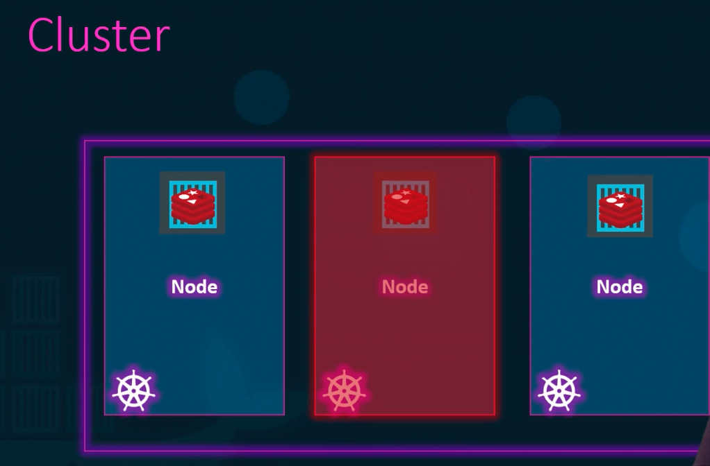
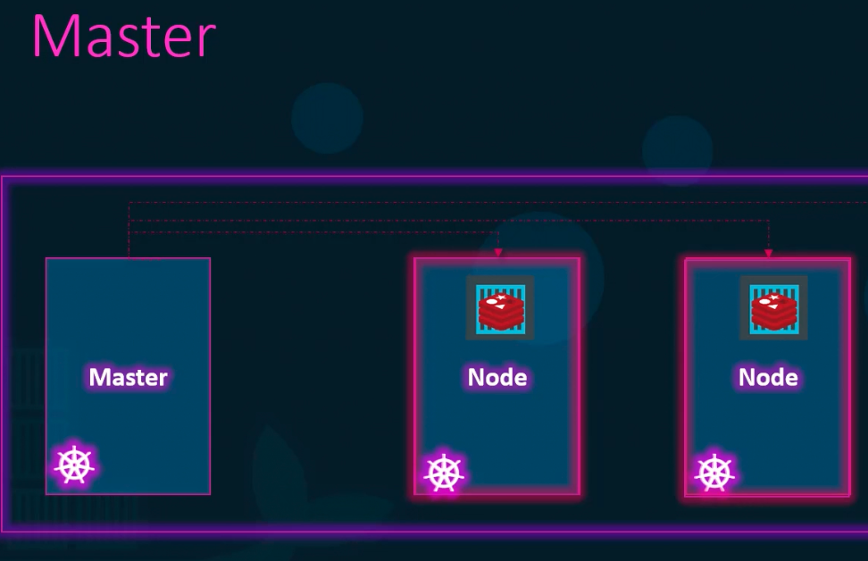

### Container Orchestration

Contains a set of tools and scripts that can host containers in a production environment.
- Contains multiple docker hosts to host containers.
- Provides clustering and scaling.
- Provides networking between containers.
- Provides load balancing.
- Provides storage management, configuration management, and security across hosts and containers.

Different container orchestration solutions
- Docker has Docker Swarm
	- Lacks advances auto scaling features.
- Google has Kubernetes
	- Widely used across GCP, AWS and Azure.
- Mesos from Apache
	- Difficult to setup and get started.

**Docker Swarm**

- Combines different hosts to form a cluster.
- Will take care of distributing instances to separate hosts for high availability and load balancing.
- There is a master/management node, which manages worker/slave nodes.
- Docker service is used to create a docker swarm
	- $`docker service create --replicas=3 --network frontend my-web-server`
	- The above command deploys 3 instances of "my-web-server" application and connects them to "frontend" network.
- 

**Kubernetes Introduction**
- Kubernetes is a widely used container orchestrator.
- Scales up and down easily.
- Manages cluster and load balancing.
- Kubernetes primarily uses Docker to deploy containers.

**Node**
- Node is a machine on which Kubernetes software is installed.
- It is the worker machine where containers will be launched.
- 

**Cluster**
- Cluster is a set of nodes grouped together.
- Master node in the cluster manages worker nodes.
- 
- Master-Worker nodes

**Components of Kubernetes**
- API Server -> Frontend
- etcd service -> key-value store for cluster
- kubelet service -> Agent that runs on every node in the cluster
- container runtime service -> Underlying software to run containers (docker)
- controller service -> Monitors when nodes/containers go down
- scheduler service -> Distributes work across nodes

`kubectl`
- Kube control tool
- Kubernetes CLI
- Lots of commands to deploy, manage and monitor clusters and containers.

---
