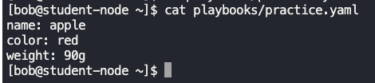
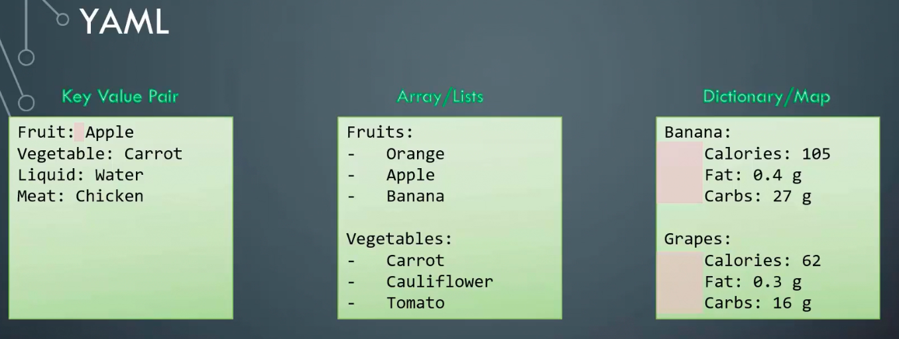
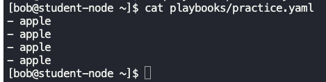
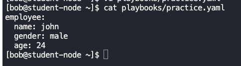
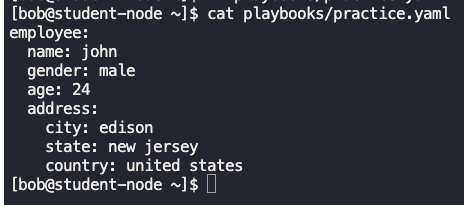
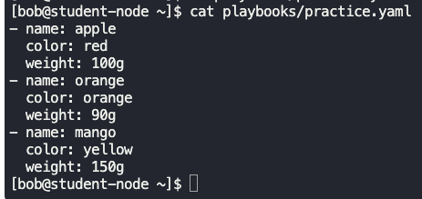
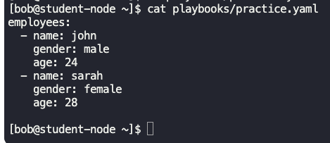
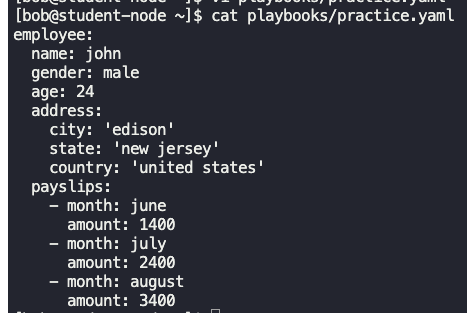

### YAML
- It is used to represent configuration data.
- key-value pair representation.
	```
	Fruit: Apple
	Vegetable: Carrot
	Liquid: Water
	```



- Spacing in the configuration is critical.



- Arrays/Lists are represented as below
```
Fruits:
-   Orange
-   Apple
-   Banana

Vegetables:
-   Carrot
-   Cauliflower
-   Tomato
```



- Dictionary is represented as below
```
Banana:
   Calories: 105
   Fat: 0.4 g
   Carbs: 27 g

Grapes:
   Calories: 62
   Fat: 0.3 g
   Carbs: 16 g
```



- Dictionary within a Dictionary



- Dictionary within an Array



- Array within a Dictionary






---


