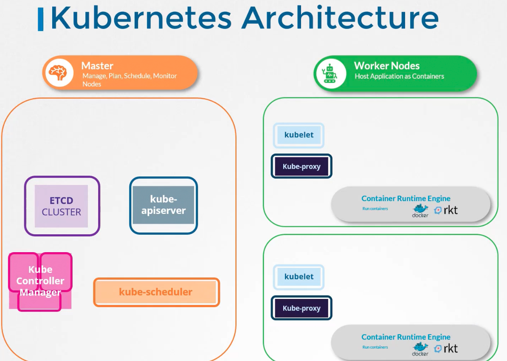

### Course details

**Presentation deck**

**Course Notes**

https://notes.kodekloud.com/docs/CKA-Certification-Course-Certified-Kubernetes-Administrator/Introduction/Course-Introduction

[https://github.com/kodekloudhub/certified-kubernetes-administrator-course](https://github.com/kodekloudhub/certified-kubernetes-administrator-course)
- Repository of notes, links to documentation, and answers to practice questions here

---

### Cluster architecture

- Purpose of Kubernetes is to host applications in the form of containers, in an automated fashion
- Kubernetes enables easy deployment of number of instances
- Kubernetes enables communication between services
- 
- Two types of Nodes
	- Worker nodes - Hosts applications as containers
	- Master nodes
		- Responsible for managing Kubernetes cluster
		- Stores information regarding different nodes
		- Planning deployment of containers
		- Monitoring health of containers
- Components of Master node
	- Etcd cluster
		- This is a key-value store database
	- Kube-scheduler
		- Scheduler identifies the right node to place a container on, based on the container's resource requirements, worker node capacity and any other policy constraints
	- Controllers / Controller-Manager
		- Takes care of different areas of managing Kubernetes cluster
		- Node Controller
			- Takes care of nodes
			- Responsible for on-boarding new nodes to the cluster
			- Monitors node health etc
		- Replication Controller
			- Ensures desired number of containers are running at all time
	- Kube-apiserver
		- This is the primary management component
		- Responsible for orchestrating all operations within the cluster
		- Exposes Kubernetes API to perform management operations on the cluster
	- Container runtime engine
		- To run the containers, ex: containerD, Docker
		- Master node components can also be run as containers
	- Kubelet
		- It is an agent which runs on each node in the cluster
		- It listens for instructions from kube-apiserver and deploys/destroys containers on the node as required
		- Kube-apiserver periodically fetches status from Kubelet to monitor status of nodes and containers on them
	- Kube-proxy
		- Enables communication between containers across worker nodes

---
