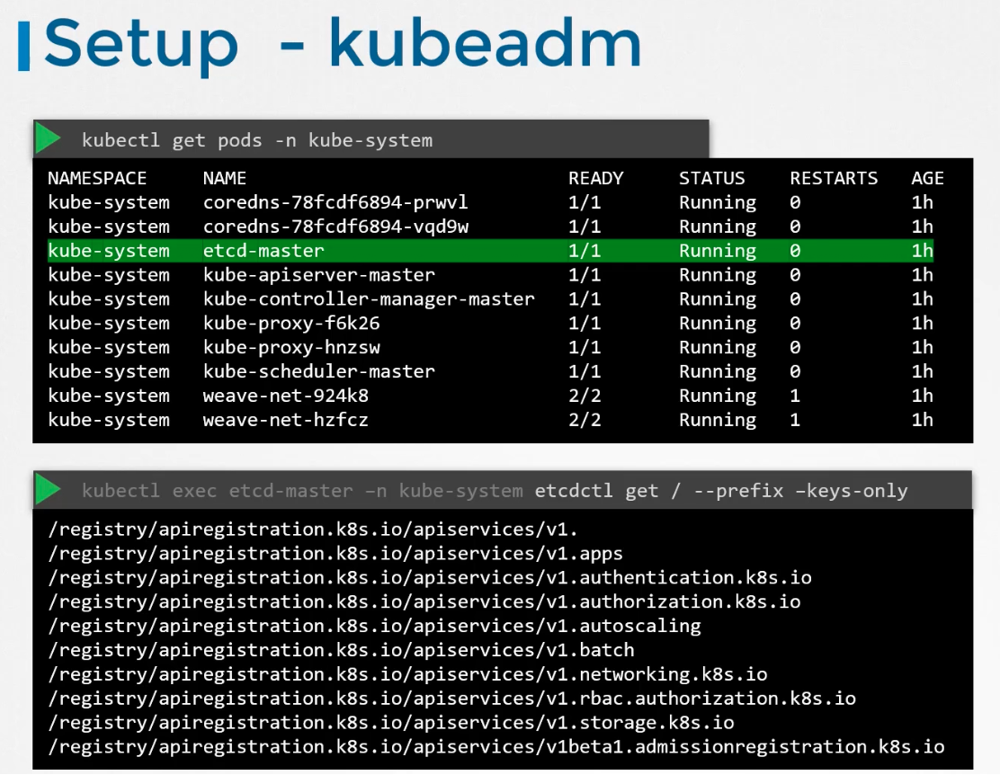

### Etcd

- Distributed, reliable key-value store that is simple, secure, and fast
- Key-value store example
```
"name": "John"
"age": "30"
"location": "NY"
```

**Install Etcd**

- Download binary based on OS from release pages etcd.io/etcd/releases/
- Extract - `tar -zxvf ....tar.gz`
- Run etcd service
	- $`./etcd`
	- This starts etcd service on port 2379
- Default control client which comes up with Etcd is `etcdctl`
	- $`./etcdctl set key 1 val 1`
		- This stores a key value pair
	- $`./etcdctl get key 1`
		- Retrieves a value
	- $`./etcdctl`
		- Shows all options
	- $`./etcdctl --version`
		- Shows both etcdctl version and the supported api version
	- To run etcdctl using a specific API version, (by default it is version 2)
		- $`ETCDCTL_API=3 ./etcdctl version` - by setting environment variable before running each command
		- Or set it for entire session
			- $`export ETCDCLT_API=3`
			- $`./etcdctl version`
	- In version 3
		- $`./etcdctl put key 1 val 1` - Stores / sets a key value pair
		- $`./etcdctl get key 1` - Retrieves / gets a value
- Etcd's role in Kubernetes
	- Etcd stores information about cluster such as
		- Nodes
		- Pods
		- Configurations
		- Secrets
		- Accounts
		- Roles
		- Bindings
- Every information we get from running `kubectl get` command is from etcd store.
- Any changes to cluster is updated in ecd store

**Configuring Etcd**

- Two ways to configure
	- Manually
		- Kube-apiserver should be configured with the client-url of the etcd server with port 2379
	- via Kubeadm
		- Kubeadm deploys etcd server as a pod
- $`kubectl get pods -n kube-system`
	- Lists all pods in the control plane, including the etcd server pod (etcd-master)
	- 
	- You can explore the database using etcdctl utility within the etcd-master pod.
	- $`kubectl exec etcd-master -n kube-system etcdctl get / --prefix -keys-only` - Gives all keys stored by Kubernetes
- Kubernetes stores data in a specific directory structure
	- Registry
		- Minions
		- Pods
		- ReplicaSets
		- Deployments
		- Roles
		- Secrets
- In a high availability environment, multiple etcd servers are spread across multiple master nodes
	- Configuration and settings are present in `etcd.service` file ("initial-cluster" is for high availability)


---
