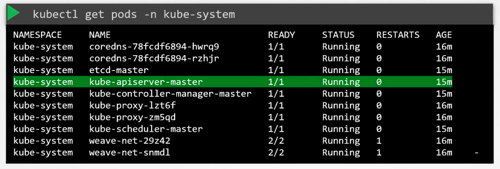

### Kube API Server

- When `kubectl` command is run, it is reaching the Kube-apiserver.
	- Kube-apiserver authenticates and validates the request
	- Then it retrieves data from etcd datastore.
- Background steps when a Pod is created
	- Step 1 - Kube-apiserver creates a pod object without assigning it to a node
		- Kube-apiserver updates this information in etcd server
		- Kube-apiserver responds back to the user that the pod is created
	- Step 2 - Kube-scheduler continuously monitors Kube-apiserver and realises there is pod created with no nodes assigned
		- Kube-scheduler identifies the node to place the new pod on and communicates it to the Kube-apiserver
	- Step 3 - Kube-apiserver updates the node information received fro Kube-scheduler in the etcd cluster
	- Step 4 - Kube-apiserver passes the information of the pod to Kubelet in the appropriate worker node
	- Step 5 - Kubelet then deploys the pod on the node and instructs the container runtime engine to deploy the image
		- Once done, Kubelet updates the status back to Kube-apiserver.
	- Step 6 - Kube-apiserver updates the container creation and deployment information in etcd cluster.
- A similar pattern, like above, is followed every time a change is requested in the cluster.
- Kube-apiserver is at the centre of all the tasks which are made to the cluster
- Kube-apiserver is the only component which interacts with etcd datastore
- You can manually install and configure Kube-apiserver on the master node, by downloading the corresponding binary
	- Configuration of kube-apiserver is present in `kube-apiserver.service`
- $`kubectl get pods -n kube-system`
- 
	- `kube-apiserver-master` is the pod where the kube-apiserver is running in the master node
- kube-apiserver pod definition file - /etc/kubernetes/manifests/kube-apiserver.yaml

---
