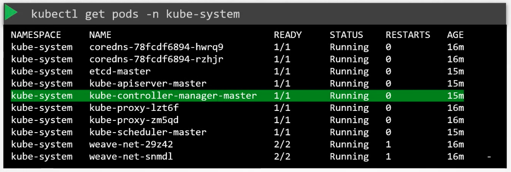

### Kube Controller Manager

- Controller is a process that continuously monitors the state of various components within the system, and works towards bringing the whole system towards the desired functioning state
- Node-controller
	- Monitors nodes and takes necessary actions to keep it running
	- It does that via kube-apiserver
	- Checks the status of nodes every 5 seconds
	- If heartbeat is not received from a node, it waits for 40 seconds before marking it unreachable
	- After marking it unreachable, it gives 5 minutes to come back up
	- It it doesn't come back up, it removes the pods assigned to that node and provisions them on healthy nodes
- Replication-controller
	- Responsible for monitoring the state of replica sets and desired number of pods are available within the replica set
	- If a pod dies, it creates another one
- Other controllers
	- Deployment controller
	- Namespace controller
	- Endpoint controller
	- Job controller
	- PV-protection controller
	- PV-Binder controller
	- Service-account controller
	- Stateful-set
	- Replica set
	- Cronjob
- All Kubernetes constructs are implemented through these controllers
	- It is the brain behind Kubernetes
- All controllers are packed into a single process called "kube-contoller-manager"
- You can manually install and configure kube-controller-manager on the master node, by downloading the corresponding binary 
- Service - kube-controller-manager.service
	- All configurations are present here
- $`kubectl get pods -n kube-system` - Lists the pod in which kube-controller-manager is running (kube-controller-manager-master)
	- 
- Pod definition file - /etc/kubernetes/manifests/kube-controller-manager.yaml

---
