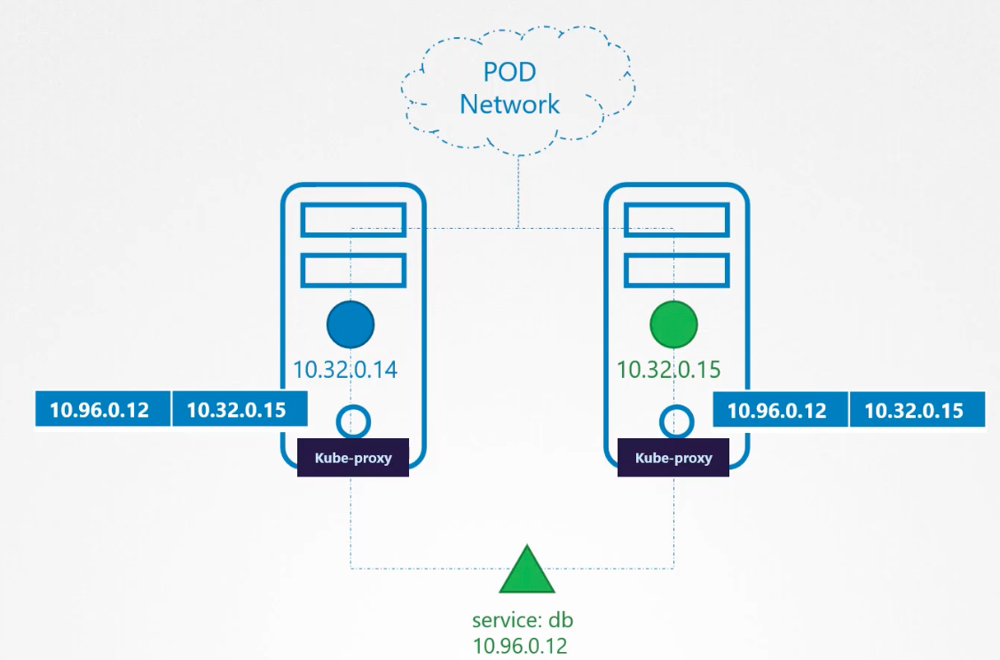
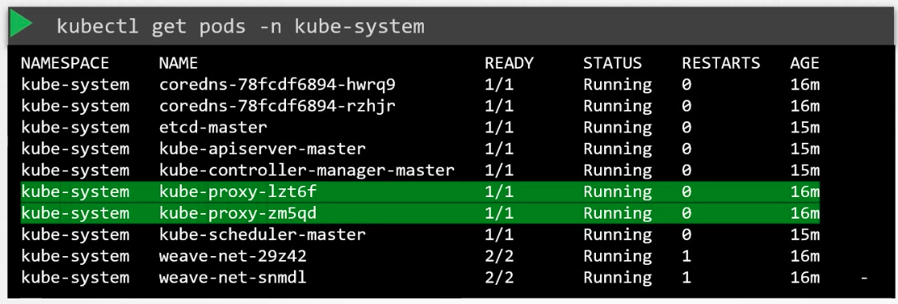

### Kube Proxy

- Within a Kubernetes cluster, every pod can reach every other pod
	- This is achieved by deploying a pod networking solution
- Pod network spans across all nodes in the cluster
- kube-aproxy is a process which runs on each node on the Kubernetes cluster
	- It looks for new services created and whenever a new service is found, it creates appropriate rules on each node to forward traffic to those services to backend pods
	- This is done using IPTable rules
- 
-  You can manually install and configure kube-proxy, by downloading the corresponding binary 
- Service - kube-proxy.service
- Kubeadm tool deploys kube-proxy as pods on each node
- $`kubectl get pods -n kube-system`
- 

---
