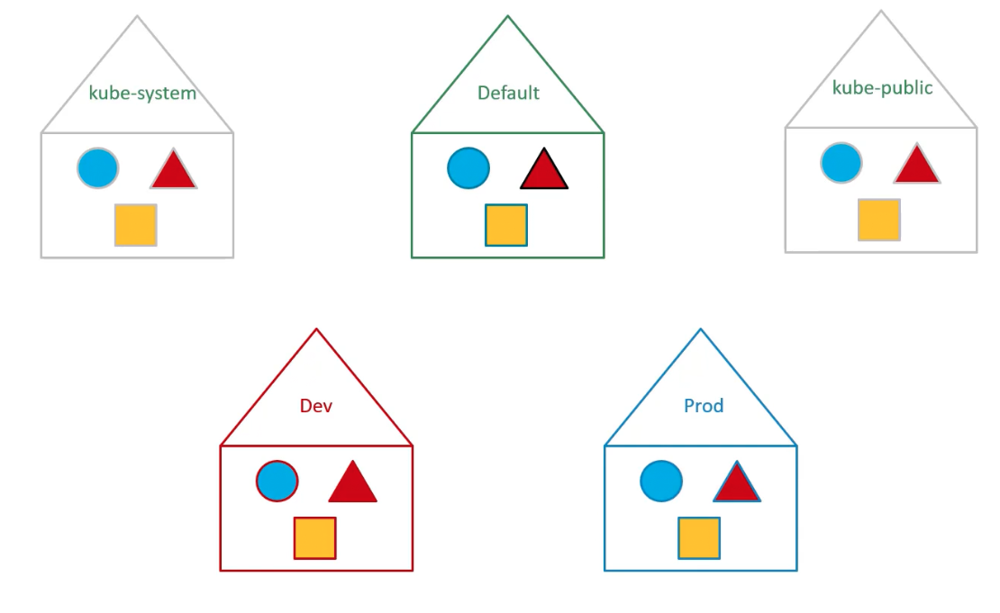
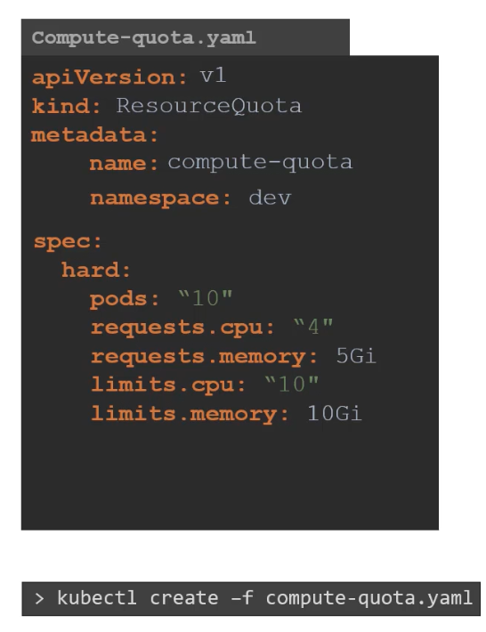
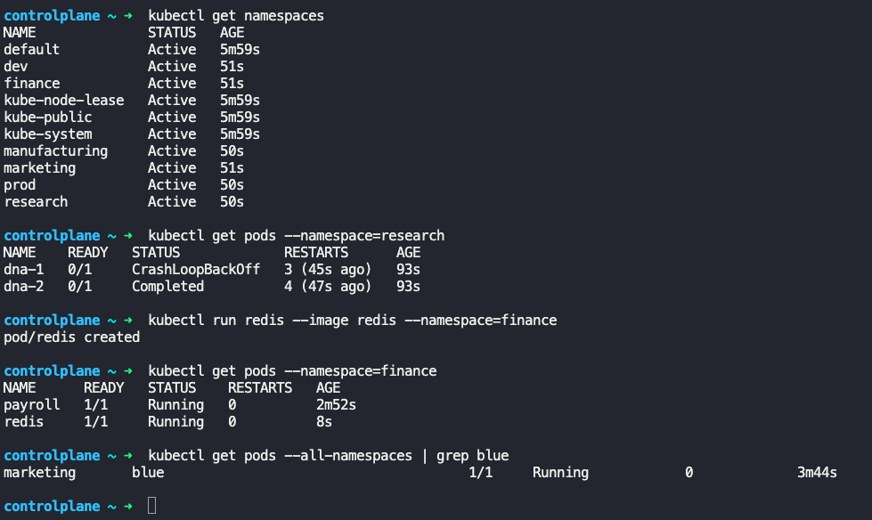

### Namespaces

- Default namespace is created automatically nu Kubernetes when the cluster is first setup
- Kubernetes creates a set of pods and services for its internal purpose, such as for networking solution, DNS service etc
	- These are created in "kube-system" namespace
- "kube-public" namespace contains resources which can be accessed publically
- Namespaces are typically used for isolation
	- Ex: Same cluster can be used to deploy both production and development environments. Deploying them in separate namespaces will isolate from each other.
- 
- Each namespace can have its own set of policies to define who can do what
- Each namespace can be assigned a quota of resources in a cluster
	- to guarantee availability of resources
	- to use resources within allowed limits
- Resources within the namespace can refer to each other simply by their names, like web-server, db-server etc.
	- For "web-server" resource to communicate with "db-server" resource in the same namespace, you can use something like `mysql.connect("db-service")`
	- For "web-server" resource to communicate with "db-server" resource in another namespace, say "dev" namespace, you can use something like `mysql.connect("db-service.dev.svc.cluster.local")`
		- 'cluster.local' - Default domain name of Kubernetes cluster
		- 'svc' - Subdomain for service (for pod it is 'pod')
		- 'dev' - Name of namespace
		- 'db-service' - Name of service
- $`kubectl get pods --namespace=<name_of_namespace>` or `kubectl get pods -n=<name_of_namespace>`
	- Lists pods in the namespace specified
- $`kubectl get pods`
	- Lists pods in the default namespace
- $`kubectl create -f pod-definition.yaml`
	- Creates pod in default namespace
- $`kubectl create -f pod-definition.yaml --namespace=<name_of_namespace>`
	- Creates pods in specified namespace
- You can specify `namespace:<name_of_namespace>` under `metadata:` section in pod-definition.yaml file.
	- If done, no need to specify `--namespace` parameter when running `kubectl` command.


**Create a Namespace**

```
apiVersion: v1
kind: Namespace
metadata:
  name: dev
```
- $`kubectl create -f namespace-dev.yaml`
	- Creates namespace "dev"
- From command line, without YAML file create a namespace
	- $`kubectl create namespace <name_of_namespace>`

**Switch to another Namespace**

- $`kubectl config set-context $(kubectl config current-context) --namespace=<name_of_namespace>`
	- This switches to the specified namespace
- To view all pods across all namespaces
	- $`kubectl get pods --all-namespaces`
	- $`kubectl get pods -A`

**Create resource quota for namespace**

```
apiVersion: v1
kind: ResourceQuota
metadata:
  name: compute-quota
  namespace: dev
spec:
  hard:
    pods: "10"
    requests.cpu: "4"
    requests.memory: 5Gi
    limits.cpu: "10"
    limits.memory: 10Gi
```
- $`kubectl create -f compute-quota.yaml`
	- Creates resource quota for "dev" namespace
- 
- $`kubectl get namespaces`
	- Lists all namespaces
- $`kubectl run nginx --image=nginx -n=<name_of_namespace>`
	- Creates a pod 'nginx' with image 'nginx' on the specified namespace
- 


---
