### Types of commands to manage infrastructure

- In infrastructure as cloud world, there are different ways to manage the objects (pods, replica sets, services, etc) in the infrastructure. They are classified into Imperative and Declarative commands

### Imperative commands

- Describes what to be done
- Describes how it has to be done, by providing step-by-step instruction
- 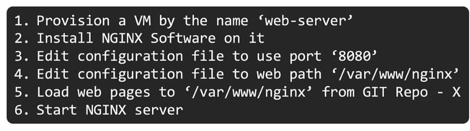
- Typically, each step should have a test to see if succeeded.
- 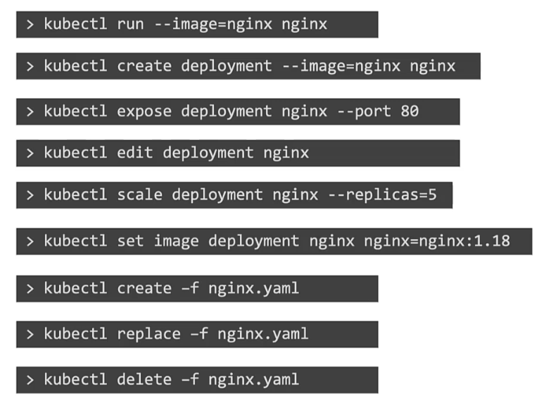
- Instead of running the following standalone commands, create yaml/manifest/configuration files and then run the `kubectl create` command.
- 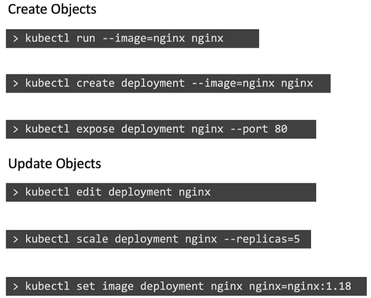
- These yaml files can be stored in version control like Git, so any changes can be tracked and reviewed.
- 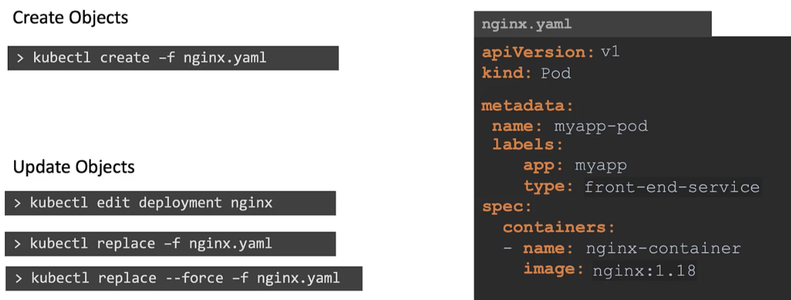
- To edit the configuration of an object, instead of using `kubectl edit` command, use `kubectl replace` command, as the former does not track changes to the object in the configuration file.
	- Edit the yaml file and then run `kubectl replace -f nginx.yaml`
	- To completely delete and recreate object, use `kubectl replace --force -f nginx.yaml`
- Imperative commands will fail if the assumed state before running command is not present
	- Say before running, `kubectl create -f nginx.yaml`, there is already a pod named `nginx` present with same configuration, the command will fail.
	- `kubect replace -f nginx.yaml` assumes a pod exists already. If not, this command will fail.


### Declarative commands

- Specify the final outcome (What to be done)
- No need to provide step-by-step instructions
- 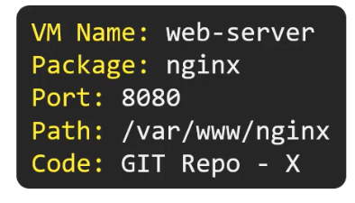
- Orchestrating tools like puppet, ansible, chef, terraform fall into this category
- Create a set of files that defines the expected state of application and services on a cluster, and with a single `kubectl apply` command, Kubernetes should be able to read the configuration file and decide by itself what needs to be done to bring the infrastructure to the expected state.
	- We will use `kubectl apply` command for creating, updating and deleting objects
- We use the same yaml/manifests/config files as in imperative commands section, but instead of using `kubectl create/replace/delete` commands, we use `kubectl apply -f nginx.yaml`
	- `apply` command is intelligent enough to create an object if it doesn't exist already
	- We can specify a directory, instead of a single file while running the `apply` command
		- `kubectl apply -f /dir1/dir2/config_files`
- If changes were to be made, we update the configuration files, and then run `kubectl apply -f <config_file_name>` to apply the changes
	- The `apply` command will figure out the right approach to create and update objects
- 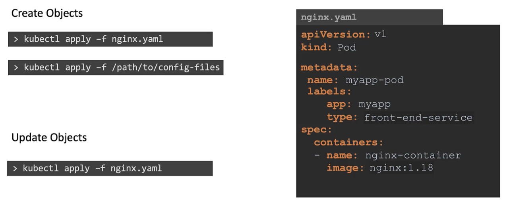


### Exam tips

- Use imperative commands to save time
	- $`kubectl run --image=nginx nginx`
	- $`kubectl create deployment --image=nginx nginx`
	- $`kubectl expose deployment nginx --port 80`
	- $`kubectl edit deployment nginx`
	- $`kubectl scale deployment nginx --replicas=5`
	- $`kubectl set image deployment nginx nginx=nginx:1.18`
- If the object configuration is complex, having multiple parameters, use an object configuration file instead
- Create a pod with labels
	- $`kubectl run redis --image=redis:alpine --labels="tier=db"`
	- 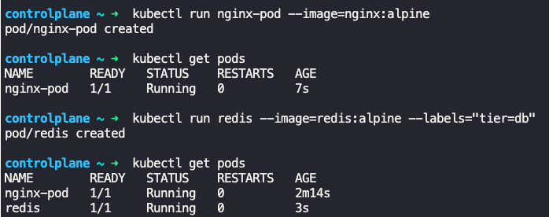
- To expose an application, say redis (pod name redis), on port 6379 using a service named "redis-service"
	- $`kubectl expose pod redis --port=6379 --name=redis-service`
	- 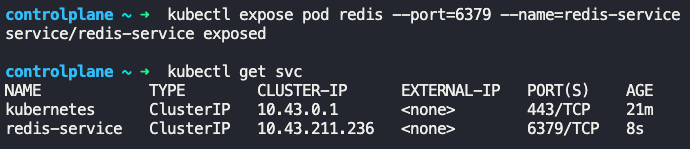
	- Other way
		- $`kubectl create service clusterip redis-service --tcp-port=6379:6379 --dry-run=client -o yaml > redis-service.yaml`
		- Now modify redis-service.yaml and add the following under `spec:` section.
		```
		selector:
		  tier:db
		```
		- Run `kubectl create -f redis-service.yaml` to create the service
- Create a deployment with name, image and replicas
	- $`kubectl create deployment webapp --image=kodekloud/webapp-color --replicas=3`
	- 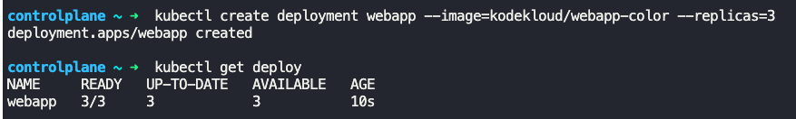
- Create pod by exposing container port on 8080
	- $`kubectl run custom-nginx --image=nginx --port-8080`
	- 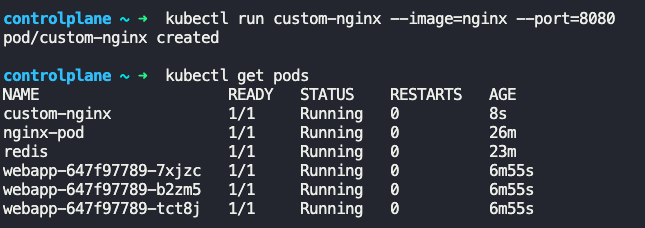
	- Other way
		- $`kubectl run httpd --image=httpd:alpine`
		- $`kubectl expose pod httpd --port=80 --name=httpd --type=clusterip`
	- Another way
		- $`kubectl run httpd --image=httpd:alpine --port 80 --expose`
		- 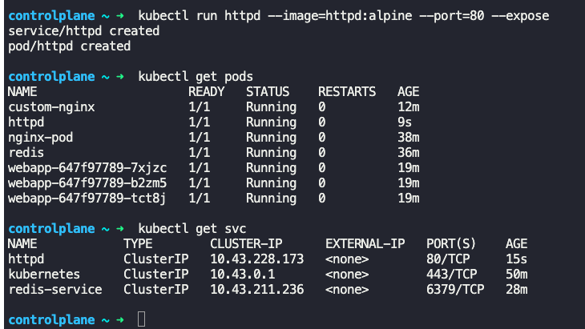
- Create a new namespace and create a new deployment in the created namespace
	- $`kubectl create namespace dev-ns`
	- $`kubectl create deployment redis-deploy --namespace=dev-ns --image=redis --replicas=2`
	- 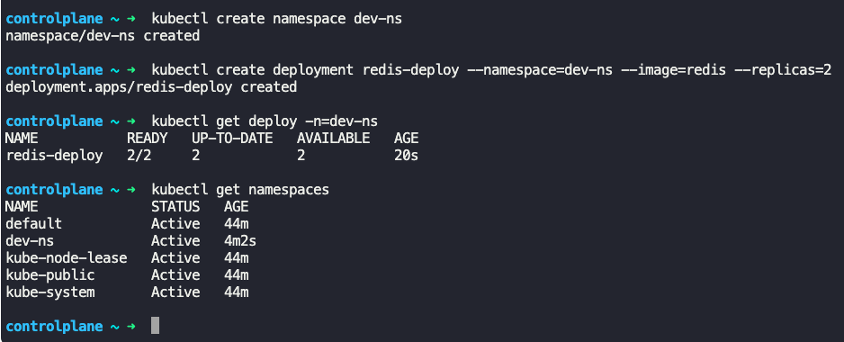


---
