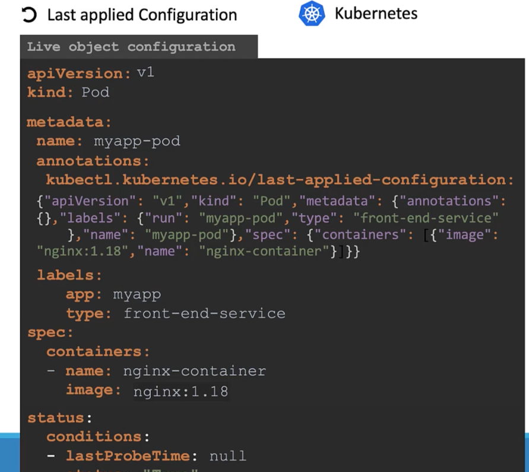
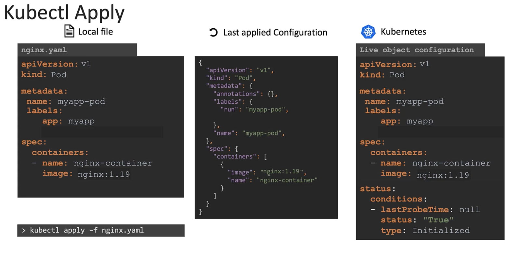
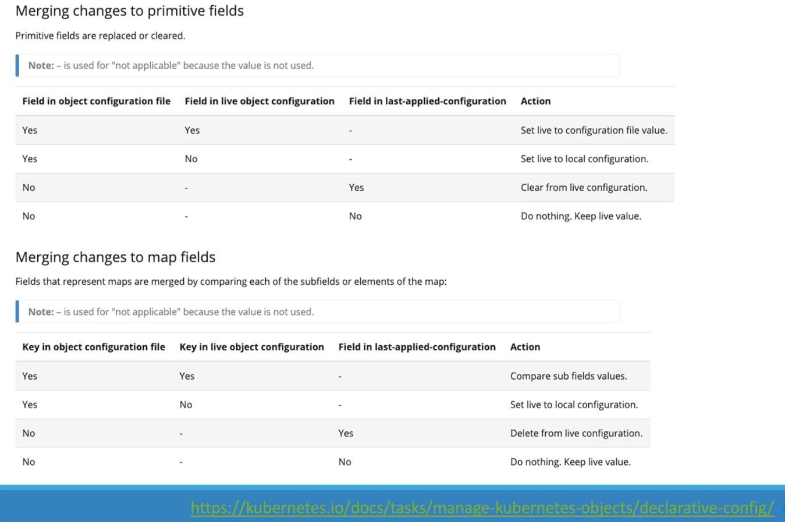

### Kubectl apply command

- `kubectl apply` is used tom manage objects in declarative way
- 3 files which Kubernetes uses when `kubectl apply` command is used
	- Object configuration file
		- This is the local yaml file created for managing Kubernetes objects
	- Live object configuration file
		- Kubernetes maintains an in-memory yaml file based on the live/current objects deployment
	- Last applied configuration
		- Whenever `kubectl apply` command is run, Kubernetes converts the object configuration file to json format and stores inside the "Live object configuration" file
		- 
- 
- Whenever a change is made to the "Object configuration" file and `kubectl apply` command is run
	- Kubernetes compares it against the "Live object configuration" file and "Last applied configuration"
	- Then makes a decision on how to implement the changes
- The above is applicable only when `kubectl apply` command is run and not for `kubectl create` or `kubectl replace` commands
- 

---
