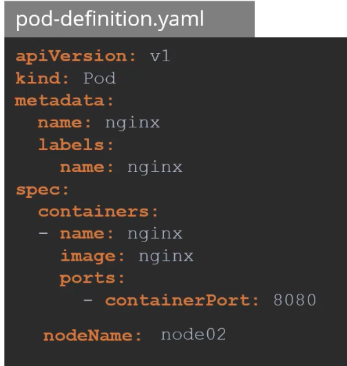
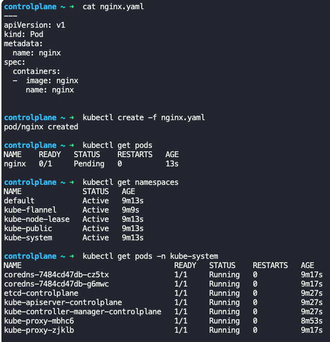
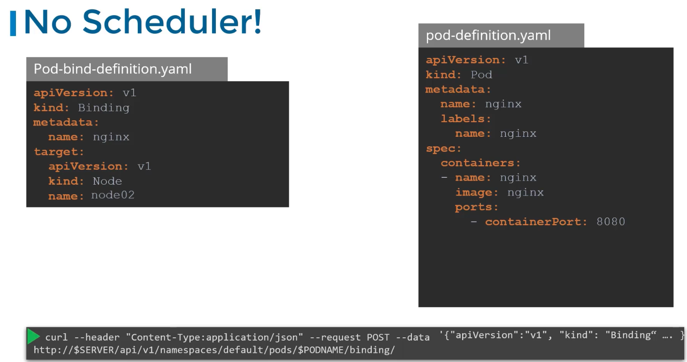
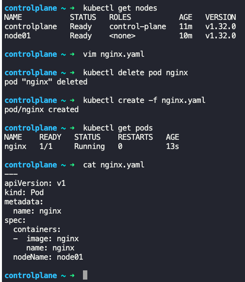
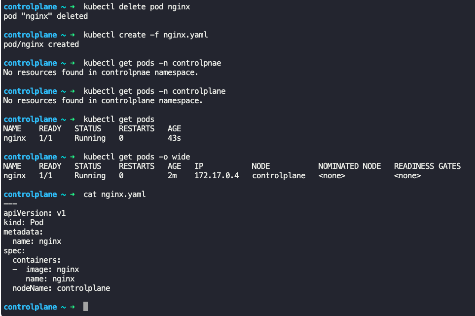

### Manual Scheduling

- Every pod definition file has a `nodeName:` field, which is not set by default
- 
- Scheduler keeps monitoring all the pod definition files and finds occurrences where `nodeName:` field is not set
	- These are candidates for scheduling
	- It then identifies the right node for the pod by running the scheduling algorithm
	- Once it identifies, it schedules the pod to the node and sets the `nodeName` property with the name of the node assigned.
- If there is no scheduler, the pods continue to be in a "pending" state
	- 
- To manually schedule, set `nodeName:` to a node, say "node02", and it will schedule the pod to the specified node.
	- This is done at pod creation time.
	- Kubernetes does not allow to change `nodeName:` post creation of pod.
- If a pod is already present, then do the following to assign the pod to a node
	- Create a binding object and send a post request to the pod's binding API, in a json format.
	- The above is what the actual Kubernetes scheduler does
```
apiVersion: v1
kind: Binding
metadata:
  name: nginx
target:
  apiVersion: v1
  kind: Node
  name: node01
```
- Convert the above yaml to json
- Send the post request using curl to pod's binding API.
- 
- Cannot move a running pod from one node to another, so need to delete existing and recreate in the chosen node
	- $`kubectl create -f nginx.yaml --force`
	- `--force` deletes existing pod and recreates it.
- 
- 


---
