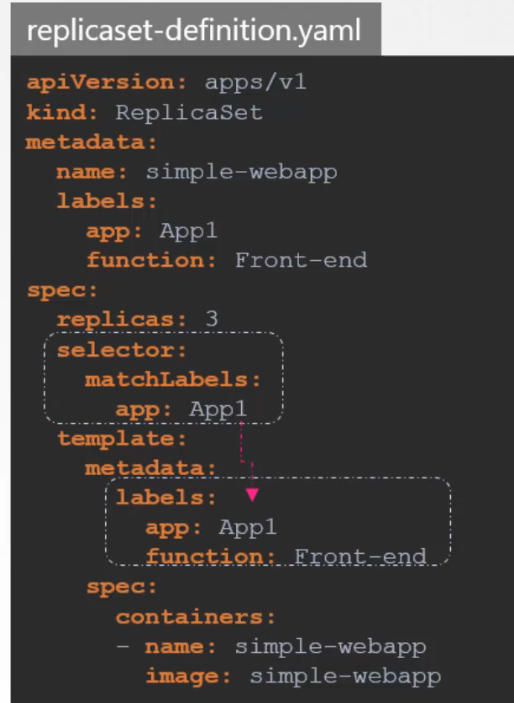
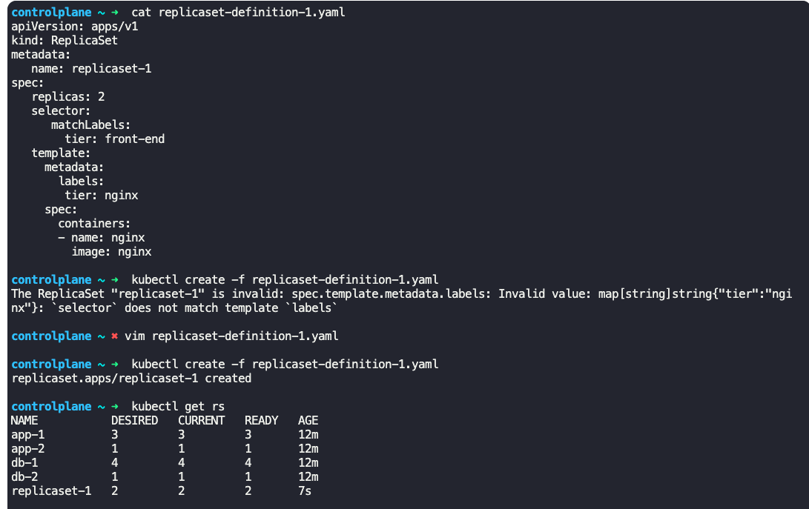
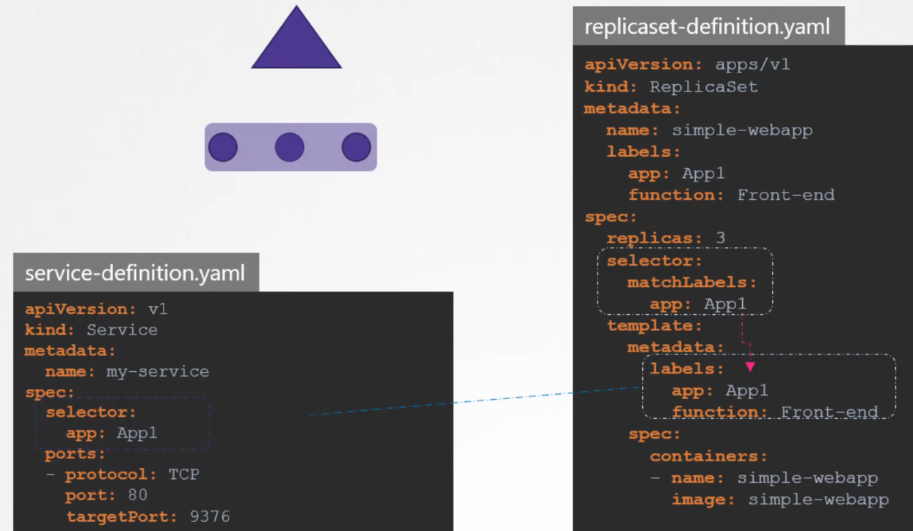
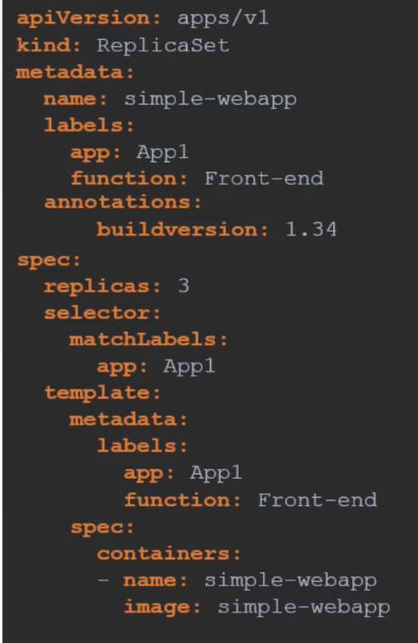
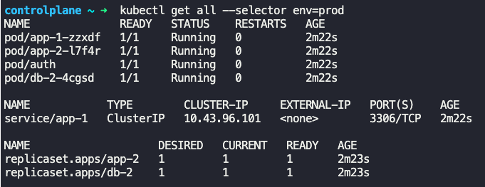
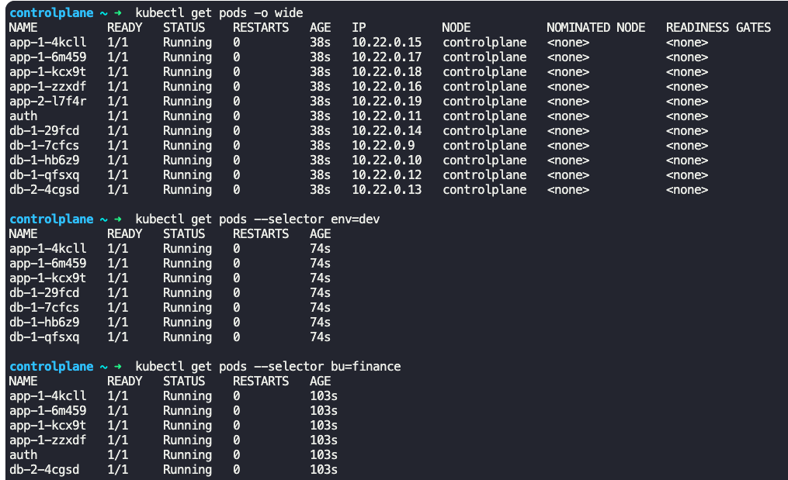
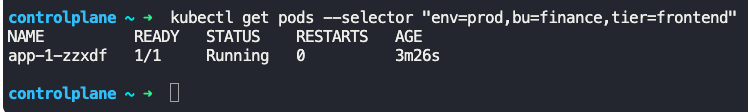

### Labels and Selectors

- To group things together and filter them, we need labels
- Labels are properties attached to each item
- Selectors can help filter these items
- Labels can be specified under the following section in the object definition file
```
metadata:
  labels:
    app=App1
```
- Selectors can be used as
	- `kubectl get pods --selector app=App1`
- Replica sets are a great example for usage of labels and selectors
	- It uses labels to create and manage instances
- 
- 
- Service object uses labels to identify objects which it will service or front
- 
- Annotations
	- Annotations are used to record additional information. It is mentioned under the following section
```
metadata:
  annotations:
    buildVersion: 1.23
```

- 
- `kubectl get all --selector env=prod`
	- Lists all Kubernetes objects having the label `env=prod`
- 
- `kubectl get pods --selector env=dev`
	- Lists all pods having label `env=dev`
- 
- `kubectl get pods --selector env=dev --no-headers | wc -l`
	- Gives the number of pods having label `env=dev`
- `kubectl get pods --selector bu=finance`
	- Lists all pods having label `bu=finance`
- `kubectl get pods --selector "env=prod,bu=finance,tier=frontend"`
	- Lists all pods having all the labels specified in the `selector` parameter
- 


---
