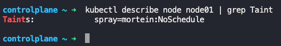

### Taints and Tolerations

- Taints and Tolerations are used to decide which pods can be scheduled on which nodes
	- This has nothing to do with security
- To prevent pods from being placed on a node, we taint a node, `taint=blue`
	- By default pods have no tolerations.
	- So unless specified, no pods can be placed on the above tainted node
- To place specific pods on a tainted node (say `taint=blue`), we add toleration to the specific pods for `taint=blue`
	- These pods can now be placed on the node with `taint=blue`
- Taints are set on nodes and Tolerations are set on pods

### Taint-Node

- `kubectl taint nodes <node_name> key=value:taint-effect`
	- Ex: `kubectl taint nodes node01 app=blue:NoSchedule`
- 
- 
- Taint-Effect
	- Defines what would happen to the pods if they do not tolerate taint
	- NoSchedule
		- Pods will not be scheduled on the node
	- PreferNoSchedule
		- System will try to avoid placing the pod on the node, but no guarantee
	- NoExecute
		- New pods will not be scheduled on the node, and existing pods will be evicted if they do not tolerate taint
- To un-taint
	- `kubectl taint nodes controlplane node-role.kubernetes.io/control-plane:NoSchedule-`
	- The`-` at the end is for removing the taint
	- 

### Tolerations-Pods

- Tolerations are defined in pod definition file under the following section
```
spec:
  tolerations:
    - key:"app"
      operator:"Equal"
      value:"blue"
      effect:"NoSchedule"
```
- The details mentioned under `tolerations:` is got from the defined taints
- `kubectl run bee --image=nginx --dry-run=client -o yaml > bee-nginx.yaml`
	- Then add the above `tolerations:` section
- 
- When the pods are now created or updated, based on the configured taints and tolerations, they are not scheduled or evicted from nodes where there is no toleration
- Taints and Tolerations does not ensure a pod to be placed in a particular node, instead it ensures that the node only accepts pods with certain tolerations
- When Kubernetes cluster is setup, Kubernetes automatically taints the master node, so that pods cannot be placed on it
	- `kubectl describe node kubemaster | gep Taint`


---


