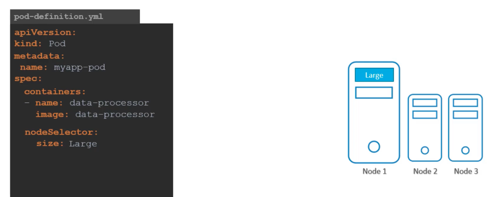

### Node Selectors

- We can set limitation on the pod, so that they only run on particular nodes
	- 2 ways to do this
		- Node Selectors
		- Node Affinity
- Add the following to `spec:` section in the pod-definition yaml file
```
spec:
  nodeSelector:
    size:Large
```
- `size:Large` is the key:value pair label which is matched with the label present on the nodes
- 
- This way it identifies the right node to place the pods on
- P.S: Before doing the above, label the node first
	- `kubectl label nodes <name_of_node> <label_key>=<label_value>`


---
