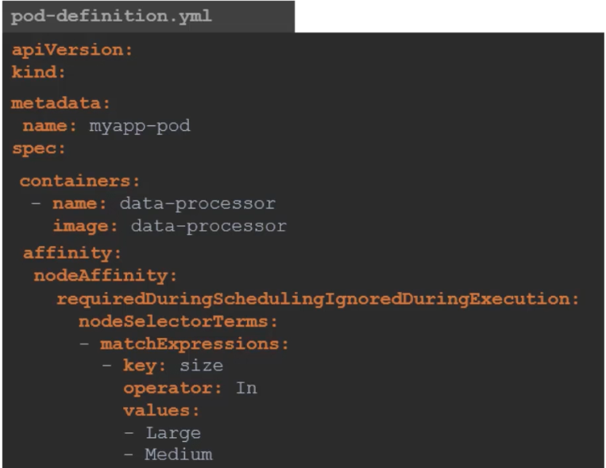
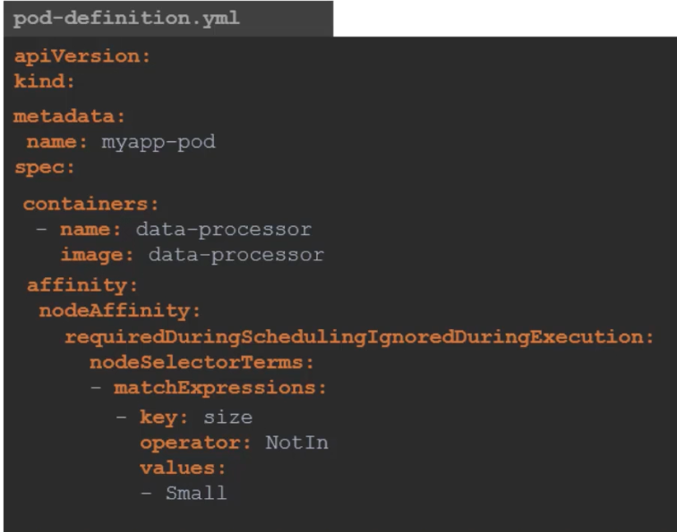
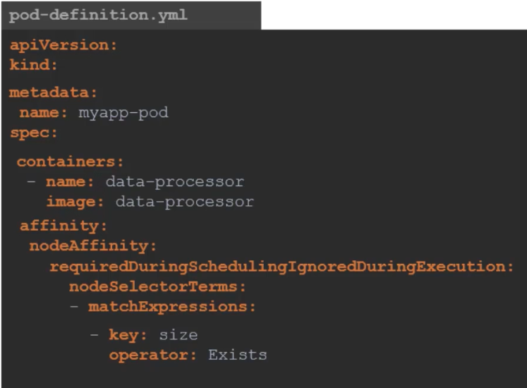
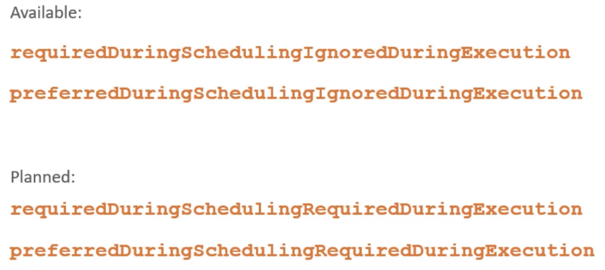
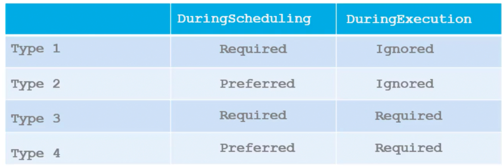
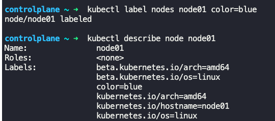
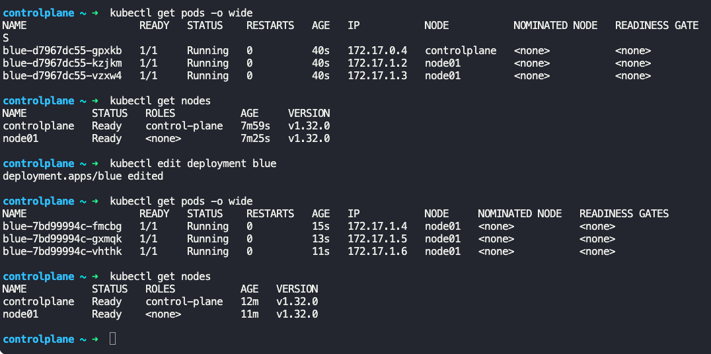

### Node Affinity

- Primary feature of Node Affinity is to ensure pods are placed in particular nodes
- In Node Selectors, we cannot mention `OR`, `NOT` expressions, which are available in Node Affinity
- Node Affinity supports operators like `In`, `NotIn`, `Exists`
- Node Affinity is specified under `spec:` section in the pod-definition file
- 
- 
- 
- Node Affinity types
	- Available
		- Type 1 - requiredDuringSchedulingIgnoredDuringExecution
		- Type 2 - preferredDuringSchedulingIgnoredDuringExecution
	- Planned
		- Type 3 - requiredDuringSchedulingRequiredDuringExecution
		- Type 4 - preferredDuringSchedulingRequiredDuringExecution
- 
- DuringScheduling - State where the pod does not exist and is created for the first time
- DuringExecution - State where the pod is already running and the labels on the nodes are changed or removed
- Required - If a node with matching labels are not found, it will not schedule
- Preferred - If a matching node is not found, scheduler will place the pod on any available node

|        | DuringScheduling | DuringExecution |
| ------ | ---------------- | --------------- |
| Type 1 | Required         | Ignored         |
| Type 2 | Preferred        | Ignored         |
| Type 3 | Required         | Required        |
| Type 4 | Preferred        | Required        |
- 
- To get list of labels set on a node
	- `kubectl describe node <name_of_node>`
		- See under `Labels:` section
	- 
	- 

---
