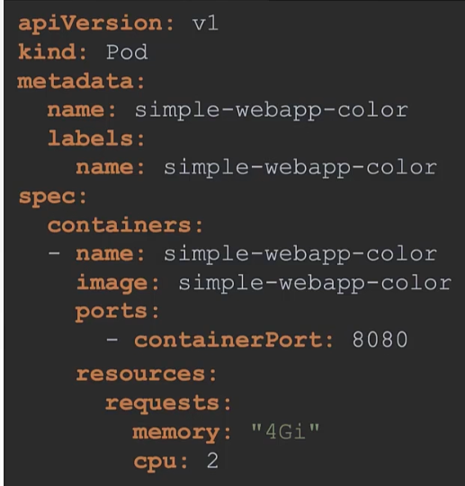
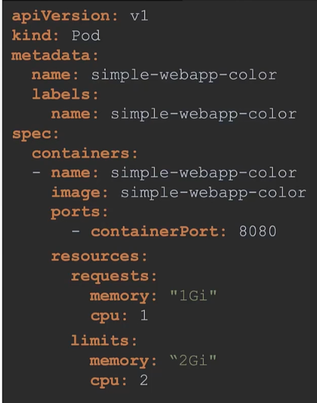
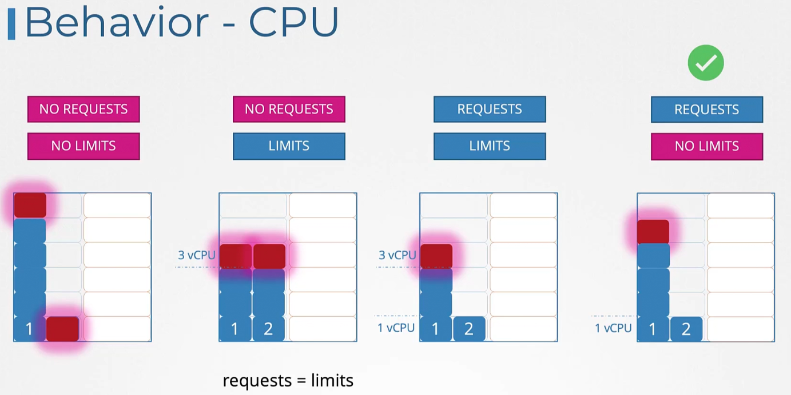
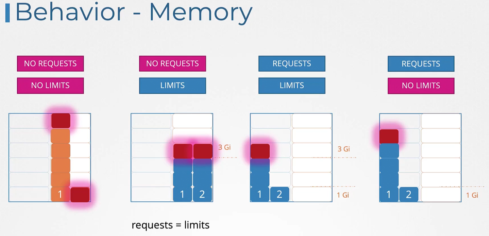
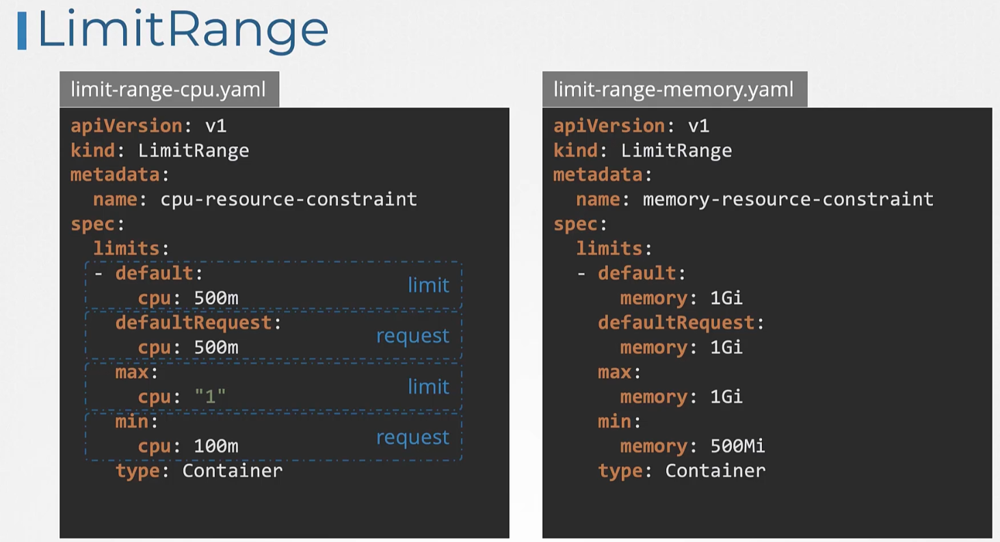
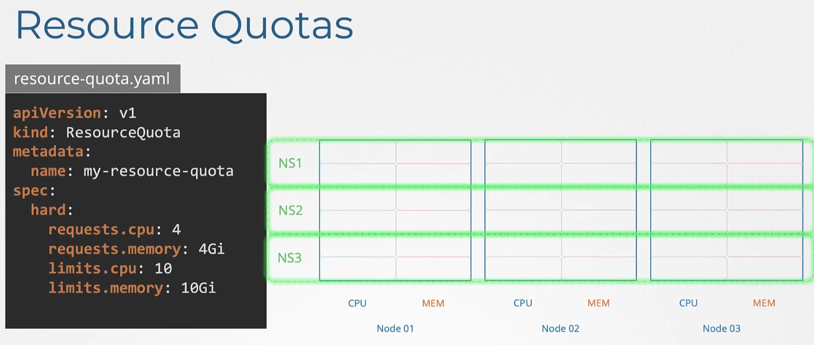
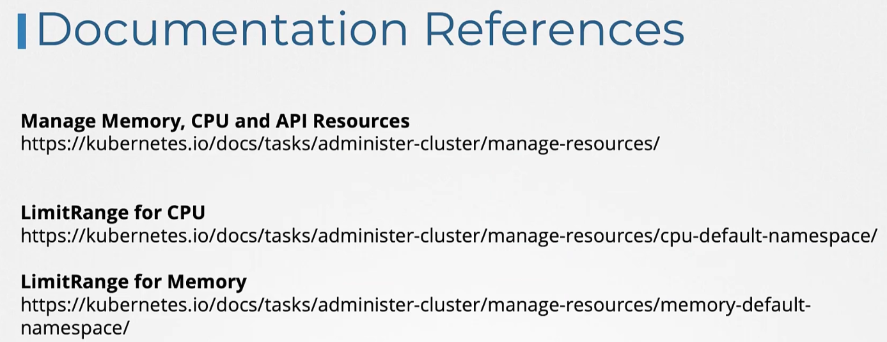

### Resource Limits

**Resourcing**
- Kube-scheduler schedules pods to nodes based on the resource requirements of pods (CPU+memory) and the resource availability on nodes (CPU+memory)

**Resource Requests**
- Pods can upfront request for resources when getting created and scheduled.
```
apiVersion: v1
kind: Pod
metadata:
  name: simple-webapp-color
  labels:
    name: simple-webapp-color
spec:
  containers:
  - name: simple-webapp-color
    image: simple-webapp-color
    ports:
      - containerPort: 8080
    resources:
      requests:
        memory: "4Gi"
        cpu: 2
```
- 
- When scheduler looks to schedule this pod, it takes the values provided under `requests:` section and schedules on the appropriate node.
- The specified resource requests are guaranteed resources for pod.
	- 1 CPU means 1 vCPU core
	- 1Gi means 1 GB of RAM

**Resource Limits**
- Limits resources for pods
- This specifies the maximum amount of resource which a pod can use.
- Resource limits are specified under `limits:` section
```
apiVersion: v1
kind: Pod
metadata:
  name: simple-webapp-color
  labels:
    name: simple-webapp-color
spec:
  containers:
  - name: simple-webapp-color
    image: simple-webapp-color
    ports:
      - containerPort: 8080
    resources:
      requests:
        memory: "4Gi"
        cpu: 2
      limits:
        memory: "8Gi"
        cpu: 4
```
- 
- P.S: Resource requests and limits are specified for each container in a pod. Each container can have different requests and limits

**When a container exceeds resource limits**
- When a container exceeds resource limits by requesting
	- More CPU
		- It is prevented from getting additional CPU
		- This is known as throttling
	- More memory
		- Additional memory, over and above the limit specified is assigned
		- If a container is constantly requesting for more memory, then the pod is taken down with "out of memory" (oom) error
- By default, Kubernetes does not have any resource request or limit set for containers
- CPU behaviour
	- No request No limit
		- No CPU resource request nor CPU resource limit set
	- No request Yes limit
		- No CPU resource request set but CPU resource limit set
		- Resource request = Resource Limit in this case
	- Yes request Yes limit
		- Both CPU resource request and CPU resource limit are set
	- Yes request No limit
		- CPU resource request is set but no CPU resource limit is set
		- Makes sure all pods have some CPU resources set.
			- Avoids choking of non-hungry pods
		- This considered to be the best option
- 
- Memory behaviour
	- No request No limit
		- No memory resource request not memory resource limit set
	- No request Yes limit
		- No memory resource request set but memory resource limit set
		- Resource request = Resource Limit in this case
	- Yes request Yes limit
		- Both memory resource request and memory resource limit are set
	- Yes request No limit
		- Memory resource request is set but no memory resource limit is set
		- Additional memory, over and above the limit specified is assigned
		- If a container is constantly requesting for more memory, then the pod is taken down with "out of memory" (oom) error
	- 

**Limit Ranges**
- Ensures every pod created has some default cpu and memory values set
- Limit ranges apply to containers/pods which are created without resource request and limit specified
- Limit ranges are applicable at namespace level
```
apiVersion: v1
kind: LimitRange
metadata:
  name: cpu-resource-constraint
spec:
  limits:
  - default:
      cpu: 500m
    defaultRequest:
      cpu: 500m
    max:
      cpu: "1"
    min:
      cpu: 100m
    type: Container
```

```
apiVersion: v1
kind: LimitRange
metadata:
  name: memory-resource-constraint
spec:
  limits:
  - default:
      cpu: 1Gi
    defaultRequest:
      cpu: 1Gi
    max:
      cpu: 1Gi
    min:
      cpu: 500Mi
    type: Container
```
- `default` - Defines default resource limit
- `defaultRequest` - Defines default resource request
- `max` and `min` - Defines the resource limit range
- 
- `kubectl apply -f limit-range-cpu.yaml --namespace=<name_of_namespace>`
- `kubectl apply -f limit-range-memory.yaml --namespace=<name_of_namespace>`
- Note:
	- Changing the values in the limit range definition file will only apply to newly created pods/containers, and will not affect existing pods/containers
	- Use `kubectl replace --force` or manually delete and recreate pods for changes to take effect

**Resource quotas**
- Namespace level object
- Limits CPU and memory usage at namespace level
- Say, all pods/containers in a namespace put together cannot consume more than 10 vCPUs and 10Gi of memory
```
apiVersion: v1
kind: ResourceQuota
metadata:
  name: my-resource-quota
spec:
  hard:
    requests.cpu: 4
    requests.memory: 4Gi
    limits.cpu: 10
    limits.memory: 10Gi
```
- `requests.cpu` - Across all pods in a non-terminal state, the sum of CPU requests cannot exceed this value.
- `requests.memory` - Across all pods in a non-terminal state, the sum of memory requests cannot exceed this value.
- `limits.cpu` - Across all pods in a non-terminal state, the sum of CPU limits cannot exceed this value.
- `limits.memory` - Across all pods in a non-terminal state, the sum of memory limits cannot exceed this value.
- 
- `kubectl create -f resource-quota.yaml --namespace=<name_of_namespace>`




---
