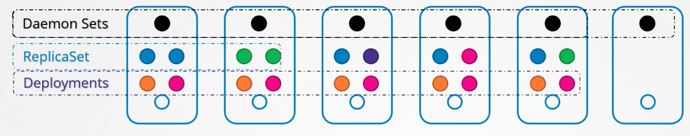
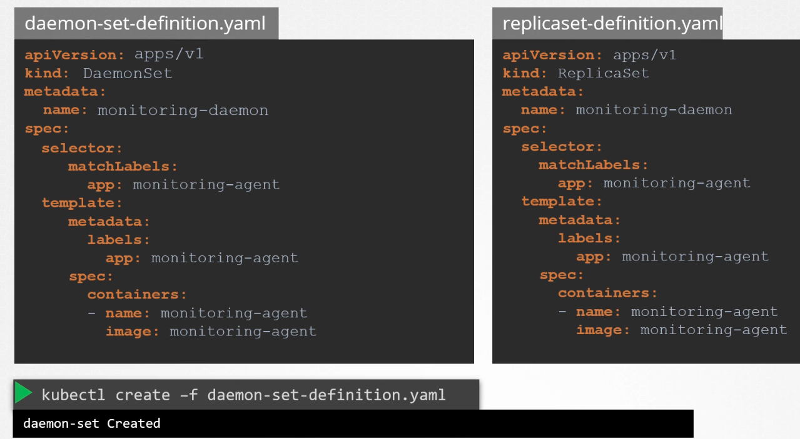
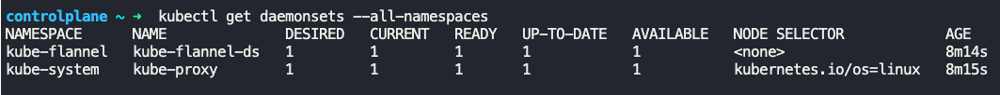
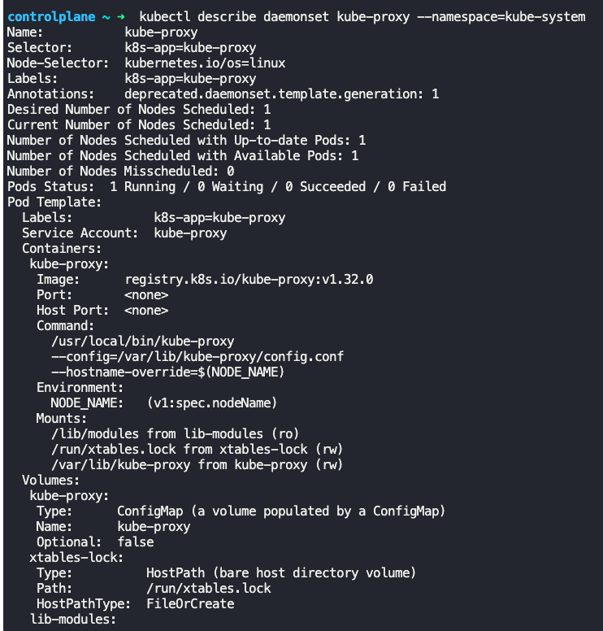
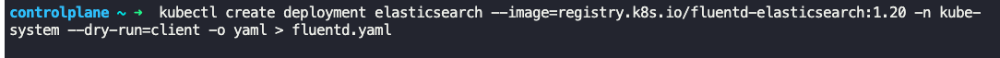
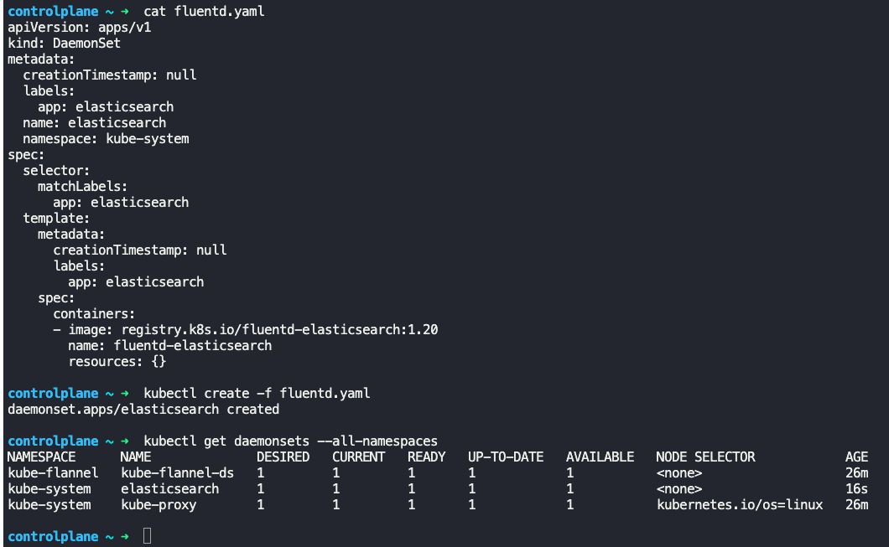

### Daemon sets

- They are like replica sets, but runs one copy of pod on each node of the cluster
- Whenever a new node is added to the cluster, a replica of the pod is created on it.
- 
- When a node is removed, the pod is automatically removed
- Daemon sets can be used for log aggregator and monitoring solutions, as it automatically deploys on all nodes in a cluster
	- `kube-proxy` is set up using daemon set
	- Networking solutions like Weavenet needs an agent running on each node, so daemon set can be used here
- Daemon set definition file is similar to replica set definition file, except the `kind:` is specified as `DaemonSet`.
```
apiVersion: apps/v1
kind: DaemonSet
metadata:
  name: monitoring-daemon
spec:
  selector:
    matchLabels:
      app: monitoring-agent
  template:
    metadata:
      labels:
        app: monitoring-agent
      spec:
        containers:
        - name: monitoring-agent
          image: monitoring-agent
```
- 
- `kubectl create -f daemonset-definition.yaml`
	- Creates a Daemon set
- `kubectl get daemonsets --all-namespaces` or `kubectl get daemonsets -A`
	- Lists all daemon sets across all namespaces
- 
- `kubectl describe daemonset <name_of_daemonset> --namespace=kube-system`
	- Describes the daemon set, which is specified, and deployed in `kube-system` namespace
- 
- Daemon set uses the default scheduler and node affinity rules to place pods on all nodes in the cluster.
	- Kube-scheduler has no effect on these pods
- To create a daemon set
	- `kubectl create deployment elasticsearch --image=elasticsearch -n kube-system --dry-run=client -o yaml > fluent-daemonset.yaml`
	- 
	- Remove replicas, strategy, status from yaml.
	- Change `kind:` to `DaemonSet`
	- Then run `kubectl create -f fluent-daemonset.yaml` to create daemon set.
	- 


---
