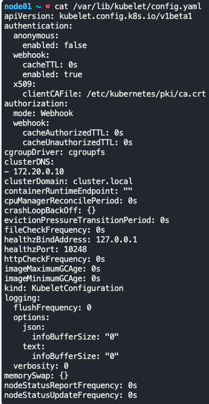

### Static Pods

- Kubelet can manage a node independently, in the situation where there is no Kubernetes cluster and hence no kube-apiserver, scheduler, etcd datastore, in-short no Master node.
- Kubelet can be configured to read pod definition yaml files from `/etc/kubernetes/manifests` directory
	- Kubelet periodically checks this directory for pod definition yaml files, reads these files, and creates pods on the node.
- Kubelets restarts the crashed pods
- If pod definition yaml file is modified, Kubelet recreates the pods with modified specifications
- If a pod definition yaml file is removed, the pod is deleted automatically by Kublet
- These pods which are created by Kubelet, without intervention from any other Kubernetes components, are known as Static Pods
- Only pods can be created this way, no ReplicaSet, Deployments or Services can be created.
- 
- The location where Kubelet needs to read the manifest/yaml/pod definition files is configured on the `kubelet.service` file at `--pod-manifest-path=/etc/kubernetes/manifests`
	- 
	- or you can specify a configuration file (which is in yaml format) like `kubeconfig.yaml` like `--config=kubeconfig.yaml` in the `kubelet.service` file.
		- In the `kubeconfig.yaml` file, specify `staticPodPath:/etc/kubernetes/manifests` for the location of manifest/yaml/pod definition files
	- 
	- Clusters setup via kubeadm uses this approach via `kubeconfig.yaml`
- To list all pods running 
	- `docker ps`
	- `nerdctl ps`
- Kubelet can take commands via 2 modes
	- Pod definition files from Static pods folder
	- HTTP API endpoints which kube-apiserver calls
- Kubelet can service both the above modes simultaneously
- Use case for Static Pods - To deploy control plane components
- kube-scheduler has no effect on these pods
- To list all static pods across all namespaces
	- `kubectl get pods -A`
		- Look for pods with `-<name_of_node>` appended to its name
	- 
- To check if a pod is static pod or not
	- `kubectl get pod <name_of_pod> -n <name_of_namespace> -o yaml`
		- See the `OwnersReferences:` section - For static pods, it will be `kind:Node`
- To get the directory path where the static pod definition files are stored
	- Run `ps aux | grep kubelet`
		- 
		- Get the `--config=/var/lib/kubelet/config.yaml` path (This path can be set to a different path though, so verify)
		- Cat `config.yaml` and see `staticPodPath:` entry to get the location of static pod path definition files
		- 
- To create a static pod
	- `kubectl run static-busybox --image=busybox --dry-run=client -o yaml --command -- sleep 1000 > static-busybox.yaml`
		- Note that you should not specify any Kubernetes parameters after `--command`.
	- Copy the `static-busybox.yaml` pod definition file to the location of static pod definition files `/etc/kubernetes/manifests`
	- 
- To delete a pod in a different node
	- SSH into the node
	- Get the config file location by running `ps aux | grep kubelet` at `--config`
	- 
	- Cat the config file and find the `staticPodPath:` location and remove the pod definition file which needs to be deleted
	- 
	- 

---
