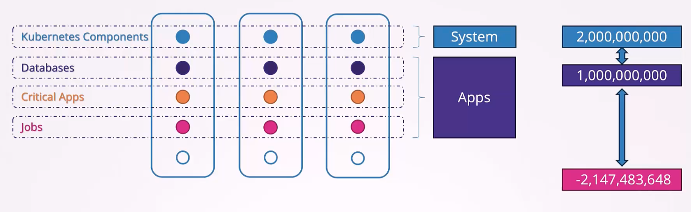
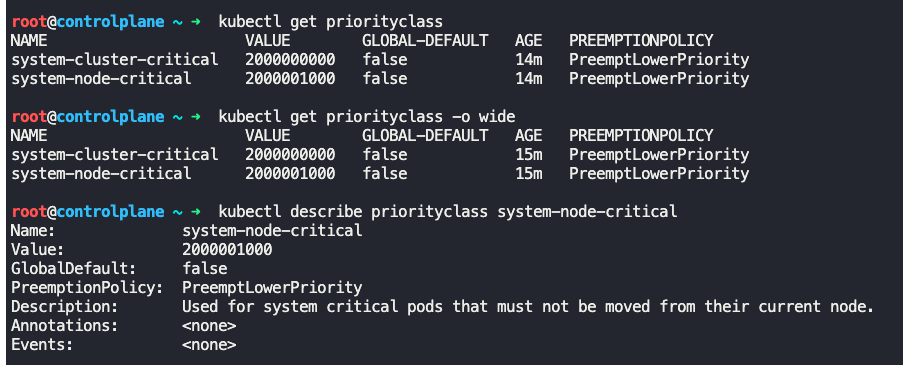
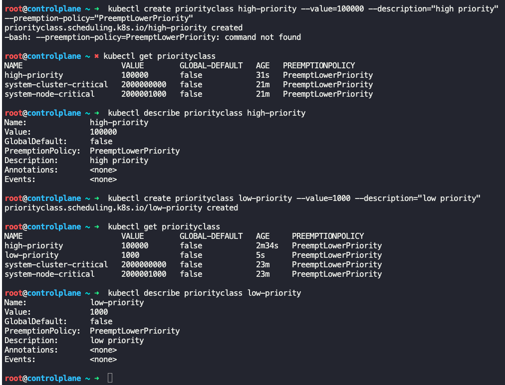
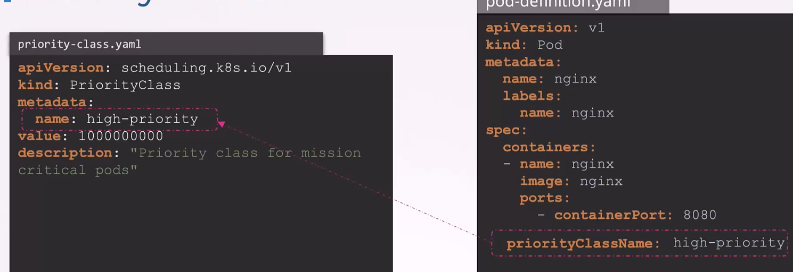
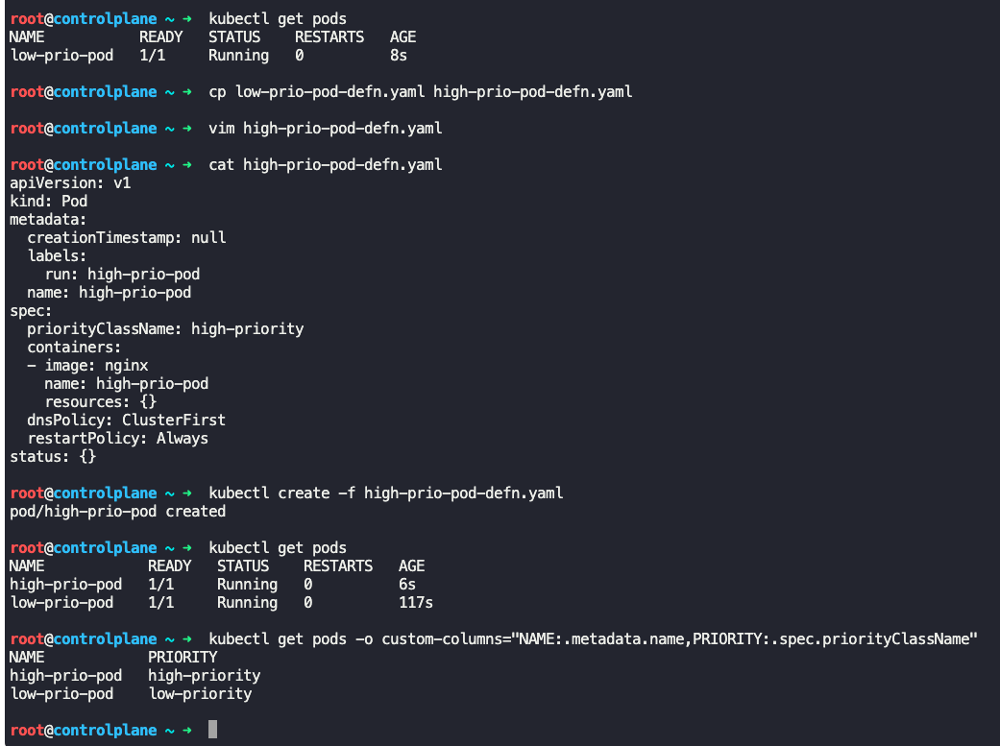
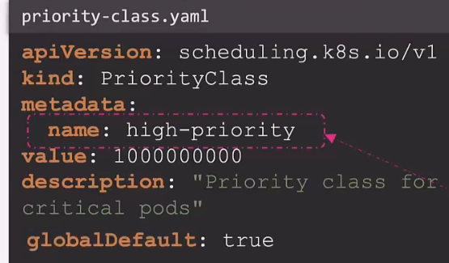
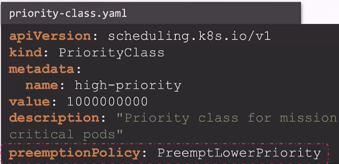

### Priority Classes

- Higher priority workloads should get scheduled without getting interrupted by lower priority workloads
- Priority classes help us define priority for different workloads
- If a higher priority workload fails to be scheduled, the scheduler will terminate a lower priority workload to ensure the higher priority workload gets scheduled
- Priority classes are applicable across namespaces.
- Priority is assigned based on a range from -ve 2 billion to 1 billion.
	- Larger number indicates higher priority
	- This priority range is for applications that are deployed
	- For Kubernetes system control plane components, priority is set to 2 billion
- 
- `kubectl get priorityclass`
	- Lists existing priority classes
- `kubectl describe priorityclass <name_of_priorityclass>`
	- Gives details about the priority class like, name, value, preemption policy etc.
- 
- To create a priority class, create a priority class definition file
```
apiVersion: scheduling.k8s.io/v1
kind: PriorityClass
metadata:
  name: high-priority
value: 1000000000
description: "Priority class for mission critical pods"
```
- Create priority class using imperative command
	- `kubectl create priorityclass high-priority --value=100000 --description="high priority" --preemption-policy="PreemptLowerPriority"`
	- `kubectl create priorityclass low-priority --value=1000 --description="low priority"`
- 
- In the pod definition file, include `priorityClassName: <name_of_priority_class>` under `spec:` section
```
apiVersion: v1
kind: Pod
metadata:
  name: nginx
  labels:
    name: nginx
spec:
  containers:
  - name: nginx
    image: nginx
    ports:
      - containerPort: 8080
  priotityClassName: high-priority
```
- 
- 
- By default all pods will have a priority set to "0"
	- To modify the default value, set `globalDefault: true` in priority class definition file.
	- This `globalDefault:` can be set in only one priority class definition file
```
apiVersion: scheduling.k8s.io/v1
kind: PriorityClass
metadata:
  name: high-priority
value: 1000000000
description: "Priority class for mission critical pods"
globalDefault: true
```
- 
- Higher priority jobs get scheduled before the lower priority jobs
- If a higher priority job comes after scheduling the lower priority job, the the next steps are defined by `preemptionPolicy:` parameter in priority class definition file
	- If `premptionPolicy: PreemptLowerPriority` is set, then lower priority jobs are evicted and newly arrived higher priority jobs are scheduled
	- 
	- If `preemptionPolicy: Never` is set, then scheduler will wait till resources are available to schedule the newly arrived high priority jobs
```
apiVersion: scheduling.k8s.io/v1
kind: PriorityClass
metadata:
  name: high-priority
value: 1000000000
description: "Priority class for mission critical pods"
premptionPolicy: PreemptLowerPriority
```
- To get priority class set on a pod
	- `kubectl get pods -o custom-columns="NAME:metadata.name,PRIORITY:spec.PriorityClassName"`


---
