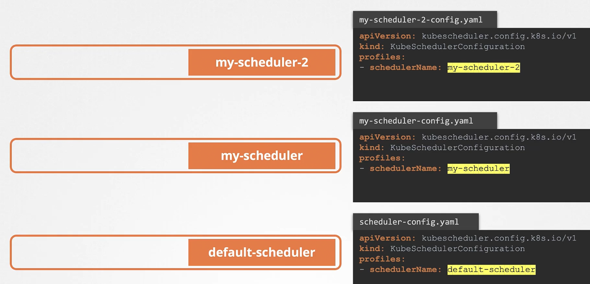
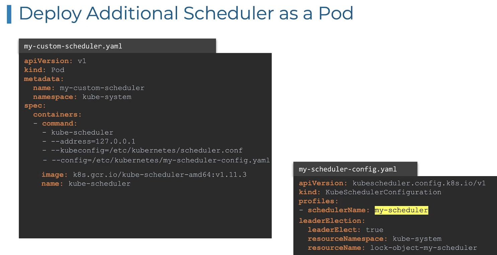
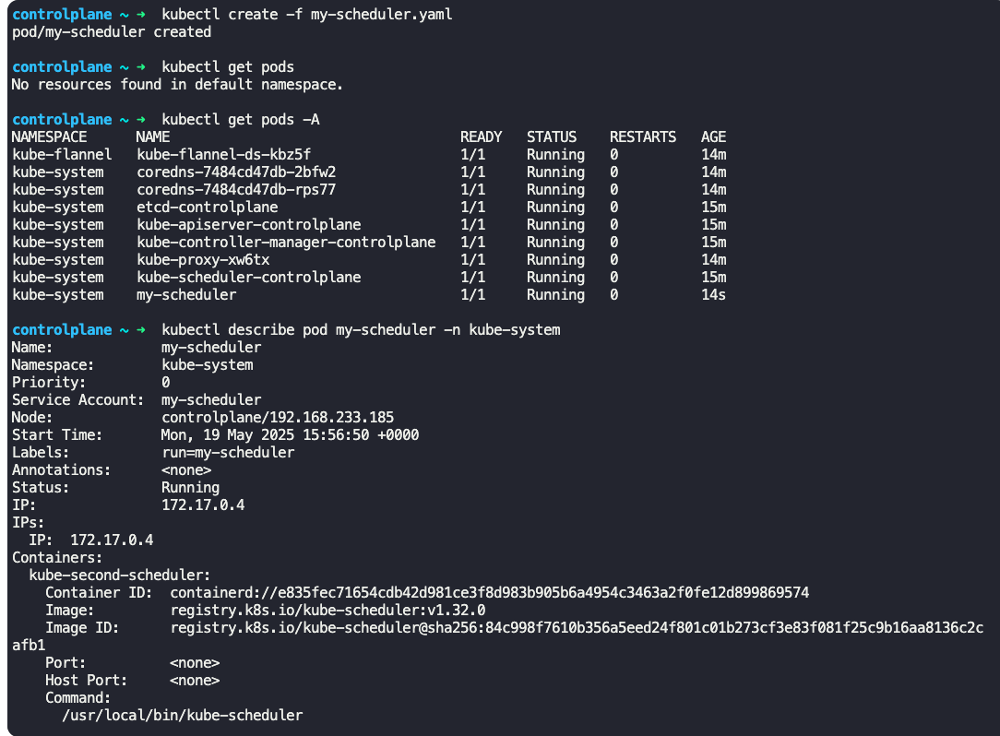
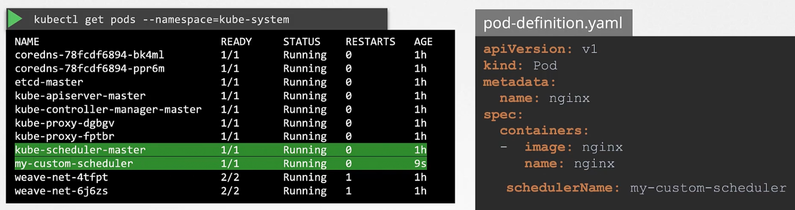
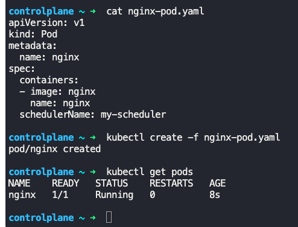
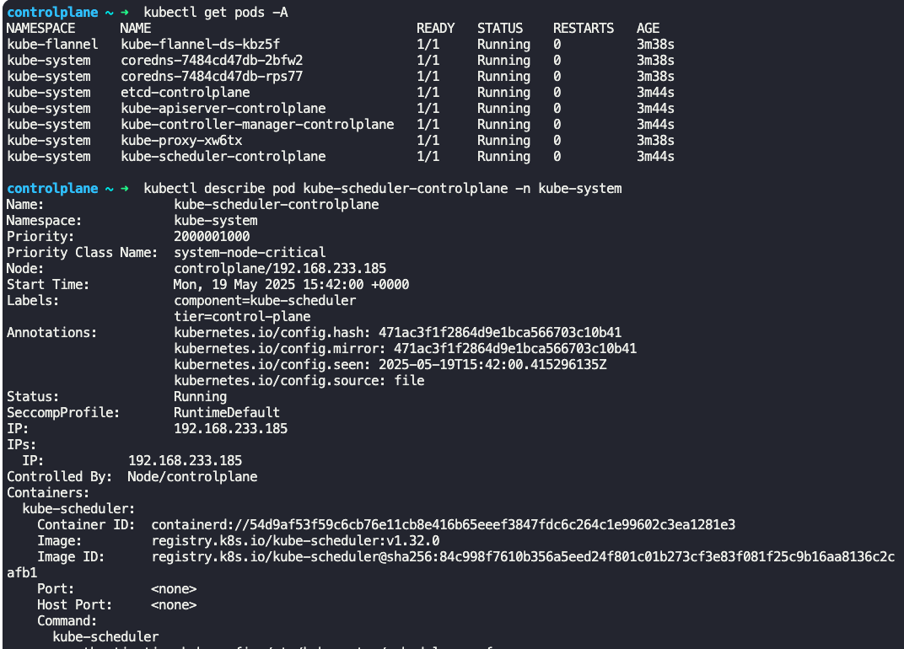

### Multiple Schedulers

- Kubernetes can have multiple schedulers along with the default one
- We can write custom schedulers and use it for specific applications.
	- Default kube-scheduler can continue to work for other remaining applications
- While creating a pod, we can instruct it to be scheduled by a specific scheduler.
- "default-scheduler" is the one which comes by default with Kubernetes
- To create a scheduler, first create a scheduler config yaml file

my-scheduler-config.yaml
```
apiVersion: kubescheduler.config.k8s.io/v1
kind: kubeSchedulerConfiguration
profiles:
- schedulerName: my-scheduler
```

my-scheduler-2-config.yaml
```
apiVersion: kubescheduler.config.k8s.io/v1
kind: kubeSchedulerConfiguration
profiles:
- schedulerName: my-scheduler-2
```

scheduler-config.yaml
```
apiVersion: kubescheduler.config.k8s.io/v1
kind: kubeSchedulerConfiguration
profiles:
- schedulerName: default-scheduler
```

- 
- Next step is to deploy additional schedulers as pod
	- Create a pod definition file with necessary configurations (for the scheduler) and point the scheduler config file created in step 1 (`--config=/etc/kubernetes/my-scheduler-config.yaml`) in the definition yaml file
	- This will deploy the custom scheduler as a pod, using the defined configurations
```
apiVersion: v1
kind: Pod
metadata:
  name: my-custom-scheduler
  namespace: kube-system
spec:
  containers:
  - command:
    - kube-scheduler
    - --address=127.0.0.1
    - --kubeconfig=/etc/kubernetes/scheduler.conf
    - --config=/etc/kubernetes/my-scheduler-config.yaml
    image: k8s.gcr.io/kube-scheduler-amd64:v1.11.3
    name: kube-scheduler
```
- 
- `kubectl get pods -n kube-system`
	- This will list all schedulers running
- 
- For a pod to use a custom scheduler, add `schedulerName: <name_of_scheduler>`, under the `spec:` section of the pod definition file
```
apiVersion: v1
kind: Pod
metadata:
  name: nginx
spec:
  containers:
  -   image: nginx
      name: nginx
  schedulerName: my-custom-scheduler
```
- 
- If the scheduler is created properly, then the pod will be in running state, else it will be in pending state
- 
- To view the scheduler scheduled runs
	- `kubectl get events -o wide`
	- Look for "scheduled" events
- To get logs of a specific scheduler
	- `kubectl logs <name_of_scheduler> --name-space=kube-system`
- `kubectl get pods -A`
	- Lists pods in all namespaces
- `kubectl describe pod kube-scheduler-controlplane -n kube-system`
	- Gives details about pod `kube-scheduler-controlplane` which is in `kube-system` namespace
- 


---
