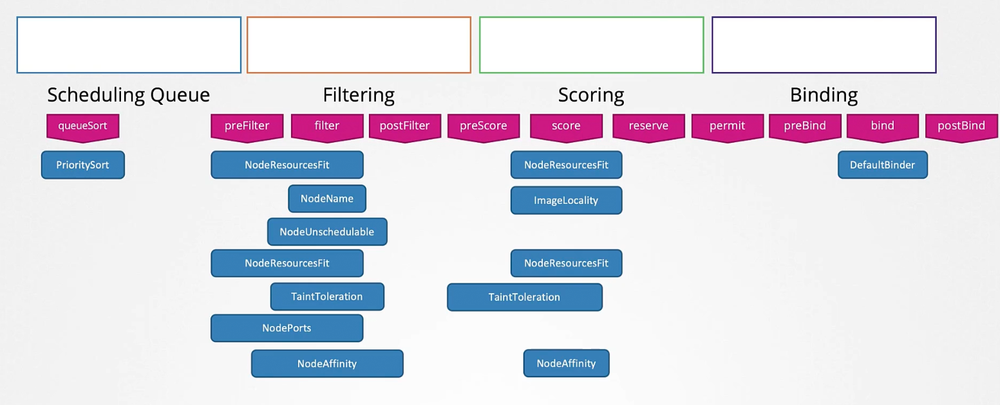
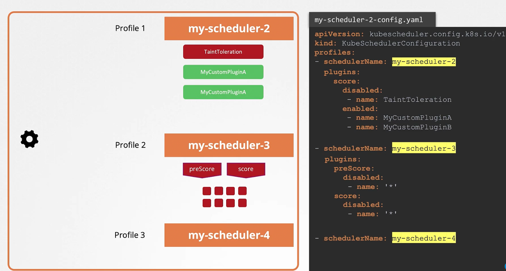

### Scheduling process

- When pods are created, they end up in a scheduling queue and wait
- Sorting phase
	- Pods are sorted based on the priority defined on the pods
		- Priority class defines priority for pods
- Filter phase
	- Nodes that cannot run a pod are filtered out.
		- This is done based on resource requirement of pods, resource availability on nodes, taints and tolerations etc
- Scoring phase
	- Nodes are scored with different weights
	- Score is based on the amount of resource a node will have after scheduling the pod
- Binding phase
	- This is where a pod is bound to a node with the highest score
- Each phase is carried out using plugins
	- Sample plugins used in sorting phase
		- PrioritySort plugin
	- Sample plugins used in filter phase
		- NodeResourcesFit plugin
		- NodeName plugin
		- NodeUnschedulable plugin
	- Sample plugins used in scoring phase
		- NodeResourcesFit plugin
		- ImageLocality plugin
	- Sample plugins used in binding phase
		- DefaultBinder plugin
- We can customise plugins using extension points
- Scheduler profiles allows you to run multiple schedulers from a single binary
	- In each profile, you can enable/disable plugins
- 
- 

---
