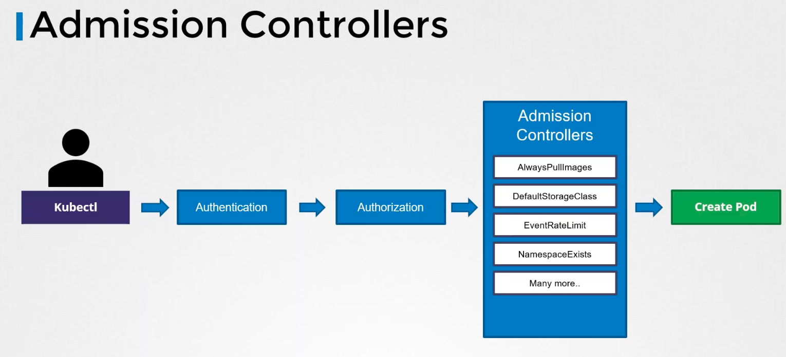
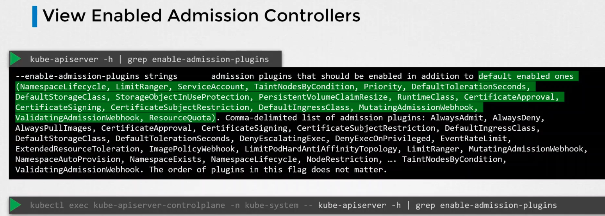
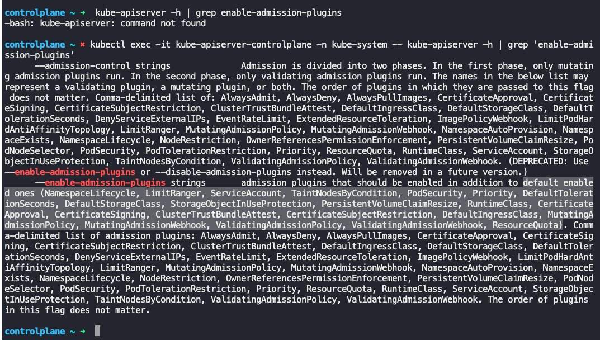
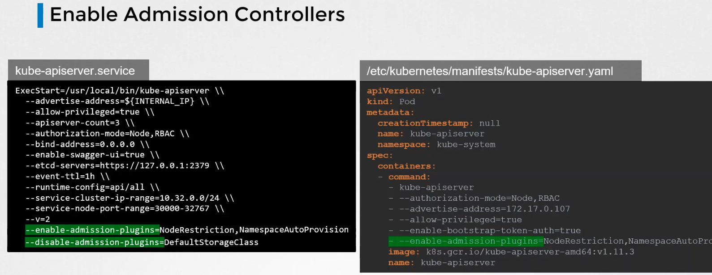
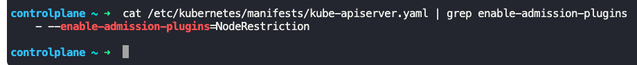
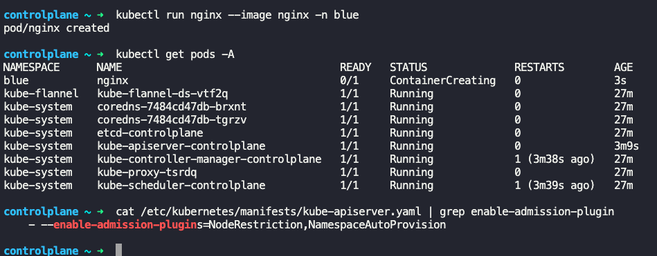
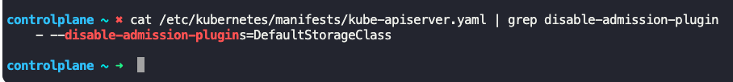
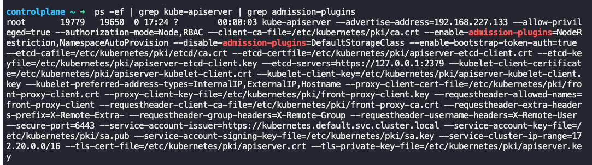

### Admission Controllers

- Admission Controllers help us implement better security measures to enforce how a cluster is used.
	- It also validates config and performs additional operations before the pod gets created
- Default available admission controllers
	- AlwaysPullImages
	- DefaultStorageClass
	- EventRateLimit
	- NamespaceExists
	- etc
- 
- To get/view admission controllers enabled by default
	- `kube-apiserver -h | grep enable-admission-plugins` or
	- `kubectl exec -it kube-apiserver-controlplane -n kube-system -- kube-apiserver -h | grep enable-admission-plugins`
	- 
	- 
- To enable admission controllers, modify `kube-apiserver.service`, which is present at `/etc/kubernetes/manifests/kube-apiserver.yaml`, at `--enable-admission-plugins` field.
- To disable admission controllers, modify `kube-apiserver.service`, which is present at `/etc/kubernetes/manifests/kube-apiserver.yaml`, at `--disable-admission-plugins` field.
- 
- To get list of additional admission controllers enabled
	- `cat /etc/kubernetes/manifests/kube-apiserver.yaml | grep enable-admission-plugins` or
	- `ps -ef | grep kube-apiserver | grep admission-plugins`
	- 
- Note:
	- `NamespaceExists` and `NamespaceAutoProvision` admission controllers are deprecated, and now replaced by `NamespaceLifecycle` admission controller
	- `NamespaceLifecycle` admission controller will make sure that requests to a non-existent namespace is rejected and the default namespaces such a `default`, `kube-system`, `kube-public` cannot be deleted
	- 
- To get list of additional admission controllers that are disabled
	- `cat /etc/kubernetes/manifests/kube-apiserver.yaml | grep disable-admission-plugins` or
	- `ps -ef | grep kube-apiserver | grep admission-plugins`
	- 
	- 

---

