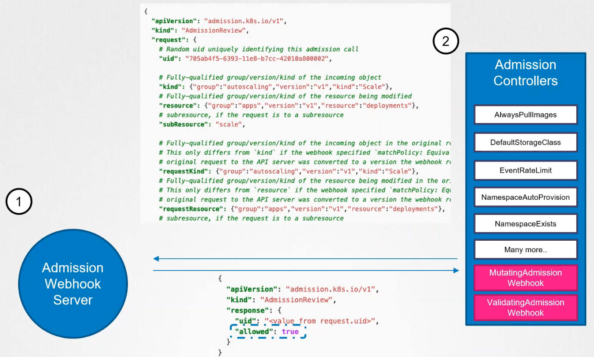
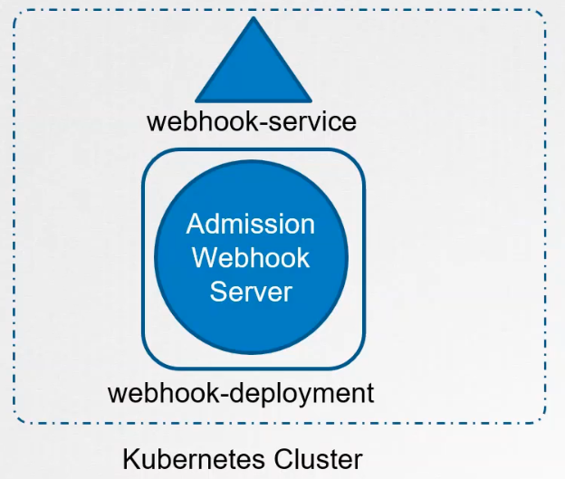
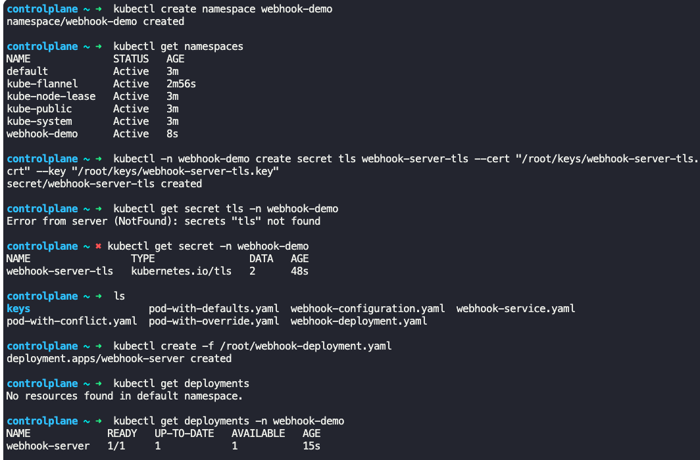
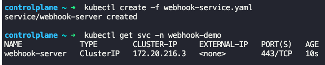
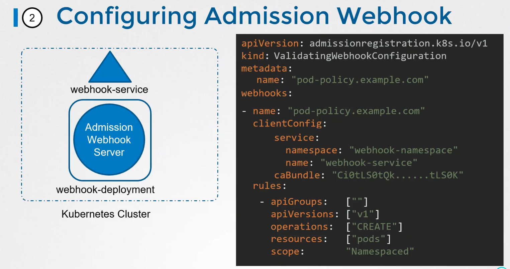
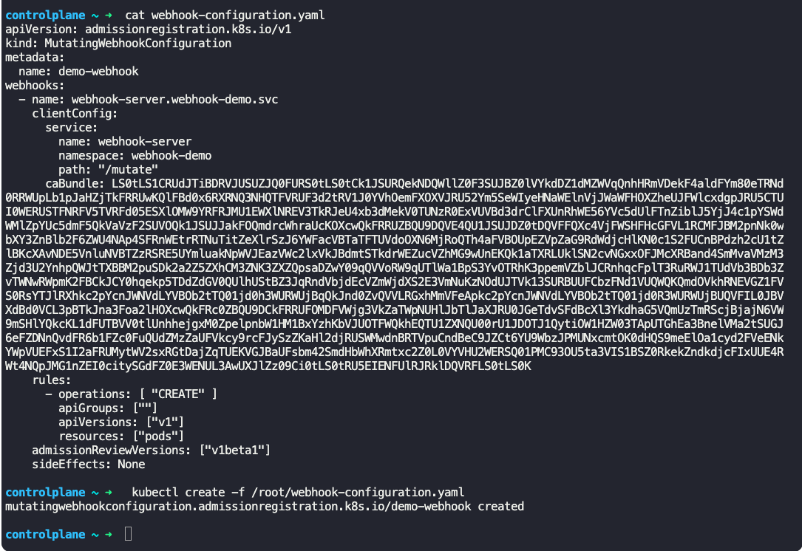
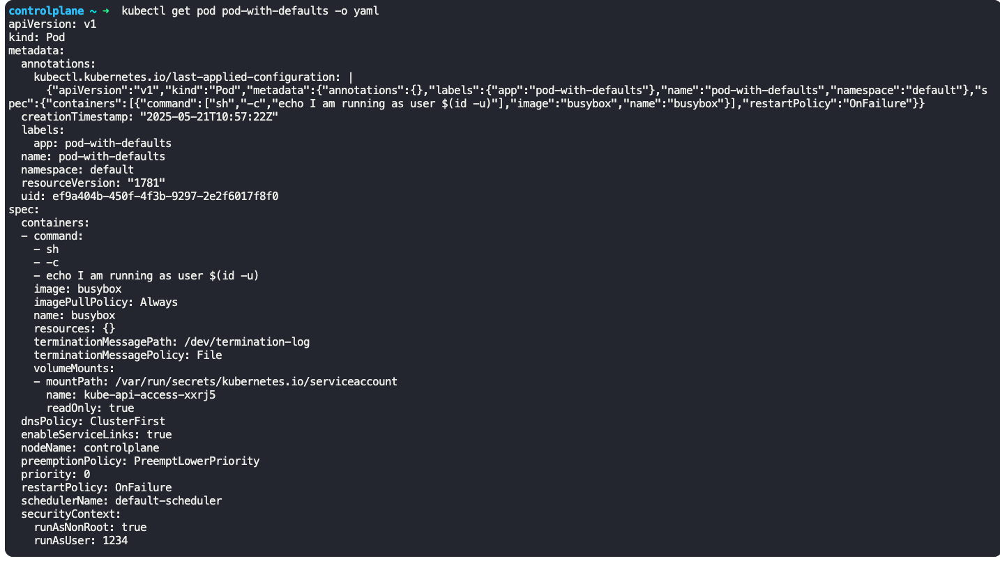
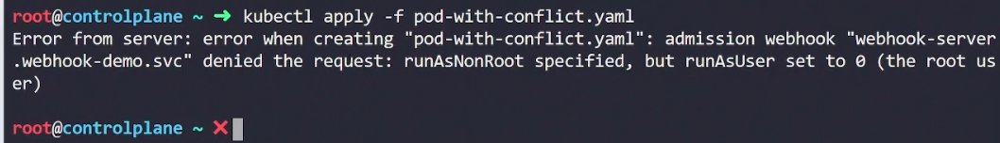

### Validating Admission Controller

- It is an admission controller which accepts or rejects the request by validating it
	- Ex: `NamespaceExists` admission controller rejects pod creation on a non-existent namespace by validating the request on which namespace the pod creation is requested for.

### Mutating Admission Controller

- It can mutate or change the object itself before it is created
	- Ex: `DefaultStorageClass` admission controller will watch for requests to create a persistent volume claim (pvc). It will check if a storage class is mentioned in pvc definition yaml file. If not, it will automatically add the storage class to the request (to create a pvc), by getting the default storage class configured for the cluster

### Admission Controller flow

- Generally mutating admission controllers are invoked first and then validating admission controllers are invoked
	- This is done so that the changes by mutating admission controllers are validated by validating admission controllers
	- Ex: `NamespaceAutoProvision` mutating admission controller is run first to create a namespace (if the namespace didn't exist already), and then `NamespaceExists` validating admission controller is run to validate is the namespace specified in the request exists
- If any of the admission controllers reject the request, the request is rejected and an error is shown
- External/custom admission controllers are supported
	- 2 special admission controllers are required
		- Mutating Admission Webhook (MAW)
		- Validating Admission Webhook (VAW)
	- `Rules` section in MAW/VAW configuration file defines what it does.
	- An admission webhook server is hosted inside the cluster or outside, and this server will run its own admission webhook service, and also contain custom checks/code for mutating and validating.
	- When a request arrives, all built-in admission controllers are run and then using MAW and VAW, it connects to our hosted admission webhook service to check for custom written validation and mutation.
		- MAW and VAW sends the request as json object to review
		- Admission webhook service responds with `allowed: true/false` in a json format
- 

### Generic steps involved in configuring MAW, VAW and to host admission webhook service

- Initial setup
	- Create a namespace, say "webhook-demo"
	- Create a TLS secret, say "webhook-server-tls" for secure webhook communication in "webhook-demo" namespace
- Step 1
	- Deploy a webhook server using deployments
	- Create a service, say "webhook-service" to access the webhook server deployment
	- 
	- 
- Step 2
	- Create a service for the above created admission webhook server
	- 
- Step 3
	- Create validating and mutating webhook configuration files
	- 
- Step 4
	- Deploy mutating admission webhook
	- 
- Once done, if we try to deploy a pod, both mutating and validating admission webhook will function
	- The mutating admission webhook will add details to the request if not present.
		- For ex, in this case it has added some security context such as `runAsNonRoot:` is set to `true` and `runAsUser:` is set to `1234`
		- 
	- The admission webhook will validate the request and fail/throw an error if a request fails validation
		- 

---
