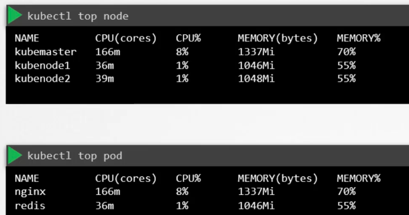
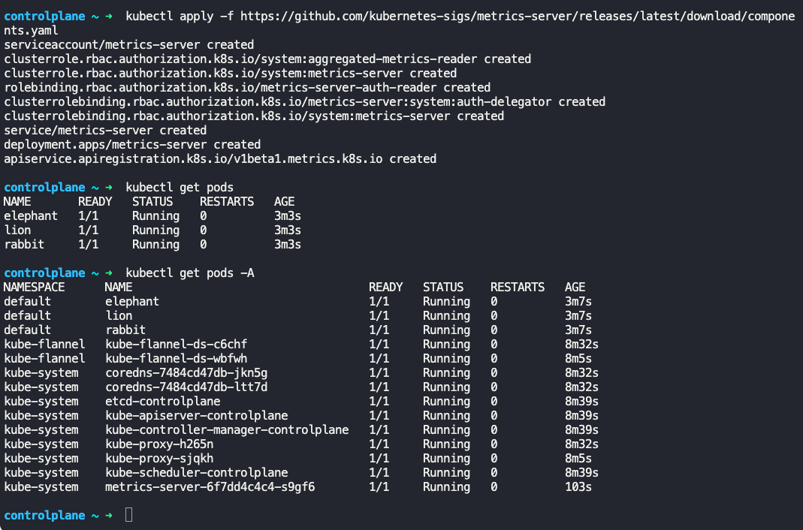
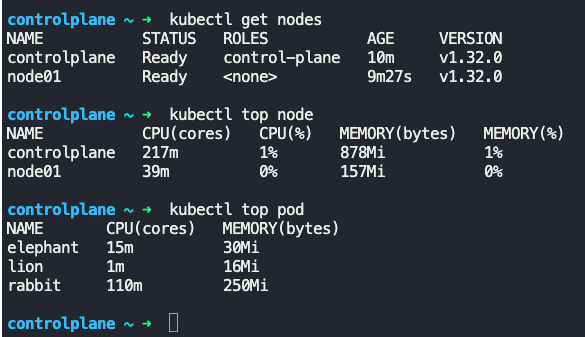

### Monitor Cluster Components

- What to monitor?
	- Node level metrics
		- Number of nodes in cluster
		- How many of those are healthy
		- Performance metrics such as, CPU, memory, disk utilization
	- Pod level metrics
		- Number of pods deployed
		- Performance metrics of each pod, such as CPU and memory consumption
- 
- We need a solution to capture, store and provide analytics on these metrics
- Kubernetes does not have a built-in solution for this
- 3rd party solutions like "metrics server", "Prometheus", "elastic stack", "Datadog" can help with capturing metrics like these
- You can have one "metrics server" configured per Kubernetes cluster
	- "Heapster" was one of the original project for monitoring Kubernetes. It is deprecated now. "Metrics server" is. slimmed down version of Heapster.
- "Metrics server" retrieves metrics from each of the nodes and pods, aggregates them and stores them in memory
	- It is in-memory only, does not store on disk
- Every node has kubelet service running.
	- There is a component in kubelet call cAdvisor (Container Advisor).
	- cAdvisor is responsible for retrieving performance metrics from pods and exposing through the kubelet API to "metrics server"
- To deploy "metrics server"
	- On minikube
		- `minikube addons enable metrics-server`
	- On all other environments
		- `git clone https://github.com/kubernetes-incubator/metrics-server`
		- `kubectl create -f deploy/1.8+/` or
		- `kubectl apply -f https://github.com/kubernetes-sigs/metrics-server/releases/latest/download/components.yaml`
	- 
- To view cluster metrics
	- `kubectl top node`
		- Gives cpu and memory consumption of each node in cluster
	- `kubectl top pod`
		- Gives performance metrics for pods
	- 

---
