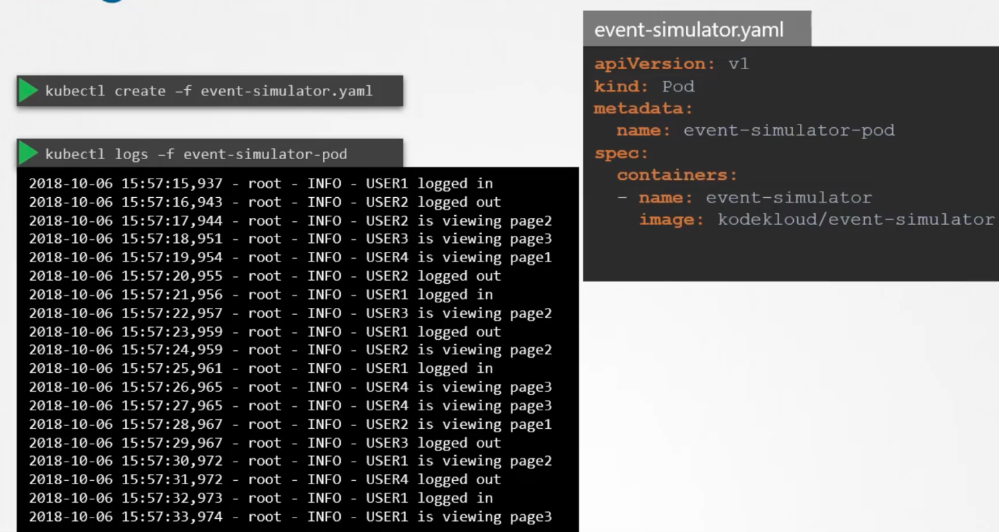
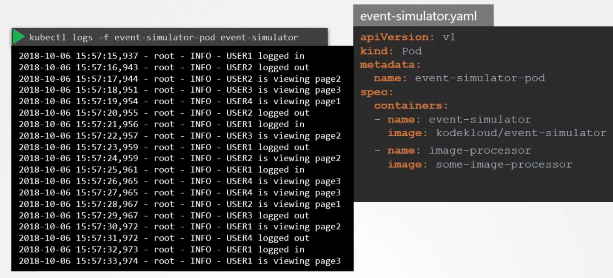

### Managing Application Logs

- Lets create a pod which simulates dummy events
	- `kubectl create -f event-simulator.yaml`
```
apiVersion: v1
king: Pod
metadata:
  name: event-simulator-pod
spec:
  containers:
    - name: event-simulator
      image: kodekloud/event-simulator
```
- To view the logs/events which the pod has generated
	- `kubectl logs -f <name_of_pod>` -> `kubectl logs -f event-simulator-pod`
- 
- Multiple containers can be present in the pod like below
```
apiVersion: v1
king: Pod
metadata:
  name: event-simulator-pod
spec:
  containers:
    - name: event-simulator
      image: kodekloud/event-simulator
    - name: image-processor
      image: some-image-processor
```
- To fetch logs from a multi-container pod, specify the container name as well
	- `kubectl logs -f <name_of_pod> <name_of_container>` -> `kubectl logs -f event-simulator-pod event-simulator`
- 


---
