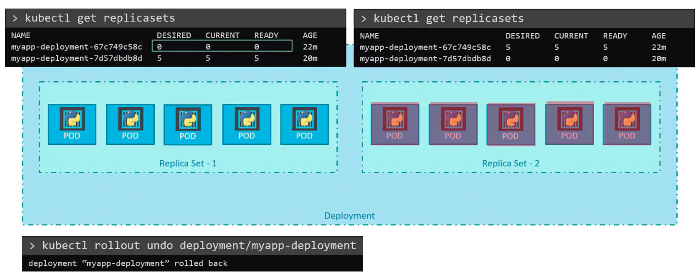

### Rollout and Revisions

- When a deployment is created, it triggers a Rollout
- A new rollout creates a new deployment Revision, say "revision 1"
	- When in future the container version needs to be upgraded, a new rollout is triggered, say "revision 2"
- This approach helps us track the changes and enables us to rollback deployment if necessary
- To check the status of rollout
	- `kubectl rollout status <name_of_deployment>`
- To see the revision and history of rollouts
	- `kubectl rollut history <name_of_deployment>`

### Deployment Strategy

- Recreate strategy
	- Take all replicas/instances of the application down and recreate the replicas/instances with the new container image
	- Has application downtime
	- This is not the default strategy
- Rolling update/upgrade strategy
	- Take down the older version of container and bring up a newer version 1 by 1
	- No application downtime and upgrade is seamless
	- This is the default strategy
- 
- Deployment strategy will be mentioned in the deployment definition file
- 
- To update a deployment,
	- we modify the deployment definition file with say,
		- new version of container image
		- new labels
		- number of replicas changed, etc
	- Run `kubcetl apply -f deployment-defn.yaml` to apply the changes
		- This triggers a new rollout and creates a new deployment revision
	- You could use `kubectl set image deployment/myapp-deployment nginx-container=nginx:1.9.1` to update the image of the container
		- But keep in mind by doing this the container image specified in the deployment yaml file will remain unchanged

### Upgrades

- When a deployment is create with 5 replicas, it automatically creates a replica set, which in turn creates the number of pods (5 in this case) to satisfy the specified number of replicas
- When upgrading,
	- Kubernetes object creates a new replica set under the hood, and starts deploying the container there
	- At the same time, it brings down the pods in old replica set 1 by 1
	- This follows a rolling upgrade strategy
	- This can be confirmed by running `kubectl get replicasets`
		- We will see 2 replica sets, old one and new one
- 

### Rollback

- Kubernetes allows you to rollback to a previous revision
- `kubectl rollout undo <name_of_deployment>`
	- This will destroy the pods in new replica set and bring up the pods in old replica set
	- This can be confirmed by running `kubectl get replicasets` before and after rollback
- 

### Commands consolidation

- Create deployment
	- `kubectl create -f deployment-defn.yaml`
- List deployments
	- `kubectl get deployments`
- Update deployments
	- `kubectl apply -f deployment-defn.yaml`
	- `kubectl set image deployment/myapp-deployment nginx=nginx:1.9.1`
- Status of rollouts
	- `kubectl rollout status <name_of_deployment>`
- Show all rollout revisions
	- `kubectl rollout history <name_of_deployment>`
- Rollback to previous revision
	- `kubectl rollout undo <name_of_deployment>`

---

