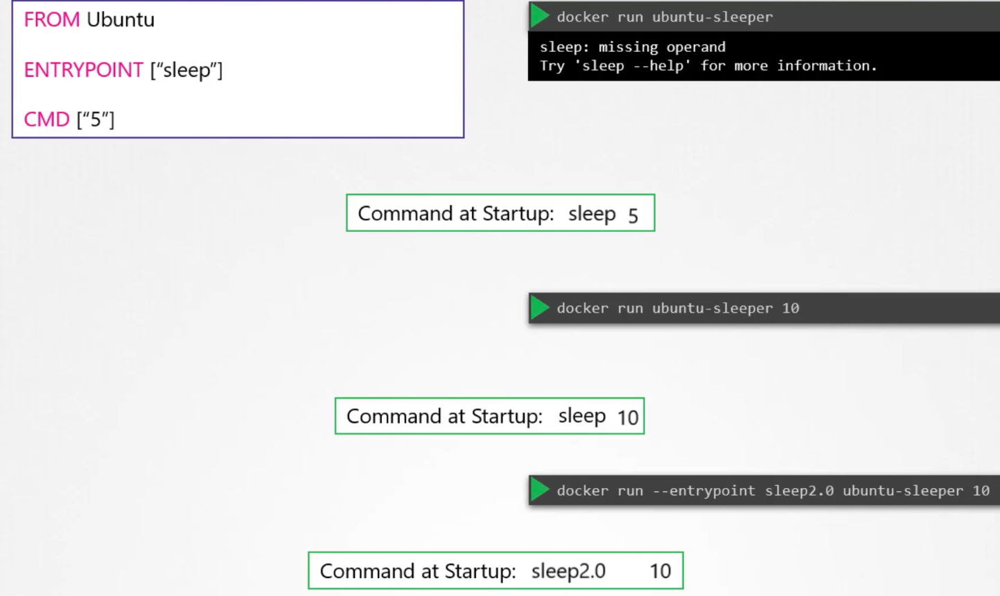

### Commands and Arguments

- Container only lives as long as the process inside is alive
	- That is why `docker run ubuntu` exits immediately
- Docker file for nginx has `CMD["nginx"]`, which runs nginx web server
	- `CMD` - Command - This will define the program which will be run when the container starts
- Similarly, for mysql container, it is the `CMD["mysqld"]` command
- 
- For ubuntu container, it is `CMD["bash"]`
	- `bash` is not a process like a web server or a DB server
	- `bash` is a shell which listens for inputs from a terminal. It it cannot find, it exits
- 
- To specify a different command to start the container
	- one way is to append a command to the `docker run` command, so that it overrides the default command specified at `CMD` in the docker file
		- `docker run ubuntu sleep 5`
	- To make the changes permanently, create a docker file and specify command to be executed like
	- Save the below in a docker file, say `ubuntu-sleeper`
```
FROM Ubuntu
CMD sleep 5 (or CMD [ "sleep", "5" ] 
```
- 
	- Build the docker file - `docker build -t ubuntu-sleeper`
	- Run the container -  `docker run ubuntu-sleeper`
- `ENTRYPOINT` instruction in docker file is like the command instruction
	- You can specify the program that runs when the container starts
	- `ENTRYPOINT [ "sleep" ]`
	- Whatever you specify on the command line will get appended to the `ENTRYPOINT` instruction, like, `docker run ubuntu-sleeper 10` implies `sleep 10`
```
FROM Ubuntu
ENTRYPOINT [ "sleep" ] 
```
- In case of `CMD` instruction, the command line parameter will replace it
- In case of `ENTRYPOINT` instruction, the command line parameter will append to it
- To have a default behaviour specified when no command line parameters are provided, use both `ENTRYPOINT` and `CMD` instructions
```
FROM Ubuntu
ENTRYPOINT [ "sleep" ]
CMD [ "5" ]
```
- `ENTRYPOINT` instruction will hold the command to be executed, say `[ "sleep" ]`
- `CMD` instruction will have a default  value, say `[ "5" ]` 
- So when `docker run ubuntu-sleeper` is run, `sleep 5 is executed`
- If `docker run ubuntu-sleeper 10` is run, then `sleep 10` is executed.
	- Command line parameter overrides the values in `CMD` instruction
- To modify `ENTRYPOINT` when executing `docker run`, use `--entrypoint` parameter
	- `docker run --entrypoint sleep2.0 ubuntu-sleeper 10`
	- The above command will execute `sleep2.0 10`
- 


---
